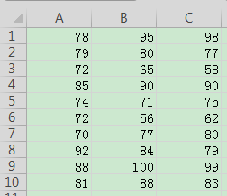
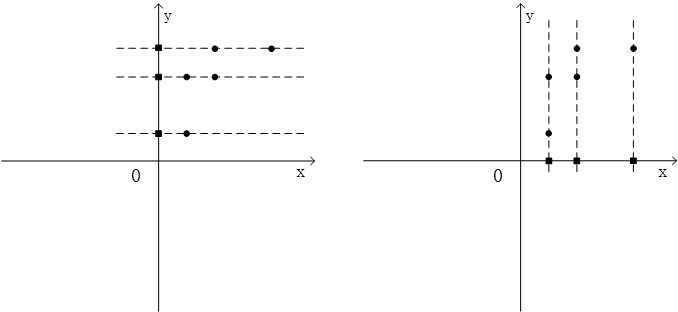
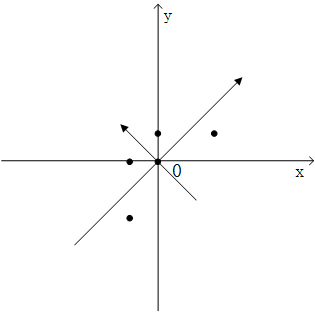

---
tags:
- 数学/线性代数
---

# 13 提取主成分：矩阵的特征值分解

## 1.期望与方差

看到这个小标题，读者也许会想，这里不是在讲线性代数么，怎么感觉像是误入了概率统计的课堂？

这里我专门说明一下，在这一讲里，我们的最终目标是分析如何提取数据的主成分，如何对手头的数据进行降维，以便后续的进一步分析。往往问题的切入点就是数据各个维度之间的关系以及数据的整体分布。因此，我们有必要先花点功夫，来梳理一下如何对数据的整体分布情况进行描述。

首先大家知道，期望衡量的是一组变量 $X$ 取值分布的平均值，我们一般记作：$E[X]$，反映的是不同数据集的整体水平。比如，在一次期末考试中，一班的平均成绩是 $90$ 分，二班的平均成绩是 $85$ 分，那么从这两个班级成绩的均值来看，就反映出一班的成绩在总体上要优于二班。

方差这个概念大家也不陌生，方差的定义是 $V[X]=E[(X-\mu)^2]$，其中，$\mu=E[X]$，他反映的是一组数据的离散程度。通俗的说就是：对于一组数据，其方差越大，数据的分布就越发散，方差越小，数据的分布就越集中。在一组样本集的方差计算中，我们采用 $\frac{1}{n-1}\sum_{1}^{n}{(x_i-\mu)^2}$ 作为样本 $X$ 的方差估计。

这里有一组数据，他描述了 10 名同学的考试成绩，第一列是英语成绩，第二列是数学成绩，第三列是物理成绩，我们将数据文件保存在 E 盘上，数据文件的截图如图 1 所示：


我们来求解一下这三门成绩的均值和方差：

**代码片段：**

```python
import numpy as np

eng, mat, phy = np.loadtxt('e:\\score.csv', delimiter=',',
                           usecols=(0, 1, 2), unpack=True)

print(eng.mean(), mat.mean(), phy.mean())
print(np.cov(eng), np.cov(mat), np.cov(phy))
```

**运行结果：**

```
79.1 80.6 80.1
54.98888888888888 188.04444444444442 181.87777777777777
```

从运行结果中我们可以看出这 10 名同学的英语、数学、物理三门功课的成绩所体现出的一些特征。三门课的平均值都差不多，但是方差值相差非常大，英语成绩的方差要明显小于数学和物理成绩的方差，这恰恰说明了这 10 名同学的英语成绩的分布相对而言要集中一些，换句话说就是大家的成绩相差不大，而另外两门理科的分数分布的则要更加分散，成绩差距相对更大。

## 2.协方差与协方差矩阵

大多数人都会有这样一种感觉，一般而言一个人如果数学成绩好，他的物理成绩大概率也会不错，反之亦然。但是数学成绩与英语成绩的却没有那么相关，至少说不像是数学成绩和物理成绩关联那样密切。

我们为了具体量化这种现象，引入协方差这个概念，对于随机变量 $X$ 和 $Y$，二者的协方差定义如下：

$$Cov[X,Y]=E[(X-\mu)(Y-v)]$$

其中，$\mu$ 和 $v$ 分别是 $X$ 和 $Y$ 的期望。其实，我们可以对比观察一下上面讲过的方差的公式：

$$V[X]=E[(X-\mu)^2]=E[(X-\mu)(X-\mu)]$$

不难发现可以将方差看做是协方差的一种特殊形式。

通过上面协方差的定义式，我们可以用通俗的话来概况这里面的含义：

当 $X$ 和 $Y$ 的协方差为正的时候，表示当 $X$ 增大的时候，$Y$ 也倾向于随之增大；协方差为负的时候，表示当 $X$ 增大，$Y$ 倾向于减小；当协方差为 $0$ 的时候，表示当 $X$ 增大时，$Y$ 没有明显的增大或减小的倾向，二者是相互独立的。

我们可以引入一个协方差矩阵，将一组变量 $X_1$ , $X_2$ , $X_3$ 两两之间的协方差用矩阵的形式统一进行表达：

$$\begin{bmatrix} V[X_1]&Cov[X_1,X_2]&Cov[X_1,X_3]\\Cov[X_2,X_1]&V[X_2]&Cov[X_2,X_3]\\Cov[X_3,X_1]&Cov[X_3,X_2]&V[X_3]\end{bmatrix}$$

协方差矩阵的第 $i$ 行，第 $j$ 列表示 $X_i$ 和 $X_j$ 之间的协方差，而对角线上表示随机变量自身的方差。我们从定义中可以看出，$Cov[X_i,X_j]$ 和 $Cov[X_j,X_i]$ 显然是相等的。因此，协方差矩阵是一个对称矩阵，结合上一讲关于对称矩阵的介绍，我们知道协方差矩阵拥有很多优良的性质，后面的应用中会派上大用场。

最后，我们来实践一下协方差矩阵的求解方法，我们来求一下由英语、数学、物理成绩构成的协方差矩阵。

**代码片段：**

```python
import numpy as np

eng, mat, phy = np.loadtxt('e:\\score.csv', delimiter=',',
                           usecols=(0, 1, 2), unpack=True)

S = np.vstack((eng,mat,phy))
print(np.cov(S))
```

**运行结果：**

```
[[  54.98888889   70.82222222   56.76666667]
 [  70.82222222  188.04444444  175.15555556]
 [  56.76666667  175.15555556  181.87777778]]
```

从这个协方差矩阵中我们观察出，数学和物理成绩之间的协方差为：$175.16$，而英语和数学、英语和物理之间的协方差分别是 $70.82$ 和 $56.77$，要明显小于数学和物理之间的协方差，这也从量化的层面说明了，数学和物理成绩之间的正相关性更强一些。

## 3.数据降维的需求背景

铺垫完前面的知识后，我们下面正式进入到数据降维的内容中来。

在研究工作中，我们常常针对我们关注的研究对象，收集大量有关他的特征属性，从而对其进行观测和分析。比如，对一组城市进行研究的时候，我们可以从人口、GDP、面积、年降水量、年平均温度、人均寿命、人均工资、人均受教育年份、性别比例、宗教人口、汽车保有量、人均住房面积等等收集相关数据。这里随手一列就是十几个特征属性，其实就算列出一百个来，也不足为奇。我们收集越多的特征属性就越方便我们全方面的对事物进行细致的研究，对深层次的规律进行探寻。

但是问题来了，随着样本特征属性数量的增多，我们需要分析处理的数据量也是直线上升的，在进行样本聚类、回归等数据分析的过程中，样本的数据维度过大，无疑会使得问题的研究变得愈加复杂。同时，大家很容易能发现一个现象，就是样本的特征属性之间还存在着相关性：比如 GDP 与汽车保有量之间，人均工资与人均受教育年份、人均寿命之间，都是存在着某种关联的，其实这也增加了问题处理的复杂性。

因此这种现状让我们感觉到，用这么多彼此相关的特征属性去描述一件事物，一方面很复杂，另一方面似乎也显得不是那么有必要。我们希望能在原有基础上减少特征属性的数量。

## 4.目标：特征减少，损失要小

那么，我们现在就视图来探究这个问题：如何对样本的特征属性进行降维。目标是什么？归结起来有两点：

第一个目标当然是特征维度要变小，不能用那么多的特征属性了。第二个是描述样本的信息损失要尽量少。数据降维，一定伴随着信息的损失，但是如果损失的太多了，自然也就失去了意义。

## 5.主成分分析法降维的思路

### 5.1.直接去掉特征？太盲目了

有读者可能会想了，能不能直接挑选一个特征属性，然后将其去掉，通过这种方法简单的实现数据降维？直觉告诉我们，似乎是不行的。这种方法最为关键的一点就是没有考虑到特征属性之间彼此紧密耦合的相关关系。这样独立的对各个特征属性进行分析，是很盲目的。

那么具体该如何做？我们还是举一个非常直观的例子来说明：

假设我们研究的对象有两个特征属性 $X$ 和 $Y$，对 $5$ 个样本进行数据采样的结果如下：

| 取值 | 样本 1 | 样本 2 | 样本 3 | 样本 4 | 样本 5 |
| ---- | ----- | ----- | ----- | ----- | ----- |
| X    | 2     | 2     | 4     | 8     | 4     |
| Y    | 2     | 6     | 6     | 8     | 8     |

我们的目标是对其降维，只用一维特征来表示每个样本。我们首先将其绘制在二维平面图中进行整体观察，如图 2 所示：


在 $5$ 个样本的特征数据分布图中，我们能挖掘出几个重要的规律：

首先，我们来探究这两个特征属性的数据分布和数据相关情况：

**代码片段：**

```python
import numpy as np
import matplotlib.pyplot as plt

x = [2,2,4,8,4]
y = [2,6,6,8,8]
S = np.vstack((x,y))

print(np.cov(S))
```

**运行结果：**

```
[[ 6.  4.]
 [ 4.  6.]]
```

结合特征变量 $X$ 和 $Y$ 的图像分布以及我们的观察发现，$5$ 个样本的特征 $X$ 和特征 $Y$ 呈现出正相关性，数据彼此之间存在着影响。

其次，我们如果真要硬来，直接去掉特征 $X$ 或特征 $Y$ 来实现特征降维，可行吗？显然是不行的，如图 3 所示，如果我们直接去掉特征 $X$，那么样本 $2$ 和样本 $3$，以及样本 $4$ 和样本 $5$，就变得无法区分了。但是实质上，在降维前的原始数据中，他们显然是有明显区别的。直接去掉特征 $Y$ 也是一样，这种简单粗暴的降维方法显然是不可取的，他忽视了数据中的内在结构关系，并且带来了非常明显的信息损失。


### 5.2.从解除特征之间的相关性入手

我们应该如何调整我们的降维策略？基于上面的现象，直观上而言，思路应该聚焦在这两方面：

一是，要考虑去除掉特征之间的相关性，想法是创造另一组新的特征来描述样本，并且新的特征必须彼此之间不相关。

二是，在新的彼此无关的特征集中，舍弃掉不重要的特征，保留较少的特征，实现数据的特征维度降维，保持尽量少的信息损失。

## 6.剖析主成分分析的细节

### 6.1.构造彼此无关的新特征

首先我们来看第一点，我们尝试用 $2$ 个新的特征来对样本进行描述，那么为了让这两个新特征满足彼此无关的要求，就得让这两个新特征的协方差为 $0$，构成的协方差矩阵是一个对角矩阵。

而目前我们所使用的原始特征 $X$ 和 $Y$ 的协方差不为 $0$，其协方差矩阵是一个普通的对称矩阵。

看到这里，你是不是突然觉得眼前一亮，我们的工作不就是要将当前的对称矩阵变换到对角矩阵么？大的方向的确如此，我们就沿着这个方向，一步一步从头到尾来实施一遍主成分分析 $(PCA)$ 的具体方法。

我们首先回顾一下协方差的定义公式：

$$Cov(X,Y)=\frac{1}{n-1}\sum_{1}^{n}{(x_i-\mu)(y_i-v)}$$

感觉公式还不够简练，我们发现如果变量 $X$ 和变量 $Y$ 的均值为 $0$，那么协方差的式子就会变得更加简单。

这个其实好办，我们将 $X$ 中的每一个变量都减去他们的均值 $\mu$，同样将 $Y$ 中的每一个变量都减去他们的均值 $v$，这样经过零均值化处理后，特征 $X$ 和特征 $Y$ 的平均值都变为了 $0$。很显然，这样的处理并不会改变方差与协方差的值，因为数据的离散程度并未发生改变，同时，从公式的表达上来看也非常清楚。

经过零均值处理后，$X$ 和 $Y$ 的协方差矩阵就可以写作：

$$\begin{bmatrix} V[X]&Cov[X,Y]\\Cov[Y,X]&V[Y]\end{bmatrix} =\begin{bmatrix}\frac{1}{n-1}\sum_{1}^{n}{x_i^2}&\frac{1}{n-1}\sum_{1}^{n}{x_iy_i}\\\frac{1}{n-1}\sum_{1}^{n}{y_ix_i}&\frac{1}{n-1}\sum_{1}^{n}{y_i^2}\end{bmatrix} =\frac{1}{n-1}\begin{bmatrix}\sum_{1}^{n}{x_i^2}&\sum_{1}^{n}{x_iy_i}\\\sum_{1}^{n}{y_ix_i}&\sum_{1}^{n}{y_i^2}\end{bmatrix}$$

我们看一下 $\begin{bmatrix}\sum_{1}^{n}{x_i^2}&\sum_{1}^{n}{x_iy_i}\\\sum_{1}^{n}{y_ix_i}&\sum_{1}^{n}{y_i^2}\end{bmatrix}$ 这个矩阵，不难发现他就是零均值化后的样本矩阵 $A=\begin{bmatrix} x_1&x_2&x_3&…&x_n\\y_1&y_2&y_3&…&y_n\end{bmatrix}$ 与自身转置矩阵 $A^T$ 相乘的结果，即协方差矩阵：

$$C=AA^T \Rightarrow \begin{bmatrix}\sum_{1}^{n}{x_i^2}&\sum_{1}^{n}{x_iy_i}\\\sum_{1}^{n}{y_ix_i}&\sum_{1}^{n}{y_i^2}\end{bmatrix} =\begin{bmatrix} x_1&x_2&x_3&…&x_n\\y_1&y_2&y_3&…&y_n\end{bmatrix} \begin{bmatrix} x_1&y_1\\x_2&y_2\\x_3&y_3\\.&.\\x_n&y_n\end{bmatrix}$$

一般而言，$X$ 和 $Y$ 满足线性无关，所以依据我们之前介绍的知识，协方差矩阵 $C$ 是对称的、正定的满秩方阵。

接下来，我们就想把各样本的特征 $X$ 和特征 $Y$ 的取值用另外一组基来表示，由于要求在新的基下表示的新特征彼此无关，那么必然的，新选择的两个基必须彼此正交。

我们选择一组新的基，$p_1$ 和 $p_2$，他们的模长为 $1$，彼此之间满足标准正交，前面我们学过，在此条件下，向量 $a=\begin{bmatrix}x_1\\y_1\end{bmatrix}$ 与向量 $p_i$ 的点积就表示向量 $a$ 在 $p_i$ 方向上的投影，同时由于 $p_i$ 是单位向量，那么点积的结果就代表了基向量 $p_i$ 的坐标。

那么向量 $a$ 在由标准正交向量 $p_1$ 和 $p_2$ 构成的新基底上的坐标即为 $\begin{bmatrix}p_1^Ta\\p_2^Ta\end{bmatrix}$，如果我们令 $P=\begin{bmatrix}p_1^T\\p_2^T\end{bmatrix}$，那么可以进一步将其表示为：$Pa$。

梳理一下这里所做的工作：

$$A=\begin{bmatrix} x_1&x_2&x_3&…&x_n\\y_1&y_2&y_3&…&y_n\end{bmatrix}$$

就是 $n$ 个样本的特征 $X$ 和特征 $Y$ 的原始采样值。而

$PA=\begin{bmatrix} p_1^Ta_1& p_1^Ta_2& p_1^Ta_3&… &p_1^Ta_n\\p_2^Ta_1&p_2^Ta_2&p_2^Ta_3&…&p_2^Ta_n\end{bmatrix}$（其中 $a_i=\begin{bmatrix}x_i\\y_i\end{bmatrix}$）。描述的就是这 $n$ 个样本在新构建的特征下的取值。

此时，我们来实现第一个目标：

即，试图让第一个新特征 $\begin{bmatrix} p_1^Ta_1& p_1^Ta_2&…&p_1^Ta_n\end{bmatrix}$ 和第二个新特征 $\begin{bmatrix}p_2^Ta_1&p_2^Ta_2&…&p_2^Ta_n\end{bmatrix}$ 满足线性无关。换句话说，就是要求这两个特征的协方差为 $0$，协方差矩阵是一个对角矩阵。

$$D=\frac{1}{n-1}PA(PA)^T=\frac{1}{n-1}PAA^TP^T=\frac{1}{n-1}PCP^T$$

这就转化成了我们再熟悉不过的问题了：去寻找让矩阵 $C$ 对角化的 $P$ 矩阵，这里还有一个好的前提条件：$C$ 是对称矩阵、正定矩阵，他保证了矩阵一定能够对角化，且特征值全都为正。

我们在对称矩阵那一节里，得到过这样的结论：对称矩阵一定可以得到由一组标准正交特征向量构成的特征矩阵。即，矩阵 $Q$ 可以表示成：

$$\begin{bmatrix} q_1&q_2&…&q_n\end{bmatrix}$$

我们进一步将 $S=Q\Lambda Q^T$ 整理一下，得到 $\Lambda=Q^TSQ$。进行展开得到

$$\Lambda=\begin{bmatrix} q_1^T\\q_2^T\\…\\q_n^T\end{bmatrix}S\begin{bmatrix} q_1&q_2&…&q_n\end{bmatrix}$$

上下两个式子进行比对我们就会发现：我们要求的矩阵 $P$，就是

$$P=Q^T=\begin{bmatrix} q_1^T\\q_2^T\\…\\q_n^T\end{bmatrix}$$

其中 $q_1$ 到 $q_n$ 就是协方差矩阵 $C$ 的 $n$ 个标准正交特征向量。由此，我们再通过 $PA$ 就能计算得出彼此线性无关的新特征。

### 6.2.结合例子实际操作

那么在这里举的实例中，我们具体来操作一下，首先我们进行零均值化的工作：

**代码片段**

```python
import numpy as np
import matplotlib.pyplot as plt

x = [2,2,4,8,4]
y = [2,6,6,8,8]

x = x - np.mean(x)
y = y - np.mean(y)

S = np.vstack((x,y))
print(S)
print(np.cov(S))
```

**运行结果：**

```
[[-2. -2.  0.  4.  0.]
 [-4.  0.  0.  2.  2.]]

[[ 6.  4.]
 [ 4.  6.]]
```

在上面的过程中，我们对原始数据两个特征的采样值进行了零均值化处理，同时也验证了：零均值化的处理后，协方差矩阵确实不变。

我们接着处理：

**代码片段：**

```python
import numpy as np
from scipy import linalg

C = np.array([[6, 4],
              [4, 6]])

evalue, evector = linalg.eig(C)
print(evalue)
print(evector)
```

**运行结果：**

```
[ 10.+0.j   2.+0.j]
[[ 0.70710678 -0.70710678]
 [ 0.70710678  0.70710678]]
```

由此，我们通过求协方差矩阵 $C$ 的特征向量，得到了新选择的两个线性无关的特征投影基，协方差矩阵 $C=\begin{bmatrix} 6&4\\4&6\end{bmatrix}$ 的特征矩阵为

$$Q=\begin{bmatrix} 0.707&-0.707\\0.707&0.707\end{bmatrix}$$

我们结合新得到的两个线性无关的新投影基所在的方向，观察一下经过零均值化处理后的数据分布，如图 4 所示：



对对角化矩阵 $D$ 进行求解：

$$D=\frac{1}{n-1}Q^TCQ =\frac{1}{4}\begin{bmatrix} 0.707&0.707\\-0.707&0.707\end{bmatrix}\begin{bmatrix}6&4\\4&6\end{bmatrix}\begin{bmatrix} 0.707&-0.707\\0.707&0.707\end{bmatrix} =\begin{bmatrix}2.5&0\\0&0.5\end{bmatrix}$$

### 6.3.新得到的特征该如何取舍

在上面的一系列操作中，我们构造了两个新特征。原始特征的方向分别是 $x$ 轴正方向和 $y$ 轴的正方向，两个原始特征彼此相关。而新构造的两个特征，方向分别是 $\begin{bmatrix} 0.707\\0.707\end{bmatrix}$ 和 $\begin{bmatrix} -0.707\\0.707\end{bmatrix}$，在这两个方向上构造的新特征，协方差为 $0$，线性无关。

那么，我们将原始特征的采样值变换到两个新选取的投影基上，就得到新的一组特征取值：

**代码片段：**

```python
import numpy as np

x = [2,2,4,8,4]
y = [2,6,6,8,8]

x = x - np.mean(x)
y = y - np.mean(y)

A = np.vstack((x,y))

p_1 = [0.707, 0.707]
p_2 = [-0.707, 0.707]

P = np.vstack((p_1,p_2))

print(A)
print(np.dot(P,A))
```

**运行结果：**

```
[[-2. -2.  0.  4.  0.]
 [-4.  0.  0.  2.  2.]]

[[-4.242 -1.414  0.     4.242  1.414]
 [-1.414  1.414  0.    -1.414  1.414]]
```

我们得到的两个结果，就是在原始特征和新构建特征上分别得到的值。

我们在此基础上再进行特征维度的降维，让二维数据变成一维。由于这两个新的特征彼此无关，我们可以放心大胆的保留一个，去掉一个。

具体保留哪一个，我们的判定标准是方差，方差越大，表明这个特征里数据分布的离散程度就越大，特征所包含的信息量就越大；反之，如果特征里数据的方差小，分布集中，则表明其包含的信息量就小。那么，我们自然选择保留信息量大的那个特征了。

这里，$\begin{bmatrix} 0.707\\0.707\end{bmatrix}$ 方向上的特征对应的方差是 $2.5$，而 $\begin{bmatrix} -0.707\\0.707\end{bmatrix}$ 方向上的特征对应的方差是 $0.5$。我们决定保留 $\begin{bmatrix} 0.707\\0.707\end{bmatrix}$ 方向上的特征取值。

此时，我们完成了主成分的提取，$5$ 个样本如果用一维数据来描述，最终的取值就是：$\begin{bmatrix} -4.242& -1.414&0.& 4.242& 1.414\end{bmatrix}$，从而实现了数据的降维。

最终所保留的就是以 $\begin{bmatrix} 0.707\\0.707\end{bmatrix}$ 为基向量的坐标值，如图 5 所示：


### 6.4.衡量信息的损失

那么，我们怎么衡量数据降维过程中的信息损失？或者反过来说，我们保留下了多少信息？这里介绍主成分贡献率的概念，上面的例子里，原本一共有两个特征，我们保留第一个作为主成分，我们用方差来衡量主成分贡献率：

主成分贡献率为：$\frac{\lambda_1}{\lambda_1+\lambda_2}=\frac{\lambda_1}{\lambda_1+\lambda_2}=\frac{2.5}{3}=83.3\%$。由此可见，我们在数据降维的过程中，数据压缩率为 $50\%$，但保留了 $83.3\%$ 的信息，感觉效果还是不错的。

## 7.推广到 $n$ 个特征的降维

这里我们推广到一般情况，如果我们有 $n$ 个特征，如何进行数据降维。

这里的思路是完全一样的。

第一步：针对采样得到的 $m$ 个样本，我们得到了一个 $n*m$ 的样本数据矩阵 $A$；

第二步：对每一个特征的取值，进行零均值化处理，如果这些特征不在一个数量级上，我们还应该将其除以标准差 $\sigma$。

第三步：利用预处理后的矩阵 $A$，求 $n$ 个特征的协方差矩阵：$C=\frac{1}{n-1}AA^T$

第四步：对协方差矩阵进行对角化处理，求得矩阵 $C$ 的 $n$ 个标准正交特征向量，并按照对应的特征值的大小依次排列。

第五步：按照事先规定的主成分贡献度，提取满足该数值要求的前 $k$ 个新构造的特征作为主成分，构造成数据压缩矩阵：$P=\begin{bmatrix}q_1^T\\q_2^T\\…\\q_k^T\end{bmatrix}$

第六步：通过矩阵相乘 $PA$ 实现前 $k$ 个主成分的提取，将 $n$ 维特征压缩到 $k$ 维。