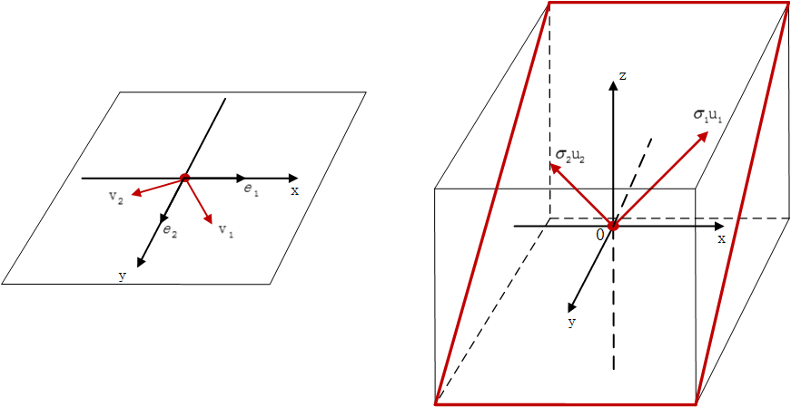
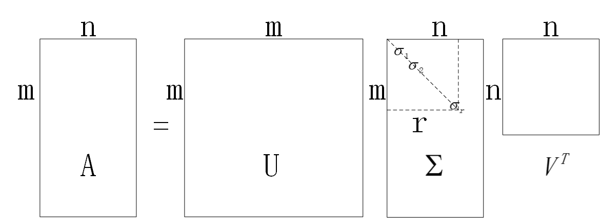

---
tags:
- 数学/线性代数
---

# 14 奇异值分解（上）：原理与通用性

## 1.再谈特征值分解的几何意义

在上一讲，我们讲了通过特征值分解（EVD）的方法对样本的特征提取主成分，从而实现数据的降维。在介绍奇异值分解（SVD）之前，我们再着重挖掘一下特征值分解的几何意义。

### 1.1.分解过程回顾

我们最开始获得的是一组原始的 $m\times n$ 数据样本矩阵 $A$，其中，$m$ 表示特征的个数，$n$ 表示样本的个数。通过与自身转置相乘：$AA^T$ 得到了样本特征的 $m$ 阶协方差矩阵 $C$，通过求取协方差矩阵 $C$ 的一组标准正交特征向量 $q_1,q_2,…q_m$ 以及对应的特征值 $\lambda_1,\lambda_2,…,\lambda_m$。

我们这里处理的就是协方差矩阵 $C$，对 $C$ 进行特征值分解，将矩阵分解成了

$$C=\begin{bmatrix} q_1&q_2&…&q_m\end{bmatrix}\begin{bmatrix} \lambda_1&&&\\&\lambda_2&&\\&&…&\\&&&\lambda_m\end{bmatrix}\begin{bmatrix} q_1^T\\q_2^T\\…\\q_m^T\end{bmatrix}$$

最终，我们选取前 $k$ 个特征向量构成数据压缩矩阵 $P$ 的各行，通过 $PA$ 达到数据压缩的目的。

### 1.2.几何意义剖析

以上是回顾之前的内容，不难发现，为了完成矩阵的特征值分解，最最关键还是要回归到这个基本性质上来：$Cq_i=\lambda_i q_i$。

我们为什么又提这个呢？结合主成分分析的推导过程我们知道，协方差矩阵 $C$ 之所以能够分解，是因为在原始空间 $R^m$ 中，我们原本默认是用 $e_1,e_2,…,e_m$ 这组默认基向量来表示我们空间中的任意一个向量 $a$，如果我们采用基变换，将 $a$ 用 $q_1,q_2,…,q_m$ 这组标准正交基来表示后，$Ca$ 的乘法运算就变得很简单了，只需要在各个基向量的方向上对应伸长 $\lambda_i$ 倍即可，如图 1 所示：

实际上，我们之前也重点分析过，因为协方差矩阵具备对称性、正定性，保证了他可以被对角化，并且特征值一定为正，从而使得特征值分解的过程一定能够顺利完成。

因此利用特征值分解进行主成分分析，核心就是获取协方差矩阵，然后对其进行矩阵分解，获得一组特征值和其对应的方向。

## 2.从 $Av=\sigma u$ 入手奇异值分解

但是，如果我们不进行协方差矩阵 $C$ 的求取，绕开它直接对原始的数据采样矩阵 $A$ 进行矩阵分解，从而进行降维操作，行不行？

如果继续沿用上面的办法，显然是不行的，特征值分解对矩阵的要求很严，首先得是一个方阵，其次在方阵的基础上，还得满足可对角化的要求。但是原始的 $m\times n$ 数据采样矩阵 $A$ 连方阵这个最基本的条件都不满足，是根本无法进行特征值分解的。

找不到类似 $Ap=\lambda p$ 的核心等式了，岂不是无能为力了？怎料，天无绝人之路，这里，我首先给大家介绍一个对于任意 $m\times n$ 矩阵的更具普遍意义的一般性质：

对于一个 $m\times n$，秩为 $r$ 的矩阵 $A$，这里我们暂且假设 $m>n$，于是就有 $r \leq n < m$ 的不等关系。我们在 $R^n$ 空间中一定可以找到一组标准正交向量 $v_1,v_2,…v_n$，在 $R^m$ 空间中一定可以找到另一组标准正交向量 $u_1,u_2,…,u_m$，使之满足 $n$ 组相等关系：$Av_i=\sigma_iu_i$，其中（$i$ 取 $1$~$n$）。

$Av_i=\sigma_iu_i$，这个等式非常神奇，我们仔细的揭开里面的迷雾，展现他的精彩之处：

矩阵 $A$ 是一个 $m \times n$ 的矩阵，他所表示的线性变换是将 $n$ 维原空间中的向量映射到更高维的 $m$ 维目标空间中，而 $Av_i=\sigma_iu_i$ 这个等式意味着，在原空间中找到一组新的标准正交向量 $\begin{bmatrix} v_1&v_2&…&v_n\end{bmatrix}$，在目标空间中存在着对应的一组标准正交向量 $\begin{bmatrix} u_1&u_2&…&u_n\end{bmatrix}$，此时 $v_i$ 与 $u_i$ 线性无关。当矩阵 $A$ 作用在原空间上的某个基向量 $v_i$ 上时，其线性变换的结果就是：对应在目标空间中的 $u_i$ 向量沿着自身方向伸长 $\sigma_i$ 倍，并且任意一对 $(v_i,u_i)$ 向量都满足这种关系（显然特征值分解是这里的一种特殊情况，即两组标准正交基向量相等）。如图 2 所示：

 在 $Av_i=\sigma_iu_i$ 的基础上，我们明白该如何往下走了：

$$A\begin{bmatrix} v_1&v_2&…&v_n\end{bmatrix}=\begin{bmatrix} \sigma_1u_1&\sigma_2u_2&…&\sigma_nu_n\end{bmatrix}$$

转换成：

$$A\begin{bmatrix} v_1&v_2&…&v_n\end{bmatrix}=\begin{bmatrix} u_1&u_2&…&u_n\end{bmatrix}\begin{bmatrix} \sigma_1&&&\\&\sigma_2&&\\&&…\\&&&\sigma_n\end{bmatrix}$$

## 3.着手尝试分解

此时感觉还差一点，因为我们发现 $u_{n+1},u_{n+2},…,u_{m}$ 并没有包含在式子里，我们把他们加进去，把 $u_{n+1},u_{n+2},…,u_{m}$ 加到矩阵右侧，形成完整的 $m$ 阶方阵

$$U=\begin{bmatrix} u_1&u_2&…&u_n&u_{n+1}&…&u_m\end{bmatrix}$$

在对角矩阵下方加上 $m-n$ 个全零行，形成 $m\times n$ 的矩阵

$$\Sigma=\begin{bmatrix} \sigma_1&&&\\&\sigma_2&&\\&&…&\\&&&\sigma_n\\&&&\\&&&\end{bmatrix}$$

很明显由于 $\Sigma$ 矩阵最下面的 $m-n$ 行全零，因此右侧的计算结果不变，等式依然成立。

此时就有：$AV=U\Sigma$，由于 $V$ 的各列是标准正交向量，因此 $V^{-1}=V^T$，移到等式右侧，得到了一个矩阵分解的式子：

$$A=U\Sigma V^T$$

其中 $U$ 和 $V$ 是由标准正交向量构成的 $m$ 阶和 $n$ 阶方阵，而 $\Sigma$ 是一个 $m\times n$ 的对角矩阵（注意，不是方阵）。

## 4.分析分解过程中的细节

从大的框架宏观来看，这个结论非常漂亮，在原空间和目标空间中各找一组标准正交基，就轻轻松松的把对角化的一系列要求轻松化解。直接得到了数据采样矩阵 $A$ 的矩阵分解形式。

但是此时还有一个最关键的地方似乎没有明确：就是方阵 $U$ 和方阵 $V$ 该如何取得，以及 $\Sigma$ 矩阵中的各个值应该为多少，我们借助在对称矩阵那一节中储备的基础知识来一一化解。

我们还是从 $A=U\Sigma V^T$ 式子入手。首先，获取转置矩阵 $A^T=(U\Sigma V^T)^T=V\Sigma U^T$，我们在此基础上可以获取两个对称矩阵：

第一个对称矩阵是：

$$A^TA=V\Sigma U^TU\Sigma V^T$$

由于 $U$ 的各列是标准正交向量，因此 $U^TU=I$，式子最终化简为了：$A^TA=V\Sigma^2V^T$。

同理，第二个对称矩阵：

$$AA^T=U\Sigma V^TV\Sigma U^T=U\Sigma^2U^T$$

这里我们结合对称矩阵那一节中的一个重要结论，揭示一下这里面的所有细节：$A^TA$ 是 $n$ 阶对称方阵，$AA^T$ 是 $m$ 阶对称方阵。他们的秩相等，为 $r=Rank(A)$。因此他们拥有完全相同的 $r$ 个非零特征值，从大到小排列为：$\lambda_1,\lambda_2,…\lambda_r$，两个对称矩阵的剩余 $n-r$ 个和 $m-r$ 个特征值为 $0$。这进一步也印证了 $A^TA=V\Sigma^2V^T$ 和 $AA^T=U\Sigma^2U^T$ 对角线上的非零特征值是完全一样的。

同时，由对称矩阵的性质可知：$A^TA$ 一定含有 $n$ 个标准正交特征向量，对应特征值从大到小的顺序排列为：$\begin{bmatrix} v_1&v_2&…&v_n\end{bmatrix}$，而 $AA^T$ 也一定含有 $m$ 个标准正交特征向量，对应特征值从大到小依次排列为 $\begin{bmatrix} u_1&u_2&…&u_m\end{bmatrix}$。这里的 $v_i$ 和 $u_i$ 一一对应。

对应的 $\Sigma$ 矩阵也很好求，求出 $AA^T$ 或 $A^TA$ 的非零特征值，从大到小排列为：$\lambda_1,\lambda_2,…,\lambda_r$，$\Sigma$ 矩阵中对角线上的非零值 $\sigma_i$ 则依次为：$\sqrt{\lambda_1}，\sqrt{\lambda_2},…,\sqrt{\lambda_r}$。因此，$\Sigma$ 矩阵对角线上 $\sigma_r$ 以后的元素均为 $0$ 了。

整个推导分析过程结束，我们隐去零特征值，最终得到了最完美的 SVD 分解结果：

$$A=\begin{bmatrix} u_1&u_2&…&u_m\end{bmatrix}\begin{bmatrix} \sigma_1&&&&&\\&\sigma_2&&&&\\&&…&&&\\&&&\sigma_r&\\&&&&\\&&&&\end{bmatrix}\begin{bmatrix} v_1^T\\v_2^T\\…\\v_n^T\end{bmatrix}$$

这里 $r \le n < m$。

我们用一个抽象图来示意一下分解的结果，有助于大家加深印象，如图 3 所示：

由此，我们顺利的得到了任意 $m\times n$ 矩阵 $A$ 的 SVD 分解形式。如何利用 python 工具进行求解，以及利用 SVD 进行数据压缩的相关内容，我们下一讲再讲。