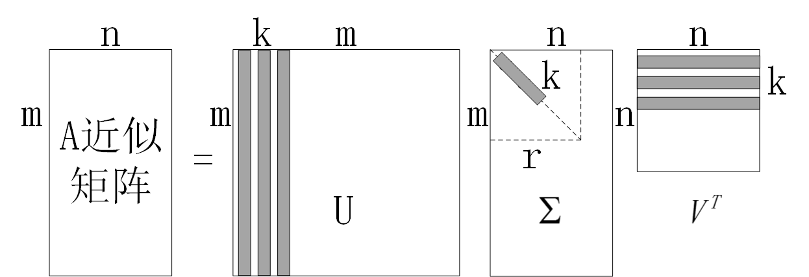

---
tags:
- 数学/线性代数
---

# 15 奇异值分解（下）：进行数据降维

我们在上一讲的理论基础上继续推进，来讲解将任意一个 $m\times n$ 形状的矩阵 $A$ 成功完成奇异值分解之后，应如何对原始数据进行主成分分析和数据降维。

## 1.行压缩数据降维

我们直接从矩阵 $A$ 的奇异值分解：$A=U\Sigma V^T$ 入手，分析如何进行行压缩数据降维。

等式两侧同时乘以左奇异矩阵的转置：$U^T$，得到：

$$U^TA=U^TU\Sigma V^T=\Sigma V^T$$

重点是左侧的 $U^TA$，我们把矩阵 $A$ 记作 $n$ 个 $m$ 维列向量并排放置的形式，我们展开来看：

$$\begin{aligned}
\begin{bmatrix} u_1&u_2&…&u_m\end{bmatrix}^TA&=\begin{bmatrix} u_1^T\\u_2^T\\…\\u_m^T\end{bmatrix}\begin{bmatrix} colA_1&colA_2&…&colA_n\end{bmatrix}\\
&=\begin{bmatrix} u_1^TcolA_1&u_1^TcolA_2&…&u_1^TcolA_n\\u_2^TcolA_1&u_2^TcolA_2&…&u_2^TcolA_n\\…&…&…&…\\u_m^TcolA_1&u_m^TcolA_2&…&u_m^TcolA_n\end{bmatrix}
\end{aligned}$$

这是我们刚讲过的基变换方法，很熟悉了吧，$colA_i$ 原本使用的是默认的一组基向量 $\begin{bmatrix} e_1&e_2&…&e_m\end{bmatrix}$，我们通过上面的基变换，将其用 $\begin{bmatrix} u_1&u_2&…&u_m\end{bmatrix}$ 这一组标准正交基来表示，由于这一组标准正交基本质上也是由协方差对称矩阵 $AA^T$ 得到，因此将各列做基变换后，数据分布从行的角度来看就彼此无关了。

此时，我们可以把每一列看作是一个样本，各行是不同的特征，各行彼此无关，我们可以按照熟悉的方法，选择最大的 $k$ 个奇异值对应的 $k$ 个标准正交向量，形成行压缩矩阵：

$$U^T_{k\times m}=\begin{bmatrix} u_1^T\\u_2^T\\…\\u_k^T\end{bmatrix}$$

通过

$$U^T_{k\times m}colA_i=\begin{bmatrix} u_1^TcolA_i\\u_2^TcolA_i\\…\\u_k^TcolA_i\end{bmatrix}$$

就实现了列向量从 $m$ 维到 $k$ 维的数据降维，完成了主成分的提取。

## 2.列压缩数据降维

奇异值分解的精彩之处就在于他可以从两个维度进行数据降维，分别提取主成分，前面介绍的是对行进行压缩降维，那么下面我们来说说如何对列进行压缩降维。

还是牢牢抓住 $A=U\Sigma V^T$ 进行启发，我们对式子两边同时乘以右奇异矩阵 $V$，得到 $AV=U\Sigma$，我们还是聚焦等式的左侧：$AV$。

我们将其整体进行转置的预处理，得到 $(AV)^T=V^TA^T$，我们把矩阵 $A$ 记作

$$\begin{bmatrix} rowA_1^T\\rowA_2^T\\…\\rowA_m^T\end{bmatrix}$$

那么同样的道理：

$$\begin{aligned}

V^TA^T&=\begin{bmatrix} v_1^T\\v_2^T\\…\\v_n^T\end{bmatrix}\begin{bmatrix} rowA_1&rowA_2&…&rowA_m\end{bmatrix}\\

&=\begin{bmatrix} v_1^TrowA_1&v_1^TrowA_2&…&v_1^TrowA_m\\v_2^TrowA_1&v_2^TrowA_2&…&v_2^TrowA_m\\…&…&…&…\\v_n^TrowA_1&v_n^TrowA_2&…&u_n^TrowA_m\end{bmatrix}
\end{aligned}$$

类比上面的行压缩过程，在 $V$ 中，我们从大到小取前 $k$ 个特征值对应的标准正交特征向量，就构成了另一个压缩矩阵：$V^T_{k\times n}=\begin{bmatrix} v_1^T\\v_2^T\\…\\v_k^T\end{bmatrix}$。很明显，通过 $V^T_{k\times n}A^T$ 就能实现将 $A^T$ 矩阵的各列由 $n$ 维压缩到 $k$ 维。而大家不要忘了，$A^T$ 的列不正是 $A$ 矩阵的各行吗。

由此，各行向量的维数由 $n$ 压缩到了 $k$ 维，实现了列压缩的数据降维。

## 3.对矩阵整体进行数据压缩

这里我们不谈按行还是按列，我们从矩阵的整体视角，再谈一个数据压缩的方式，我们的思路有点类似级数的概念，将一个 $m\times n$ 的原始数据矩阵 $A$ 分解成若干个同等维度矩阵乘以各自权重后相加的形式。这个如何实现？

依旧从奇异值分解的表达式入手，$A=U\Sigma V^T$，我们展开成完整的矩阵形式：

$$A=\begin{bmatrix} u_1&u_2&…&u_m\end{bmatrix}\begin{bmatrix} \sigma_1&&&&&\\&\sigma_2&&&&\\&&…&&&\\&&&\sigma_r&\\&&&&\\&&&&\end{bmatrix}\begin{bmatrix} v_1^T\\v_2^T\\…\\v_n^T\end{bmatrix}$$

这里 $r \le n < m$。

这里展开就得到了：

$$A=\sigma_1u_1v_1^T+\sigma_2u_2v_2^T+\sigma_3u_3v_3^T+…+\sigma_ru_rv_r^T$$

不难发现，每一个 $u_iv_i^T$ 的结果都是一个等维的 $m\times n$ 形矩阵，并且他们彼此之间正交，前面的 $\sigma_i$ 则是对应矩阵的权重，$\sigma_1 > \sigma_2 > \sigma_3 >…>\sigma_r$，依序代表了“重要性”的程度，因此我们可以按照主成分贡献率的最低要求，选择前 $k$ 项进行叠加，用来对原始数据矩阵 $A$ 进行近似：

$$A\Rightarrow \sigma_1u_1v_1^T+\sigma_2u_2v_2^T+\sigma_3u_3v_3^T+…+\sigma_ku_kv_k^T$$

原理示意图如图 1 所示：



这种思想和处理方式在图像压缩的应用中很有用处。

## 4.利用 python 进行实际操作

### 4.1.利用 python 进行奇异值分解

举一个 $7\times 5$ 的矩阵 $A$ 为例：

$$A=\begin{bmatrix} 0&0&0&2&2\\0&0&0&3&3\\0&0&0&1&1\\1&1&1&0&0\\2&2&2&0&0\\5&5&5&0&0\\1&1&1&0&0\end{bmatrix}$$

这是一个看上去很有规律的矩阵。

我们这里就不按照推导 SVD 原理的过程：先求 $AA^T$, $A^TA$，再接着获得 $U$，$V$，$\Sigma$ 矩阵这样一步步计算。我们通过 python 提供的工具，直接一次性获得奇异值分解的所有结果。

**代码片段：**

```python
import numpy as np

A=[[0, 0, 0, 2, 2],
   [0, 0, 0, 3, 3],
   [0, 0, 0, 1, 1],
   [1, 1, 1, 0, 0],
   [2, 2, 2, 0, 0],
   [5, 5, 5, 0, 0],
   [1, 1, 1, 0, 0]]

U, sigma, VT = np.linalg.svd(A)

print(U)
print(sigma)
print(VT)
```

**运行结果：**

```
[[  0.00000000e+00   5.34522484e-01   8.41650989e-01   5.59998398e-02
   -5.26625636e-02   1.14654380e-17   2.77555756e-17]
 [  0.00000000e+00   8.01783726e-01  -4.76944344e-01  -2.09235996e-01
    2.93065263e-01  -8.21283146e-17  -2.77555756e-17]
 [  0.00000000e+00   2.67261242e-01  -2.52468946e-01   5.15708308e-01
   -7.73870662e-01   1.88060304e-16   0.00000000e+00]
 [ -1.79605302e-01   1.38777878e-17   7.39748546e-03  -3.03901436e-01
   -2.04933639e-01   8.94308074e-01  -1.83156768e-01]
 [ -3.59210604e-01   2.77555756e-17   1.47949709e-02  -6.07802873e-01
   -4.09867278e-01  -4.47451355e-01  -3.64856984e-01]
 [ -8.98026510e-01   5.55111512e-17  -8.87698255e-03   3.64681724e-01
    2.45920367e-01  -6.85811202e-17   1.25520829e-18]
 [ -1.79605302e-01   1.38777878e-17   7.39748546e-03  -3.03901436e-01
   -2.04933639e-01   5.94635264e-04   9.12870736e-01]]

[  9.64365076e+00   5.29150262e+00   7.40623935e-16   4.05103551e-16
   2.21838243e-32]

[[ -5.77350269e-01  -5.77350269e-01  -5.77350269e-01   0.00000000e+00
    0.00000000e+00]
 [ -2.46566547e-16   1.23283273e-16   1.23283273e-16   7.07106781e-01
    7.07106781e-01]
 [ -7.83779232e-01   5.90050124e-01   1.93729108e-01  -2.77555756e-16
   -2.22044605e-16]
 [ -2.28816045e-01  -5.64364703e-01   7.93180748e-01   1.11022302e-16
   -1.11022302e-16]
 [  0.00000000e+00   0.00000000e+00   0.00000000e+00  -7.07106781e-01
    7.07106781e-01]]
```

这样就非常简单的一次性获得了分解的结果，这里要强调一点，通过程序中获得的 $sigma$ 变量不是一个矩阵，而是由 $5$ 个奇异值按照从大到小顺序组成的列表，而最后一项，打印出来的不是 $V$ 矩阵，而是转置后的矩阵 $V^T$。

### 4.2.行和列的数据压缩实践

下面我们利用奇异值分解的结果进行行压缩和列压缩：

我们观察这一组奇异值，我们发现前两个奇异值在数量级上占有绝对的优势，因此我们选择 $k=2$ 进行行压缩和列压缩。

依照上面介绍的知识点，我们利用 $U^T_{2 \times 7}A$ 将矩阵 $A$ 的行数由 $7$ 行压缩成了 $2$ 行。利用 $V^T_{2\times 5}A^T$，将矩阵 $A^T$ 的行由 $5$ 行压缩成了 $2$ 行，换句话说就是将矩阵 $A$ 的列由 $5$ 列压缩成了 $2$ 列。

**代码片段：**

```python
import numpy as np

A=[[0, 0, 0, 2, 2],
   [0, 0, 0, 3, 3],
   [0, 0, 0, 1, 1],
   [1, 1, 1, 0, 0],
   [2, 2, 2, 0, 0],
   [5, 5, 5, 0, 0],
   [1, 1, 1, 0, 0]]

U, sigma, VT = np.linalg.svd(A)

U_T_2x7 = U.T[:2,:]
print(np.dot(U_T_2x7,A))

VT_2x5=VT[:2,:]
print(np.dot(VT_2x5,np.mat(A).T).T)
```

**运行结果：**

```
[[ -5.56776436e+00  -5.56776436e+00  -5.56776436e+00   0.00000000e+00
    0.00000000e+00]
 [  3.60822483e-16   3.60822483e-16   3.60822483e-16   3.74165739e+00
    3.74165739e+00]]

[[  0.00000000e+00   2.82842712e+00]
 [  0.00000000e+00   4.24264069e+00]
 [  0.00000000e+00   1.41421356e+00]
 [ -1.73205081e+00  -7.39557099e-32]
 [ -3.46410162e+00  -1.47911420e-31]
 [ -8.66025404e+00  -2.95822839e-31]
 [ -1.73205081e+00  -7.39557099e-32]]
```

于是我们成功的分别将矩阵 $A$ 的行和列进行了压缩。

### 4.3.利用数据压缩进行矩阵近似

最后，我们来实践一下如何对矩阵 $A$ 的整体进行数据压缩。同样，我们取前两个奇异值 $\sigma_1，\sigma_2$，利用 $\sigma_1u_1v_1^T+\sigma_2u_2v_2^T$ 进行矩阵 $A$ 的近似。

**代码片段：**

```python
import numpy as np

A=[[0, 0, 0, 2, 2],
   [0, 0, 0, 3, 3],
   [0, 0, 0, 1, 1],
   [1, 1, 1, 0, 0],
   [2, 2, 2, 0, 0],
   [5, 5, 5, 0, 0],
   [1, 1, 1, 0, 0]]

U, sigma, VT = np.linalg.svd(A)
A_1 = sigma[0]*np.dot(np.mat(U[:, 0]).T, np.mat(VT[0, :]))
A_2 = sigma[1]*np.dot(np.mat(U[:, 1]).T, np.mat(VT[1, :]))
print(A_1+A_2)
```

**运行结果：**

```
[[ -6.97395509e-16   3.48697754e-16   3.48697754e-16   2.00000000e+00
    2.00000000e+00]
 [ -1.04609326e-15   5.23046632e-16   5.23046632e-16   3.00000000e+00
    3.00000000e+00]
 [ -3.48697754e-16   1.74348877e-16   1.74348877e-16   1.00000000e+00
    1.00000000e+00]
 [  1.00000000e+00   1.00000000e+00   1.00000000e+00   5.19259273e-17
    5.19259273e-17]
 [  2.00000000e+00   2.00000000e+00   2.00000000e+00   1.03851855e-16
    1.03851855e-16]
 [  5.00000000e+00   5.00000000e+00   5.00000000e+00   2.07703709e-16
    2.07703709e-16]
 [  1.00000000e+00   1.00000000e+00   1.00000000e+00   5.19259273e-17
    5.19259273e-17]]
```

从运行结果来看，我们用较少的数据量实现了不错的矩阵近似效果。