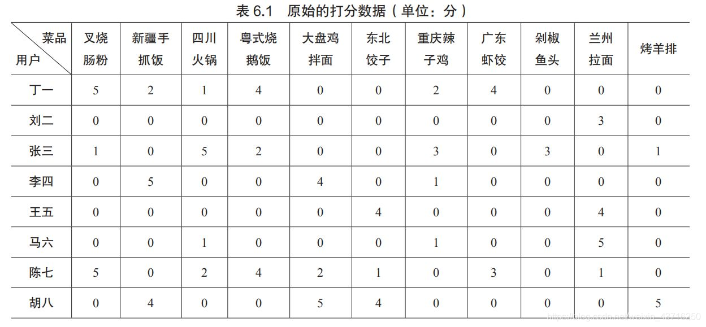
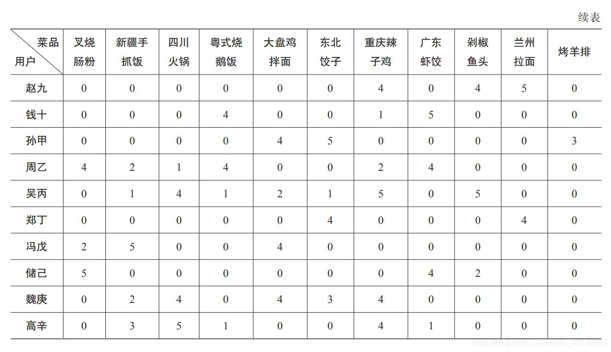
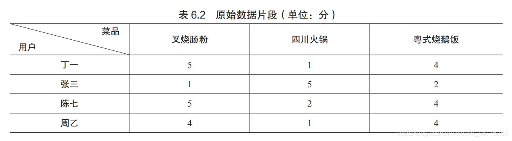

---
tags:
- 数学/线性代数
---

# 16 SVD在推荐系统中的应用

## 1.应用背景


在这一节里，我们来重点分析一下如何把 $SVD$ 的处理方法应用到推荐系统中，我们在一个实际的案例中进行探讨。

有一个风味美食平台，经营着多种不同风味儿的地方特色美食，在系统中维护着一个原始的打分表：表中的行表示各个用户，列表示各种菜品，每一个用户在对一个菜品消费之后都会对其进行打分，分数为1分~5分，分数越高表示评价越高。如果该用户没有消费某道菜品，则分数值默认为0分。

在我们的例子中，一共有18名用户对11个不同的菜品进行了打分评价，原始的打分数据如下： 

 



# 2.整体思路概述


我们首先要想一下，推荐系统到底应该推荐什么。答案很简单：就是聚焦用户没有消费过的菜品（也就是没有打过分的那些菜品），通过模型评估，分析出某个具体用户可能会喜欢的菜品，然后推荐给他，达到最大可能消费的目的。

但是问题来了，我们怎么知道这个用户会有多喜欢某个特定的未买过的菜品呢，我们又不能去实际问他。这里，我们采用所谓的**协同过滤**的思路，先通过其他所有用户的评价记录，来衡量出这个菜品和该用户评价过的其他菜品的相似程度，利用该用户对于其他菜品的已评分数和菜品间的相似程度，估计出该用户会对这个未评分菜品打出多少分。类似的，这样一来可以得到该用户所有未消费过的菜品的估计得分，拿出估分最高的菜品推荐给用户就可以了，这就是大致的总体思路。

那么归结起来这里面关键的技术点有三条：

1、衡量菜品之间的相似性 2、评分估计 3、稀疏评分矩阵的处理

# 3.如何衡量菜品之间的相似性


两个菜品，我们通过不同用户对其的打分，将其量化成一个分数向量，然后通过对两个菜品的分数向量进行分析比较，定量的进行两个菜品的相似度计算。计算相似度的方法有很多，例如，有欧式距离、皮尔逊相关系数、余弦相似度等等。

这里，我们采用余弦相似度的方法，来定量分析两个商品的相似程度，当然也可以换用其他的方法。

对于两个指定向量： $v_1$ 和 $v_2$ ，二者的余弦相似度就是用二者夹角 $\theta$ 的余弦值 $cos \theta$ 来表示：$cos \theta = \frac{v_1\cdot v_2}{|v_1||v_2|}$，余弦值的取值范围在 $-1$ 到 $1$ 之间，我们想对其进行归一化处理，通过 $0.5+0.5* \frac{v_1\cdot v_2}{|v_1||v_2|}$ 将余弦相似度划到 $0$ 到 $1$ 的范围内，此时，值越接近 $1$ 代表两个向量的相似度越高。

这里，我们用原始数据集中的一个片段进行举例： 

 我们对这个片段数据进行分析，四个顾客分别对三道菜进行了打分，于是每道菜就可以用一个 $4$ 维的列向量来进行描述，我们分别对他们两两之间进行余弦相似度的计算，来定量的分析这三道菜之间的相似度。

**代码片段：**

```
import numpy as np

scoreTable = np.mat([[5,1,4],
                      [1,5,2],
                      [5,2,4],
                      [4,1,4],
                      ])

def cosSim(vec_1, vec_2):
    dotProd = float(np.dot(vec_1.T, vec_2))
    normProd = np.linalg.norm(vec_1)*np.linalg.norm(vec_2)
    return 0.5+0.5*(dotProd/normProd)


print(cosSim(scoreTable[:,0],scoreTable[:,1]))
print(cosSim(scoreTable[:,0],scoreTable[:,2]))
print(cosSim(scoreTable[:,1],scoreTable[:,2]))
```

+ 1+ 2+ 3+ 4+ 5+ 6+ 7+ 8+ 9+ 10+ 11+ 12+ 13+ 14+ 15+ 16+ 17


**运行结果**

```
0.763307359425
0.991313756989
0.823788062901
```

+ 1+ 2+ 3


运行结果显示，叉烧肠粉和粤式烧鹅饭对应的分数向量，其余弦相似度最高，而四川火锅与这两道菜的相似度就要低一些。这也恰好符合我们的常识，毕竟叉烧肠粉和粤式烧鹅饭是有名的粤菜，和四川火锅跟他们明显不是一个风格系列的。

# 4.真实稀疏数据矩阵的降维处理


我们在计算每两道菜之间的余弦相似度的时候，必须要求找到同时吃过这两道菜的所有顾客为其所打的分值，换句话说，就是参与相似度计算的分数向量的每个元素都必须非零，且来自于相同的几个顾客。

我们的原始数据矩阵中，记录了 $18$ 位顾客对 $11$ 道菜的打分情况，因为每个人不可能吃遍美食平台上的每一道菜（确切的说一般人都只吃过少部分菜品），因此这个矩阵是一个稀疏矩阵，大量的 $0$ 项。这样一来，虽然一方面，矩阵的维数很高，但是从另一方面来看，某个顾客同时对两道菜打过分的情况却并不一定很普遍。

于是，我们在思考，是否依据数据矩阵的实际打分情况，按行对原始打分矩阵进行压缩降维，将其处理成一个低维的矩阵，然后再对其进行余弦相似度的处理。

显然这是一个好主意，我们之前讲过的 $SVD$ 按行压缩的方式就派上用场了。

首先我们整理原始矩阵，并对其进行奇异值分解：

**代码片段：**

```
scoreData = np.mat([
[5,2,1,4,0,0,2,4,0,0,0],
[0,0,0,0,0,0,0,0,0,3,0],
[1,0,5,2,0,0,3,0,3,0,1],
[0,5,0,0,4,0,1,0,0,0,0],
[0,0,0,0,0,4,0,0,0,4,0],
[0,0,1,0,0,0,1,0,0,5,0],
[5,0,2,4,2,1,0,3,0,1,0],
[0,4,0,0,5,4,0,0,0,0,5],
[0,0,0,0,0,0,4,0,4,5,0],
[0,0,0,4,0,0,1,5,0,0,0],
[0,0,0,0,4,5,0,0,0,0,3],
[4,2,1,4,0,0,2,4,0,0,0],
[0,1,4,1,2,1,5,0,5,0,0],
[0,0,0,0,0,4,0,0,0,4,0],
[2,5,0,0,4,0,0,0,0,0,0],
[5,0,0,0,0,0,0,4,2,0,0],
[0,2,4,0,4,3,4,0,0,0,0],
[0,3,5,1,0,0,4,1,0,0,0]
])

U, sigma, VT = np.linalg.svd(scoreData)
print(sigma)
```

+ 1+ 2+ 3+ 4+ 5+ 6+ 7+ 8+ 9+ 10+ 11+ 12+ 13+ 14+ 15+ 16+ 17+ 18+ 19+ 20+ 21+ 22+ 23


**运行结果：**

```
[ 18.00984878  13.34523472  11.52884033  10.1161419    7.13556169
   5.86405759   4.87893356   3.59711712   3.28710923   2.48996847
   2.06103963]
```

+ 1+ 2+ 3


我们选取的特征个数 $k$ ，取决于至少需要多少个奇异值的平方和才能达到所有平方和的 $90\%$，即我们之前介绍过的主成分贡献率的概念。

**代码片段：**

```
sigmaSum = 0

for k in range(len(sigma)):
    sigmaSum = sigmaSum + sigma[k] * sigma[k]
    if float(sigmaSum)/float(np.sum(sigma ** 2)) > 0.9:
        print(sigma[:k+1])
        break
```

+ 1+ 2+ 3+ 4+ 5+ 6+ 7


**运行结果：**

```
[ 18.00984878  13.34523472  11.52884033  10.1161419    7.13556169
   5.86405759]
```

+ 1+ 2


经过简单的处理发现，我们需要 $6$ 个奇异值，使之达到主成分贡献率的 $90\%$，于是我们就可以通过行压缩的方式，将原始的分数矩阵的行由 $18$ 维压缩到 $6$ 维，避免稀疏矩阵的情况：

我们通过行压缩的方式，对矩阵进行行压缩，在行压缩的基础上，推荐算法中通常还需要再乘以奇异值方阵，赋予其对应的权重值，最终获取降维后的 $6\times 11$ $scoreDataRC$ 行压缩矩阵。

**代码片段：**

```
sigma_K = np.mat(np.eye(6)*sigma[:6])
scoreDataRC = sigma_K * U.T[:6,:] * scoreData
print(scoreDataRC)
```

+ 1+ 2+ 3


**运行结果：**

```
[[-112.4308753  -112.87222698 -124.19623361 -105.3993477  -111.288632
   -73.59389971 -135.0414711  -100.44297783  -64.70437823  -40.78142832
   -36.26815254]
 [  72.48369701  -41.51056586   -2.73164141   63.4068466   -80.85031966
   -74.17305344   -5.56275757   78.96337678   -0.5442874   -22.36535334
   -43.68006783]
 [ -37.12342785  -37.62324399   48.30321076  -12.27825448  -44.01558208
   -15.58603044   61.15421157  -29.1271841    51.75734522   48.33639061
   -24.5927832 ]
 [  17.52124987  -26.0972729   -31.74323843    6.7731707    -9.84514566
    43.42277156  -20.38567072   17.78646057   -3.58400334   75.2486827
     6.44560751]
 [  -4.65216236  -30.40184468   14.31575194    8.88222668   -3.18752866
    25.17373196   -2.36071622    3.80908229    0.60261906  -21.93806491
    14.73475607]
 [  12.3915557    -6.28064351  -10.81041971   -9.75679724    6.46828122
    -3.64007586   -1.80356759   -1.88718634   25.44954779   -5.17787313
     6.4052445 ]]
```

+ 1+ 2+ 3+ 4+ 5+ 6+ 7+ 8+ 9+ 10+ 11+ 12+ 13+ 14+ 15+ 16+ 17+ 18


后面，我们就利用 $scoreDataRC$ 这个矩阵来进行各个菜品之间相似度的计算。

# 5.评分估计


当我们顺利的得到菜品之间两两相似度的值时，我们就可以基于此进行某顾客未购菜品的评分估计了。

基本思想就是，利用该顾客已经评过分的菜品分值，来估计某个未评分菜品的分值，令我们要估计的菜品为 $G_x$，该顾客已经评过分的菜品为 $G_a,G_b,G_c$，评过的分数分别对应为：$Score_a,Score_b,Score_c$，这三件菜品与 $G_x$ 的相似度分别为： $Sim_a,Sim_b,Sim_c$，由此，我们利用相似度加权的方式，来估计 $G_x$ 的评分值 $Score_x$：

$Score_x=\frac{Score_a\cdot Sim_a+Score_b\cdot Sim_b+Score_c\cdot Sim_c}{Sim_a+Sim_b+Sim_c}$

通过这种方法，可以估计出该顾客所有未买过的菜品的评分，然后取估计值最高的某个菜品（或某 $n$ 个），作为推荐的菜品推送给客户，这是我们猜测的该客户没有吃过的菜品中可能最喜欢的一道。

按照这个方法，我们来估计一下，排在最后一行的顾客**高辛**，他没吃过的那些菜中，最喜欢的可能会是哪一道菜：

我们先按照上面的评分公式以及余弦相似度的函数，来写一个未打分菜品的评分函数：

**代码片段：**

```
def estScore(scoreData,scoreDataRC,userIndex,itemIndex):
    n = np.shape(scoreData)[1]
    simSum = 0
    simSumScore = 0
    for i in range(n):
        userScore = scoreData[userIndex,i]
        if userScore == 0 or i == itemIndex:
            continue
        sim = cosSim(scoreDataRC[:, i], scoreDataRC[:, itemIndex])
        simSum = float(simSum + sim)
        simSumScore = simSumScore + userScore * sim
    if simSum == 0:
        return 0
    return simSumScore / simSum
```

+ 1+ 2+ 3+ 4+ 5+ 6+ 7+ 8+ 9+ 10+ 11+ 12+ 13+ 14


这个函数看上去比较复杂，我们花点时间好好分析一下。整个函数的作用是估计第 $userIndex$ 个用户对第 $itemIndex$ 个菜品（此菜品应为未打分的菜品）的评分。函数的四个参数分别表示为：

$scoreData$：表示原始的用户-菜品打分矩阵； $scoreDataRC$： 表示 $scoreData$ 经过 $SVD$ 处理后的行压缩矩阵； $userIndex$：该用户位于 $scoreData$ 矩阵中的行索引； $itemIndex$：该菜品位于 $scoreData$ 矩阵中的列索引；

我们分析一下整个代码的关键点：

**第 $2$ 行**：获取原始的用户-菜品打分矩阵的列数，也就是菜品的总个数；

**第 $3$ 行**：对于该 $userIndex$ 用户， $simSum$ 变量用来记录该 $itemIndex$ 菜品与其他已打分菜品相似度的和；

**第 $4$ 行**：对于该 $userIndex$ 用户，$simSumScore$ 变量用来记录该 $itemIndex$ 菜品与其他已打分菜品的加权相似度之和，其中权重就是该用户对其他已打分菜品的打分值；

**第 $5$ 行-第 $11$ 行**：遍历所有菜品，计算 $simSum$ 和 $simSumScore$ 这两个量；

**第 $9$ 行**：利用 $SVD$ 处理后的行压缩矩阵，得到指定的 $itemIndex$ 菜品与第 $i$ 个菜品之间的相似度；

**第 $14$ 行**：按照定义的公式，返回预估的评分值。

# 6.菜品推荐结果


最后到了揭开谜底的时刻了，在高辛没有评分过的那些菜品中，他最可能喜欢吃的是哪道菜呢？

很简单，我们利用上面 $estScore$ 评分函数，对所有未评分的菜品进行预估打分，然后我们选取分数最高的一道菜品，就可以认为是高辛最可能打高分的（也就是可能最爱吃的）菜品，并推荐给他。

***代码片段：***

```
n = np.shape(scoreData)[1]
userIndex = 17
for i in range(n):
    userScore = scoreData[17, i]
    if userScore != 0:
        continue
    print("index:{},score:{}".format(i, estScore(scoreData, scoreDataRC, userIndex, i)))
```

+ 1+ 2+ 3+ 4+ 5+ 6+ 7


***运行结果：***

```
index:0,score:2.6347116715331174
index:4,score:2.925989345977112
index:5,score:2.933723884808588
index:8,score:2.9657073178482745
index:9,score:2.9057073432965526
index:10,score:2.9263484655262872
```

+ 1+ 2+ 3+ 4+ 5+ 6


从程序的运行结果中，我们可以看出，$index=8$ 的菜品得分最高，可以推荐给高辛，通过查表我们发现，这道菜是剁椒鱼头。我们看到，高辛的已打分菜品中，四川火锅和重庆辣子鸡得分很高，看来他喜欢吃口味偏辣的菜品，因此这个推荐是合理有效的。

那我们再多观察一下，在这些未打分的菜品中，高辛可能最不愿意吃的又是哪道菜呢？通过运行结果观察发现，是 $index=0$ 的菜品，这道菜得分最低，查表发现，这道菜是叉烧肠粉，这个和高辛对其他两道粤菜打分偏低的情况也是一致的。

# 7.小结


至此，我们就学习完了整个协同过滤的全过程，最后总结一下里面的几个关键步骤：

第一步：获取原始的用户-菜品打分矩阵 $scoreData$；

第二步：利用 $SVD$ 处理原始矩阵 $scoreData$，获取行压缩矩阵 $scoreDataRC$；

第三步：针对指定的 $userIndex$ 用户以及指定的 $itemIndex$ 未打分菜品，基于 $scoreDataRC$ 矩阵的数据，采用余弦相似度计算出该菜品与所有已打分菜品的相似度；

第四步：利用公式 $Score_x=\frac{Score_a\cdot Sim_a+Score_b\cdot Sim_b+Score_c\cdot Sim_c}{Sim_a+Sim_b+Sim_c}$，计算出该指定菜品的预估分数；

第五步：计算出该 $userIndex$ 用户所有未打分菜品的预估分数值，将预估分数最高（或前 $n$ 高）的菜品推荐给他。