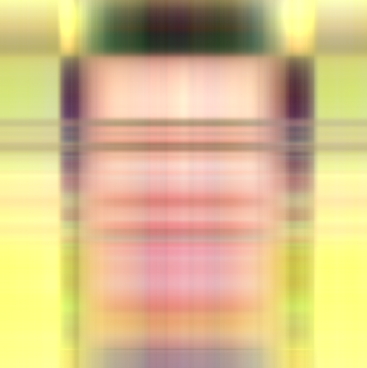
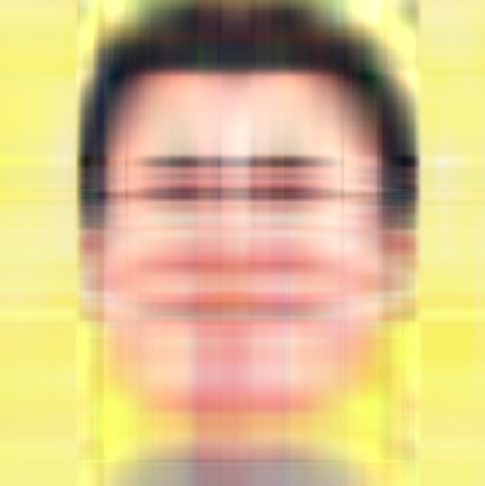
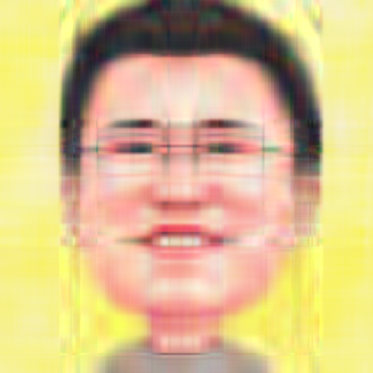
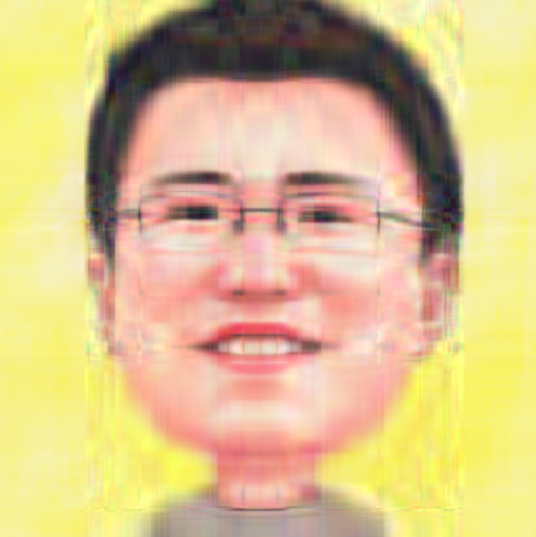

---
tags:
- 数学/线性代数
---

# 17 利用 SVD 进行彩色图片压缩

这一节，我们再来介绍一个 [奇异值分解](https://so.csdn.net/so/search?q=%E5%A5%87%E5%BC%82%E5%80%BC%E5%88%86%E8%A7%A3&spm=1001.2101.3001.7020) 的实际案例：即如何基于SVD的主成分分析方法，来对一张彩色图像进行压缩处理。

## 1.图像的数据表示

很明显，如果要对一张图像进行压缩，首先我们得知道应该如何用数据的形式来表示一张具体的图像，在此基础上才能进行下一步的数据压缩处理。那么首先我们利用 python 中的第三方工具 $pillow$，来读取一张样例图片，观察他的参数信息。

这里我们要处理的样例图片如下：


这里要提醒一下大家，由于 $pillow$ 库是第三方工具，不是 $python3$ 自带的库文件，因此在使用前需要提前用 pip 工具进行安装，当然这个过程很简单：

***代码片段：***

```bash
pip install pillow
```

安装完毕后，我们利用 $pillow$ 工具读取我们的测试图片，观察他的一些参数信息：

***代码片段：***

```python
import numpy as np
from PIL import Image

oriImage = Image.open(r'e:\\test.png', 'r')
imgArray = np.array(oriImage)
print(imgArray.shape)
print(imgArray)
```

***运行结果：***

```
(537, 536, 4)

[[[248 243 173 255]
  [250 244 176 255]
  [247 242 169 255]
  ..., 
  [247 242 178 255]
  [245 241 173 255]
  [246 242 175 255]]

 [[249 244 170 255]
  [249 243 172 255]
  [248 242 168 255]
  ..., 
  [246 241 177 255]
  [247 243 179 255]
  [246 242 180 255]]

 [[249 244 169 255]
  [248 242 171 255]
  [249 243 175 255]
  ..., 
  [246 241 173 255]
  [246 242 175 255]
  [246 242 177 255]]

 ..., 
 [[246 241 180 255]
  [246 241 184 255]
  [246 240 185 255]
  ..., 
  [248 243 150 255]
  [247 243 139 255]
  [247 242 138 255]]

 [[246 242 172 255]
  [245 241 174 255]
  [245 242 176 255]
  ..., 
  [247 243 143 255]
  [247 242 142 255]
  [250 243 144 255]]

 [[246 242 174 255]
  [245 242 176 255]
  [246 242 179 255]
  ..., 
  [247 242 145 255]
  [250 242 151 255]
  [248 243 147 255]]]
```

从程序的运行结果来看，这张图片被表示成为了一个三维的 $ndarray$ 数组 $imgArray$，数组的维度是 $537\times 536 \times 4$，这里他有一个更加专业的名称：$3D$ 张量，由图像的三个维度信息所构成：高度、宽度和颜色通道。

高度和宽度的概念我们无须多言，他们分别表示在高和宽的维度上各有多少个像素点，程序的运行结果告诉我们：这张图就是高度 $\times$ 宽度为 $537 \times 536$ 的像素点阵。而颜色通道就用来具体对应的描述每个像素点的颜色信息，明确每个位置上的像素点颜色，如此一来就构建出了整幅完整的图像。

我们在样例中使用的是一张 $png$ 格式的图片，从程序运行结果来看，$png$ 的颜色通道维数是 $4$ 维，依次分别对应 $RGBA$ 四个通道的取值，每个通道都是 $8$ 位无符号整形数，取值范围 $0-255$ 之间。

这四个通道分别表示的含义相信大家不会陌生，$RGB$ 分别代表红色、绿色和蓝色三个通道，通过对不同取值的三个通道进行叠加从而可以产生各种所需的颜色，而最后一个 $A$ 通道，表示不透明度参数，取值越大表示图像的不透明度越高，如果取值 $255$，则表示这是一张完全不透明的图像。

## 2.先谈谈灰度图的处理

灰度图的压缩比较简单直观，很多资料也喜欢拿他举例子。灰度图说的更直白一些就是我们原来常见的黑白图片。在这种情况下，颜色通道只用一维就可以了，通过 $0-255$ 范围内的不同取值，用来表示白-灰-黑的程度。

这样的情况比较好处理，原来的 $3D$ 张量退化成一个简单的矩阵（我们称其为 $img$ 矩阵）， $img$ 矩阵的形状就是图像的高 $\times$ 宽，而矩阵的元素值就是对应像素的灰度值（取值 $0-255$ ）。

得到了用来表示灰度图像的 $img$ 矩阵，接下来的处理就很简单了，我们通过对 $img$ 矩阵进行奇异值分解，获取了 $U$，$sigma$，$V^T$ 三个矩阵，按照压缩的需要，我们取前 $k$ 个奇异值以及对应的左、右特征向量，就能通过下面的公式完成图像的压缩重建：

$img \approx \sigma_1 u_1 v_1^T+\sigma_2 u_2 v_2^T+\sigma_3 u_3 v_3^T + … +\sigma_ku_kv_k^T$

这个思路我们在前面的章节里提到过，相信大家很容易就能理解。

## 3.彩色图像的压缩处理思路

但是，目前的实际情况要稍稍复杂一些，$png$ 格式的彩色图像不同于灰度图，他有四个颜色通道，我们该如何处理呢？这里我们提供一个解决方案，当然如果读者有更好的思路和想法，也可以集思广益，多多交流。

我们的解决思路分为三步：

第一步：通道分离。对于 $png$ 格式的彩色图片，拥有四个颜色通道 $RGBA$，那我们可以尝试着先将每个颜色通道进行分离，产生四个形状一样，均为图像高 $\times$ 宽的单通道矩阵： $imgR$、$imgG$、$imgB$、$imgA$。

第二步：矩阵压缩。对每个单通道矩阵进行奇异值分解，取前 $k$ 个奇异值，进行四个单通道矩阵的压缩重建，分别形成四个压缩后的矩阵：$imgRC$、$imgGC$、$imgBC$、$imgAC$。

第三步：图像重建。我们将四个压缩后的单通道矩阵合并形成表示 $png$ 格式的 $3D$ 张量，通过该 $3D$ 张量来重构出压缩后的彩色图像。

## 4.代码实现及试验结果

我们按照上面分析的三步思路，利用 python 来具体实现彩色图片的压缩。

第一步，我们首先进行通道分离，我们将 $imgArray$ 数组中的每个通道分别单独抽取出来，得到 $4$ 个高 $\times$ 宽的二维数组，每个位置上的取值就是对应像素的某个颜色通道的取值：

***代码片段：***

```python
R = imgArray[:, :, 0]
G = imgArray[:, :, 1]
B = imgArray[:, :, 2]
A = imgArray[:, :, 3]

print(R)
print(G)
print(B)
print(A)
```

***运行结果：***

```
[[248 250 247 ..., 247 245 246]
 [249 249 248 ..., 246 247 246]
 [249 248 249 ..., 246 246 246]
 ..., 
 [246 246 246 ..., 248 247 247]
 [246 245 245 ..., 247 247 250]
 [246 245 246 ..., 247 250 248]]

[[243 244 242 ..., 242 241 242]
 [244 243 242 ..., 241 243 242]
 [244 242 243 ..., 241 242 242]
 ..., 
 [241 241 240 ..., 243 243 242]
 [242 241 242 ..., 243 242 243]
 [242 242 242 ..., 242 242 243]]

[[173 176 169 ..., 178 173 175]
 [170 172 168 ..., 177 179 180]
 [169 171 175 ..., 173 175 177]
 ..., 
 [180 184 185 ..., 150 139 138]
 [172 174 176 ..., 143 142 144]
 [174 176 179 ..., 145 151 147]]

[[255 255 255 ..., 255 255 255]
 [255 255 255 ..., 255 255 255]
 [255 255 255 ..., 255 255 255]
 ..., 
 [255 255 255 ..., 255 255 255]
 [255 255 255 ..., 255 255 255]
 [255 255 255 ..., 255 255 255]]
```

从程序运行的结果来看，我们成功得到了 $4$ 个 $2$ 维 $ndarray$ 数组。

第二步，我们来看看算法的核心部分，也就是利用 $SVD$ 算法来压缩各个通道矩阵：

***代码片段：***

```python
def imgCompress(channel,percent):
    U, sigma, V_T = np.linalg.svd(channel)
    m = U.shape[0]
    n = V_T.shape[0]
    reChannel = np.zeros((m,n))

    for k in range(len(sigma)):
        reChannel = reChannel + sigma[k]*np.dot(U[:,k].reshape(m,1),V_T[k,:].reshape(1,n))
        if float(k)/len(sigma) > percent:
            reChannel[reChannel < 0] = 0
            reChannel[reChannel > 255] = 255
            break
            
    return np.rint(reChannel).astype("uint8")
```

这里我们对代码进行重点解析，这是一个完成通道矩阵压缩的功能函数，函数的参数有两个，$channel$ 表示需要进行压缩处理的单个颜色通道矩阵，$percent$ 表示利用 $SVD$ 进行矩阵重建的过程中，保留奇异值的百分比。

第 2 行：对通道矩阵进行奇异值分解；

第 3~5 行：初始化 $m \times n$ 大小的全零矩阵 $reChannel$。

第 7~8 行：依照 $percent$ 参数值，取前 $k$ 个奇异值，按照 $\sigma_1 u_1 v_1^T+\sigma_2 u_2 v_2^T+\sigma_3 u_3 v_3^T + … +\sigma_ku_kv_k^T$ 的公式，重建出经过压缩处理的通道矩阵 $reChannel$ 。

从代码中我们还需要注意到几个非常重要的数据处理细节，一方面需要把处理后得到的数据约束到 $0-255$ 的取值范围内，这是最终进行图像显示的要求，另一方面要求对数值进行取整，数据类型为 8 位无符号整形数。

第三步，我们最后完成通道重建工作，将经过 $SVD$ 处理的四个单通道矩阵合并成表示 $RGBA$ 四通道的完整 $3D$ 张量，并在此基础上观察不同奇异值取值比例下的图像压缩效果。

***代码片段：***

```python
for p in [0.001,0.005,0.01,0.02,0.03,0.04,0.05,0.1,0.2,0.3,0.4,0.5,0.6,0.7,0.8,0.9]:
    reR = imgCompress(R, p)
    reG = imgCompress(G, p)
    reB = imgCompress(B, p)
    reA = imgCompress(A, p)
    reI = np.stack((reR, reG, reB, reA), 2)

    Image.fromarray(reI).save("{}".format(p)+"img.png")
```

上面的代码片段中，我们的变量 $p$ 表示取所有奇异值的前多少比例，例如第一个参数取值是 $0.001$，就表示取前 $0.1\%$ 个奇异值来构建压缩的图像。

我们可以观察一下，不同奇异值取值比例下的图像显示效果：

***试验结果：***



图 7.2.取前 0.1% 的奇异值重建的图像



图 7.3.取前 0.5% 的奇异值重建的图像



图 7.4.取前 1% 的奇异值重建的图像



图 7.5.取前 2% 的奇异值重建的图像


图 7.6.取前 5% 的奇异值重建的图像


图 7.7.取前 10% 的奇异值重建的图像


图 7.8.取前 20% 的奇异值重建的图像


图 7.9.原图

从试验的运行结果对比来看，使用前 $1\%$ 的奇异值重建图像，就能大致观察出原始图像的主要特征；使用前 $10\%$ 的奇异值重建出来的图像，就相对比较清晰了。而用前 $20\%$ 的奇异值重建出来的图像，用肉眼观察，清晰度就和原图没有太大的区别了，这就较好的实现了压缩图像存储空间的效果。

这就是利用 SVD 方法对彩色图像进行压缩的思路和操作过程。