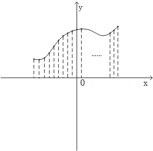

---
tags:
- 数学/线性代数
---

# 18 傅里叶级数：从向量的角度看函数

## 1 函数：无穷维向量

空间是整个线性代数理论与实践的核心概念，在这一节中我们再一次的遇见了他。我们先简要的回顾一下之前介绍过的向量空间有关概念。向量空间 $R^n$ 由所有含有 $n$ 个成分的列向量所构成。比如，$R^4$ 空间中就包含了所有含有 $4$ 个成分的列向量 $\begin{bmatrix}x_1\\x_2\\x_3\\x_4\end{bmatrix}$， 因此 $R^n$ 空间也称为是 $n$ 维空间，并且在这个向量空间 $R^n$ 当中，我们还定义了向量的加法、标量乘法以及内积等基本运算法则。

在这里我们其实还想要多说一点的是，我们一直所讨论的向量空间 $R^n$ 是一个有限维的空间，即：向量中的成分个数是有限的。而接下来，我们会把思路进一步的打开，将空间的概念从狭义引申到广义，去探讨一下函数和向量之间的关联。

函数的概念相信大家并不会感到陌生，函数反映的是自变量和因变量之间的一种映射关系，如果我们给定自变量元素 $x$，对他施加映射规则 $f$，就得到了因变量元素 $y$，即我们所熟悉的表示方法：$y=f(x)$。这种看待问题的角度来源于函数的基本定义，但是从中我们似乎找不到函数和向量有什么关联。

这是因为我们根深蒂固的会从解析式的角度去看待函数，关注的是他的映射规则。如果从更直接的角度去看待呢？回顾一下我们绘制一条函数曲线的过程，我们会对应的在坐标系中对各个自变量的取值进行描点，然后将这些点连接成函数曲线。我们会发现：如果自变量的取值越密集，那么所描绘出来的曲线就越趋近于原始的函数曲线，当 $\Delta x\rightarrow 0$ 的时候，通过描点法绘制出来的曲线就和真实的函数曲线无异了。

那么此时，如果我们对函数曲线依照 $\Delta x$ 的间隔进行均匀采样，如图 7.1 所示，就能得到一组采样值 $y_1,y_2,y_3,y_4,……$，特别的，当采样间隔 $\Delta x\rightarrow 0$ 的时候，这一组采样值就能够完全的代表这个函数了。



此时，如果我们利用向量工具对这一组函数值进行表示，即表示为 $\begin{bmatrix}y_1\\y_2\\\dots\\y_m\\y_{m+1}\\\dots\end{bmatrix}$，他就和函数很自然的对应了起来，这是一种返璞归真的思路和方法。并且最为重要的一点是，由于自变量 $x_m$ 和 $x_{m+1}$ 之间的间距 $\Delta x\rightarrow 0$，因此采样的个数，即向量中的成分个数是无限的，由此我们又可以说：我们成功的把函数放到了一个无穷维的向量空间当中去了。

建立起了这种对应关系，我们就可以采用向量空间中介绍过的运算法则和相关概念，来进一步讨论构建在空间中的函数运算性质。在本节后面的内容中，我们都将采用这种类比的方法进行讲解。

## 2 寻找一组正交的基函数

一旦我们将函数看作是无穷维空间中的向量，我们自然而然的就可以将 $n$ 维向量空间 $R^n$ 中的内积定义进行迁移。

我们在之前的章节中曾经谈到过，向量的坐标基于基底的选取，向量空间 $R^n$ 中的任何一个 $n$ 维向量 $v$ 都可以写成 $n$ 个基向量 $e_1,e_2,e_3,…,e_n$ 线性组合的形式，即：$v=x_1e_1+x_2e_2+x_3e_3+…+x_ne_n$ ，并且这种表示方法是唯一的，我们在此基础上对向量进行进一步的变换和分析。

那么如果从向量的角度去审视函数，我们能否将一个指定的函数 $f(x)$ 写成一组基函数的组合呢？答案是肯定的，并且正如同基向量的选取有很多种选择一样，基函数也有不同的多种选择，那么什么样的基函数才能称得上是好的基函数呢？关于这一点，我们同样去从向量空间中寻找答案。

在向量空间中，标准正交向量满足彼此无关，且同时满足向量为单位长度的特性，我们一般使用一组标准正交向量作为基向量，他们性质优越、操作简便。我们以此类推，是否也应该选取类似性质的一组函数作为 $f(x)$ 在无穷维向量空间中的基函数呢？答案也是肯定的，下面就让我们按照这个思路去寻找和讨论。

验证两个向量是否满足正交，需要进行的是向量的内积运算，我们回顾一下两个 $n$ 维向量 $u$ 和 $v$ 进行内积运算的运算法则：

$$\begin{aligned}

u \cdot v &= \begin{bmatrix}u_{1} \\u_{2} \\u_{3} \\\cdots \\u_{n}\end{bmatrix} \cdot \begin{bmatrix} v_{1} \\v_{2} \\v_{3} \\\ldots \\v_{n}\end{bmatrix}\\

&= u_{1} v_{1}+u_{2} v_{2}+u_{3} v_{3}+\ldots+u_{n} v_{n} \\
& = \sum_{k  = 1}^{n} u_{k} v_{k}
\end{aligned}$$

如果要满足向量 $u$ 和向量 $v$ 之间彼此正交，则他们的内积运算结果必须为 $0$，即：$u\cdot v=0$。

那么两个函数 $f(x)$ 和 $g(x)$ 的内积该如何进行表示呢？很显然，由于他们被表示成了向量，直观上看函数的内积表示形式同向量相比应该是一样的，但是在这里我们需要注意两个要点：一方面是参与内积运算的两个向量的维数都是无穷的；另一方面他们的采样间隔都是趋近于 $0$。因此很自然，离散量的加和运算演变成了连续量的积分运算，两个无穷维向量的内积运算本质上就是两个函数乘积的积分（这是微积分里的基本概念，相信大家不会感到陌生），因此，我们可以将函数 $f(x)$ 和 $g(x)$ 的内积表示成：

$f(x)\cdot g(x)=\int_{a}^{b}f(x)g(x)$

如果积分运算的结果为 $0$，则表示这两个函数满足彼此正交的关系，即有希望被我们选择作为基函数。

我们来看一个实际的例子，计算一下我们熟悉的正弦函数 $sin x$ 和余弦函数 $cos x$ 的内积，由于他们都是周期为 $2\pi$ 函数，因此我们计算 $[0,2\pi]$ 范围内的积分结果：

***代码片段：***

```python
from sympy import integrate, cos, sin
from sympy.abc import x
import numpy as np

e = integrate(sin(x)*cos(x), (x, 0, 2*np.pi))
print(e.evalf())
```

***运行结果：***

```
0
```

从代码的运行结果中我们可以看到：积分运算的结果为 $0$，即两个函数的内积为 $0$，说明他们彼此之间是满足正交的，这个结果正如我们所期待。但是，仅仅由正弦函数 $sin x$ 和余弦函数 $cosx$ 作为基函数是远远不够的，因为从基向量的相关概念中我们知道，$n$ 维向量空间 $R^n$ 中的任意一个向量都被表示为空间中 $n$ 个基向量的线性组合形式，而我们将函数视作是无穷维的向量，因此通过类比可知，我们需要的不是两个基函数，而是一组满足彼此之间两两正交的无穷序列作为基函数。

寻找和构造一组这样的基函数，似乎是一个无从下手的难题，但是正如自然界中鬼斧神工的奇山异水一样，数学的世界里确实是存在让你啧啧称奇的完美结果。正弦函数和余弦函数的正交性不仅仅局限在 $sinx$ 和 $cosx$ 这两个函数，实质上，下面这个正余弦函数的无穷序列两两之间都满足正交性：

$1(cos 0x),sinx,cosx,$$sin2x,cos2x,sin3x,$$cos3x,…,sinnx,cosnx,…$

类似的这种无穷序列正是我们想要的，他是针对函数这个无穷维向量的一组好基。$sinnx$ 和 $cosmx$，$(m\neq n)$，满足正交性的推演过程并不难，也是通过验证二者的乘积在 $[0,2\pi]$ 取值范围内的积分是否为 $0$，具体的计算过程我们就不在这里展开了，我们随意举几个实例来验算一下：

***代码如下：***

```python
from sympy import integrate, cos, sin
from sympy.abc import x
import numpy as np

e1 = integrate(sin(2*x)*cos(5*x), (x, 0, 2*np.pi))
e2 = integrate(sin(4*x)*cos(0*x), (x, 0, 2*np.pi))
e3 = integrate(sin(x)*cos(2*x), (x, 0, 2*np.pi))
print(e1.evalf())
print(e2.evalf())
print(e3.evalf())
```

***运行结果***

```
0
0
0
```

通过程序的运行结果，我们发现确实该序列中的函数两两之间满足正交的关系。当然了，满足彼此正交的基函数不仅仅只有这一种，在本书当中我们将重点讨论这一种情况，其他的例子有兴趣的读者可以查阅相关资料。

## 3 周期函数与傅里叶级数

函数可以分为周期函数和非周期函数两个大类，我们首先从周期函数入手去展开讨论，首先我们从一个指定周期 $2\pi$ 为的函数 $f(x)$ 开始进行分析，这是最基本、最典型的一种情况。

有了这组由正余弦函数无穷序列所构成的正交基函数，我们就可以按照之前的思路对函数 $f(x)$ 进行处理，我们在无穷维的空间中，在正余弦函数所构成的基上进行函数展开，将函数 $f(x)$ 写成他们的线性组合的形式：

$$f(x)=a_0+a_1cosx+b_1sinx+a_2cos2x+b_2sin2x+a_3cos3x+b_3sin3x+……$$

我们接着把上面的式子写成展开式的形式：

$$f(x)=a_0+\sum_{k=1}^{+\infty}{[a_kcos(kx)+b_ksin(kx)]}$$

这种级数的展开形式可谓是大名鼎鼎，他就是周期为 $2\pi$ 的函数 $f(x)$ 的傅里叶级数，这里有几点我们需要注意一下：

**第一**：从展开式中我们可以看出，周期为 $2\pi$ 的函数 $f(x)$ 被表示成了正弦函数 $sin(kx)$ 和余弦函数 $cos(kx)$ 所构成的基函数的线性组合，并且在通常的情况下，基函数的个数是无穷多个。

**第二**：我们确实是实现了我们制定的重大目标，这一组基函数是彼此正交的。

**第三**：按照傅里叶级数对函数 $f(x)$ 进行展开的操作，其物理意义是非常重大的。如果我们把函数 $f(x)$ 的自变量 $x$ 替换成 $t$，可能大家会更加豁然开朗。

$$f(t)=a_0+\sum_{k=1}^{+\infty}{[a_kcos(kt)+b_ksin(kt)]}$$

我们利用这个等式建立起了时域和频域的桥梁，等式的左侧是关于时间 $t$ 的函数，而右侧则是一系列不同频率谐波的叠加，且这些谐波的频率都是周期函数 $f(t)$ 频率的整数倍。

我们通过傅里叶级数，很巧妙的拿到了周期函数用不同频率谐波叠加的表达方式，这样一来我们可以非常直观的去除掉某个指定频率的成分，这在信号处理的领域中是最为重要也最为基础的概念。如果我们仅仅是去观察时域中的函数曲线 $f(t)$，想要实现上述的滤波功能，看似是根本不可能的，而一旦通过傅里叶级数将时域函数 $f(t)$ 转换到频域当中，这个滤波的过程就变得相当简单了。关于傅里叶级数的应用我们也就点到为止，如果读者感兴趣，可以去查阅信号处理的相关资料。

更一般的，如果时域中的函数 $f(t)$ 是任意周期 $T$，那么我们用于傅里叶级数展开的基频率就是 $\omega_0=\frac{2\pi}{T}$（在前面周期为 $2\pi$ 的例子中，基频率就是 $\omega_0=\frac{2\pi}{2\pi}=1$），傅里叶级数中所有正余弦函数的频率都是基频率的整数倍，依次为：$\omega_0,2\omega_0,3\omega_0,…,n\omega_0,…$。最终，对于周期为 $T$ 的时域函数 $f(t)$，对他的傅里叶级数进行一般化的描述，就记作为：

$$f(t)=a_0+\sum_{k=1}^{+\infty}{[a_kcos(k\omega_0t)+b_ksin(k\omega_0t)]}$$

## 4 傅里叶级数中的系数

通过 $f(t)=a_0+\sum_{k=1}^{+\infty}{[a_kcos(k\omega_0t)+b_ksin(k\omega_0t)]}$ 这个重要的式子，我们架起了时域和频域之间的联通桥梁，从一个随着时间 $t$ 不断变化的函数曲线中提取出了他的频谱。傅里叶级数中的 $a_0,a_1,b_1,a_2,b_2,…,a_n,b_n$ 等称之为傅里叶系数，他反映了各个用来叠加的谐波幅度，体现了各个频率分量在总的信号中所占的分量。

是不是有一种似曾相识的感觉？这种级数展开的形式其实在我们这本书的介绍中前前后后已经出现了好几次，并且都是非常重要的关键点，本质上都是将待处理的对象进行分解，将其转换到一组选定的正交基上，并且用一些指标来衡量各个正交基所代表成分的重要性程度。

我们一起来回忆一下前面出现过的几种类似情况：

在主成分分析的过程中，我们选取的正交基是数据协方差矩阵 $C$ 的 $n$ 个标准正交特征向量，我们利用特征向量所对应的特征值来衡量他们的优先顺序；

在利用奇异值分解进行数据压缩的过程中，我们把待压缩的数据矩阵写成 $A=\sigma_1u_1v_1^T+\sigma_2u_2v_2^T+\sigma_3u_3v_3^T+…+\sigma_ru_rv_r^T$ 的形式，其中展开式里每一个 $u_iv_i^T$ 相乘的结果都是一个等维的 $m×n$ 形状的矩阵，并且他们彼此之间都满足相互正交的关系，前面的系数 $\sigma_i$ 则是各个对应矩阵的权重值。$\sigma_1>\sigma_2>\sigma_3>…>\sigma_r$ 的不等关系则依序代表了各个矩阵片段“重要性”的程度；

有没有一种殊途同归的感觉，我们把待分析的对象分解到了一组基上，这些基的具体形态各异，他们可以是向量，可以是矩阵，也可以是函数，而这些基因为相互正交而彼此无关，这些彼此无关的成分由于其拥有不同的权重，从而提供给了我们处理具体问题的量化依据。

正因为如此，求取傅里叶级数的系数就显得非常重要，表面上看我们的已知信息并不多，而级数却又是无穷级数，那么这应该如何处理呢？

实际上，我们只需要抓住各个基函数彼此之间满足正交的特性就可以很容易的进行处理了，傅里叶级数 $f(t)=a_0+\sum_{k=1}^{+\infty}{[a_kcos(k\omega_0t)+b_ksin(k\omega_0t)]}$ 中的各项除了与自身以外，与其他各项都保持正交，依据此项特性，对于任意系数 $a_n$ 而言，我们有：

$$\begin{aligned}
\int_{t_0}^{t_0+T}f(t)cos(n\omega_0t)dt&=\int_{t_0}^{t_0+T}\{a_0+\sum_{k=1}^{+\infty}{[a_kcos(k\omega_0t)+b_ksin(k\omega_0t)]}\}cos(n\omega_0t)dt\\
&=\int_{t_0}^{t_0+T}a_ncos^2(n\omega_0t)dt
\end{aligned}$$

同理，对于系数 $b_n$ 而言同样有：

$$\begin{aligned}
\int_{t_0}^{t_0+T}f(t)sin(n\omega_0t)dt&=\int_{t_0}^{t_0+T}\{a_0+\sum_{k=1}^{+\infty}{[a_kcos(k\omega_0t)+b_ksin(k\omega_0t)]}\}sin(n\omega_0t)dt\\
&=\int_{t_0}^{t_0+T}b_nsin^2(n\omega_0t)dt
\end{aligned}$$
这里的积分运算并不太难，我们就不具体推演了，最后我们直接给出傅里叶级数系数的表达式：

$$a_0=\frac{1}{T}\int_{t_0}^{t_0+T}f(t)dt$$

$$a_n=\frac{2}{T}\int_{t_0}^{t_0+T}f(t)cos(n\omega_0t)dt$$

$$b_n=\frac{2}{T}\int_{t_0}^{t_0+T}f(t)sin(n\omega_0t)dt$$

由此，我们就求得了傅里叶级数的各个系数。

## 5 非周期函数与傅里叶变换

讨论完了周期函数，自然我们不能遗漏掉了非周期函数的情况。在周期函数的傅里叶级数中与函数周期 $T$ 密切相关的量就是基频率 $\omega_0$，基函数中任意一个正余弦函数的频率都是他的整数倍，这个我们之前已经讲过，换句话说，$\omega_0$ 表示的就是从时域转换到频域之后，频谱中各相邻频率的间隔。

而我们可以把非周期函数看做是周期 $T$ 无穷大的周期函数，因此，频率间隔 $\omega_0=\frac{2\pi}{T}\rightarrow 0$，谱线越来越密，最终由离散谱变成了连续谱。

## 6 思维拓展分析

其实傅里叶分析的具体细节远远不止这些，想要更深入、更细致的掌握他还需要花些功夫，当然这些细节并不是我们本书的核心重点。

通过这一节内容的讨论，主要目的是对我们的思维进行拓展，把线性代数的一些运算方法和处理思想从传统的向量空间拓展到无穷维的函数空间中去。我们通过把向量的内积、正交等运算概念进行类比引入，实现对正交的函数基的概念定义和方法运用，巧妙的连接起时域和频域，这非常有助于我们去体会向量与函数的共通之处，当然这也是本章内容的写作初衷。