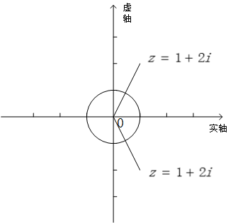
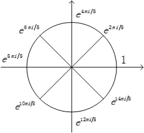
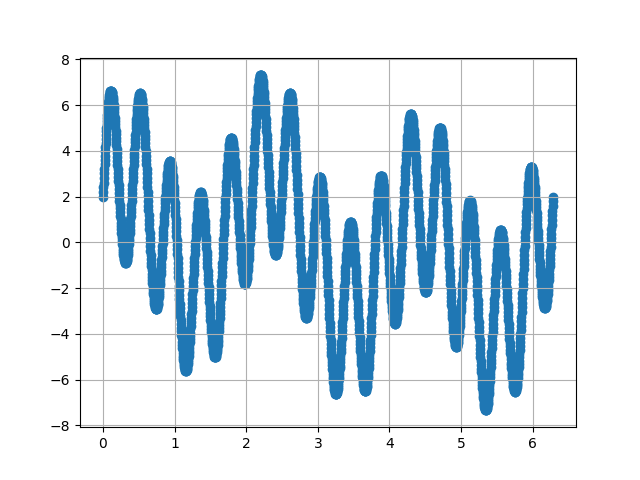
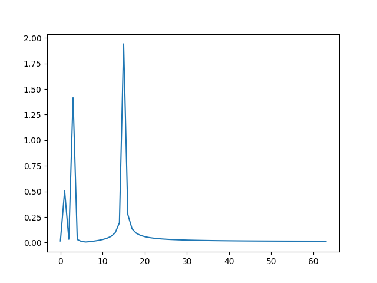

---
tags:
- 数学/线性代数
---

# 19 复数域中的向量与矩阵

## 1 回顾：复数和复平面

首先我们快速的回顾一下复数和复平面的基本知识，便于后续知识的介绍。我记得当我们接触到 $x^2=-1$ 这个方程的时候，虚数 $i$ 第一次进入到了我们的世界中，对于虚数而言，他的加法和乘法运算都并无新意：

$$\begin{aligned}

i+i=2i\\

2i+3i=5i
\end{aligned}$$

唯一的新奇之处就在于虚数的平方运算，也就是在解方程 $x^2=-1$ 的时候，其平方运算结果是 $i^2=-1$。

那么对虚数有了认识之后，复数的概念就很自然的出来了。复数是一个形如 $a+bi$ 的数，他由实数 $a$ 和虚数 $bi$ 组成，其中复数的实部是 $Re(a+bi)=a$，而他的虚部则是 $Im(a+bi)=b$。

复数的加法运算很简单，他被描述成实部和虚部分别对应相加：

$$(a+bi)+(c+di)=(a+c)+(b+d)i$$

例如：有两个复数 $z_1=2+i$，$z_2=3+2i$，则 $z_1$ 和 $z_2$ 的加法运算结果为：$z_1+z_2=5+3i$。

实际上，我们不难通过对比发现，复数的加法有点类似于向量空间 $R^2$ 中的向量加法运算：

$$\begin{bmatrix}a\\b\end{bmatrix}+\begin{bmatrix}c\\d\end{bmatrix}=\begin{bmatrix}a+b\\c+d\end{bmatrix}$$

而复数的乘法运算则是需要应用分配律：

$$(a+bi)(c+di)=ac+adi+bci+bdi^2=(ac-bd)+(ad+bc)i$$

我们还是用上面的两个复数进行举例，则 $z_1$ 和 $z_2$ 的乘法运算结果为：

$$z_1z_2=(2+i)(3+2i)=6+7i+2i^2=4+7i$$

将复数和二维向量进行对比后可以发现：我们可以在一个平面上来表示任意一个复数，这个平面就是复平面，我们将平面上的 $x$ 轴称之为实轴，$y$ 轴称之为虚轴，通过分别将实部和虚部作为 $x$ 轴和 $y$ 轴上的坐标，我们就能够将每一个复数表示成为复平面上的对应点，实际上这就类似于在向量空间 $R^2$ 上对二维向量进行表示。

对于复数的模这个概念，大家应该不会陌生。复数 $z=a+bi$，我们将 $\sqrt{a^2+b^2}$ 称作是复数 $z$ 的模或绝对值，记作 $|z|$，也可以记作是 $r$。

引入了复数的模长 $r$ 这个概念，我们可以基于此谈谈复数的极坐标表示法。对于复数的极坐标，另一个重要的量是角度 $\theta$，此时复数的实部记作是 $a=rcos\theta$，虚部记作是 $b=rsin\theta$，因此整个复数又被写作是 $z=a+bi=rcos\theta+irsin\theta$，最终我们把式子合并，记作：$z=re^{i\theta}$。

我们在这里列举了三种复数的表示方法，尤其是极坐标的表示法为后面的重要内容埋下了伏笔，利用极坐标形式表示的复数，在进行幂运算的时候是非常方便的。复数 $z$ 的 $n$ 次幂为 $z^n=r^ne^{in\theta}$，从式子中我们可以观察到：对于复数的 $n$ 次幂，在复平面上表示为：复数的模长（半径 $r$）变成了原始模长的 $n$ 次方，夹角 $\theta$ 变为了原来的 $n$ 倍。

共轭的概念也是复数中的一个重要基础概念，复数 $z=a+bi$ 的共轭复数记作是 $\bar{z}=a-bi$，即实部相同，虚部符号恰好相反。从几何意义的角度来说，复数 $z$ 和共轭复数 $\bar{z}$ 在复平面上关于实轴对称。

如下图 7.2 所示，我们来实际的在一个复平面上展示上述基本概念：



从图中我们看到了一个半径为 $1$ 的单位圆，即对于复数 $z=a+bi$ 而言，他表示所有 $a^2+b^2=1$ 的复数，我们可以把他们记作是 $z=cos\theta+isin\theta$，极坐标表示形式为：$z=e^{i\theta}$。我们把这两个等式结合起来，就有：

$$e^{i\theta}=cos\theta+isin\theta$$

这就是大名鼎鼎的欧拉公式，大家可以稍作留意。对于这种模长（半径）为 $1$ 的复数，他具备一个非常好的性质。大家可以思考一下他的 $n$ 次幂运算的最终结果，即结果所得的复数半径始终为 $1$，保持不变，只有 $\theta$ 角变为了原来的 $n$ 倍，也就是说幂运算的结果，始终都在复平面的单位圆上滑动。

由此引出一个非常重要的复数：$\omega=e^{2\pi i/n}$，如图 7.3 所示，我们可以看出复数 $\omega$ 的几何意义在于：他是复平面单位圆上的第一个 $n$ 等分点。



复数 $\omega=e^{2\pi i/n}$ 有一个非常重要的性质，请大家务必要牢牢记住，那就是 $\omega^1$,$\omega^2$,$\omega^3$,$\omega^4$,…,$\omega^n$ 这 $n$ 个复数的 $n$ 次幂的运算结果都是 $1$。换句话说，这 $n$ 个复数就是方程 $z^n=1$ 的解。

讲到这里，知识点并不算太复杂，但是或许你暗暗在心中质疑这里讲的复数与我们本书的主题有什么关联？请你耐心的继续往下读，这里我们可以事先剧透一下，复数 $\omega$ 将是离散傅里叶变换中傅里叶矩阵的核心元素。

在知识回顾的最后，我们列举一下如何用 python 实现复数的常用基本运算：

***代码如下：***

```python
z1 = 2 + 1j
z2 = 3 + 5j
print(z1.real)  #实部
print(z2.imag)  #虚部
print(z1+z2)    #加法
print(z1*z2)    #乘法
print(z1.conjugate())  #共轭
print(abs(z1))  #模长
```

***运行结果：***

```
2.0
5.0
(5+6j)
(1+13j)
(2-1j)
2.23606797749979
```

## 2 实数域的拓展：共轭转置

我们在前面的内容中已经学习过，列向量 $u=\begin{bmatrix}u_1\\u_2\\u_3\\…\\u_n\end{bmatrix}$ 的转置是行向量，即：$u^T=\begin{bmatrix}u_1&u_2&u_3&…&u_n\end{bmatrix}$，而实数域中向量长度的平方就是向量与自身的内积，也可以写作是 $u^Tu$ 的形式。

那么对于包含有复数成分的复向量 $z$ 呢？转置的概念能否直接迁移过来？我们先不忙着回答是还是否，先看一个实例：

比如我们也想求一个复向量 $z=\begin{bmatrix}1\\0\\i\end{bmatrix}$ 长度的平方，如果我们依旧沿用实数域中的操作方法，就会有：

$$|z|^2=z^Tz=\begin{bmatrix}1&0&i\end{bmatrix}\begin{bmatrix}1\\0\\i\end{bmatrix}=1+1-0=0$$

对于这个答案，我们的内心之中肯定是难以接受的，因为向量 $z$ 并非一个零向量，但是我们却计算出了他的长度为 $0$。因此，复向量和实数向量对于转置的操作是有区别的，对于一个复向量 $z$ 和复矩阵 $A$ 而言，我们在对他进行与实数域中相同的转置操作时，还需要将其中的复数元素转换成他的共轭复数，因此整个过程合并称作是共轭转置。

即，对于复向量 $z=\begin{bmatrix}z_1\\z_2\\z_3\\…\\z_n\end{bmatrix}=\begin{bmatrix}a_1+b_1i\\a_2+b_2i\\a_3+b_3i\\…\\a_n+b_ni\end{bmatrix}$，我们将他的共轭转置记作是：$z^H=\begin{bmatrix}\bar{z_1}&\bar{z_2}&\bar{z_3}&…&\bar{z_n}\end{bmatrix}$。

那么，在共轭转置的基础上，我们再来看看复数向量长度平方的计算结果：

$$|z|^2=z^Hz=\begin{bmatrix}a_1-b_1i&a_2-b_2i&a_3-b_3i&…&a_n-b_ni\end{bmatrix}\begin{bmatrix}a_1+b_1i\\a_2+b_2i\\a_3+b_3i\\…\\a_n+b_ni\end{bmatrix}=\sum_{k=1}^{n}{(a^2_k+b^2_k)}$$

从结果中我们发现，复数向量长度的平方就等于向量中各个成分的模长平方和：$|z|^2=z^Hz=\sum_{i=1}^n{|z_k|^2}$。

此时我们已经知道了复数向量长度的计算法则，那么我们再把这个概念引申一下，在复数域的范围内，求解复数向量 $u=\begin{bmatrix}u_1\\u_2\\u_3\\…\\u_n\end{bmatrix}$ 和 $v=\begin{bmatrix}v_1\\v_2\\v_3\\…\\v_n\end{bmatrix}$ 之间的内积：

$$u\cdot v=u^Hv=\begin{bmatrix}\bar{u_1}&\bar{u_2}&\bar{u_3}&…&\bar{u_n}\end{bmatrix}\begin{bmatrix}v_1\\v_2\\v_3\\…\\v_n\end{bmatrix}=\bar{u_1}v_1+\bar{u_2}v_2+\bar{u_3}v_3+…+\bar{u_n}v_n$$

其实复数域中的内积定义是可以把实数域的情况包含进去的，实数本质上就是虚部为 $0$ 的复数，对这样的复数取其共轭复数，其结果仍然等于自身。那么对于一个实数向量而言，其共轭转置实质上就只有转置操作了。

我们来看一个小例子，体会一下这里面的运算过程。我们有复向量 $u=\begin{bmatrix}1\\0\\i\end{bmatrix}$ 和复向量 $v=\begin{bmatrix}i\\3\\1\end{bmatrix}$，求这两个向量的内积：

很简单，一切都按照定义来进行操作：

$$u\cdot v=u^Hv=\begin{bmatrix}1&0&-i\end{bmatrix}\begin{bmatrix}i\\3\\1\end{bmatrix}=i-i=0$$

从计算结果来看，复向量 $u$ 和 $v$ 的内积为 $0$，两个向量彼此正交。

## 3 厄米特矩阵

建立起了复向量的共轭转置概念之后，很自然的我们就能联想到矩阵的共轭转置操作，即同样在完成矩阵转置操作的同时，对矩阵的各元素取共轭复数。

即，有原始矩阵 $A=\begin{bmatrix}z_{11}&z_{12}&z_{13}&…&z_{1n}\\z_{21}&z_{22}&z_{23}&…&z_{2n}\\z_{31}&z_{32}&z_{33}&…&z_{3n}\\…&…&…&…&…\\z_{m1}&z_{m2}&z_{m3}&…&z_{mn}\end{bmatrix}$，则他的共轭转置矩阵为：$A^H=\begin{bmatrix}\bar{z}_{11}&\bar{z}_{21}&\bar{z}_{31}&…&\bar{z}_{m1}\\\bar{z}_{12}&\bar{z}_{22}&\bar{z}_{32}&…&\bar{z}_{m2}\\\bar{z}_{13}&\bar{z}_{23}&\bar{z}_{33}&…&\bar{z}_{m3}\\…&…&…&…&…\\\bar{z}_{1n}&\bar{z}_{2n}&\bar{z}_{3n}&…&\bar{z}_{mn}\end{bmatrix}$，这和向量的共轭转置操作并无二致。

到这里，其实我们可以同样提炼出这样一个事实，那就是：实数域内的转置操作就是复数域中共轭转置的一种特殊情况。

由此，我们引出复数域中的一个极其重要的矩阵：厄米特矩阵，又称为自共轭矩阵。最好的方法还是在实数域中去找到对应的概念，那就是对称矩阵。在实数域中，如果矩阵 $S$ 的转置矩阵等于自身，即满足 $S=S^T$，则矩阵 $S$ 称之为是对称矩阵。引申到复数域中，如果一个复数矩阵 $S$，他的共轭转置矩阵等于自身，即满足 $S=sSH$，则矩阵 S 就是厄米特矩阵。

我们举一个复数域内的厄米特矩阵来实际的看一看：

$$S=\begin{bmatrix}1&1+i&2+3i\\1-i&2&-2i\\2-3i&2i&3\end{bmatrix}$$

很显然，矩阵 $S$ 满足 $S^H=S$，他的共轭转置矩阵等于他自身，矩阵 $S$ 就是一个厄米特矩阵，他的对角线上的元素必须是实数。

很显然，实对称矩阵也是复数域中厄米特矩阵的一种特殊情况，那么我们还是按照之前类比思考的思路，在前面的章节中，我们重点学习过，实对称矩阵 $S$ 拥有非常好的性质，他拥有实数特征值和正交的特征向量。

那么作为复数域中的延伸概念，厄米特矩阵是否拥有类似的性质？答案一定是肯定的，我们简要的来说明一下：

第一个性质：厄米特矩阵 $S$ 的特征值一定是实数。

这个证明过程很简单：

$Sz=\lambda z \Rightarrow z^HSz=z^H\lambda z\Rightarrow z^HSz=\lambda z^Hz$

我们抓住 $z^HSz=\lambda z^Hz$ 这个关键等式进行观察，很显然等式的左侧有：

$(z^HSz)^H=z^HS^H(z^H)^H=z^HSz$，我们可以观察出两个事实，一方面 $z^HSz$ 是自共轭的，同时可以观察出 $z^HSz$ 计算结果的维度是 $1\times 1$，即结果是一个数，因此 $z^HSz$ 显然只能是一个实数了。

同时在等式右侧 $\lambda z^Hz$ 当中，$z^Hz$ 是复数向量 $z$ 长度的平方，显然也是实数，那么作为系数的特征值 $\lambda$ 也必须是一个实数了。

第二个性质：厄米特矩阵 $S$ 中，不同特征值对应的特征向量满足彼此正交。

我们来看看任意两个特征值 $\lambda_1$ 和 $\lambda_2$ 以及他们所分别对应的特征向量：$z_1$ 和 $z_2$。依照定义显然有 $Sz_1=\lambda_1z_1$，$Sz_2=\lambda_2z_2$。

我们处理第一个特征值定义式子：$Sz_1=\lambda_1z_1\Rightarrow z_2^HSz_1=\lambda_1z^H_2z_1$

而对于第二个特征值定义式，我们有：$(Sz_2)^H=(\lambda_2z_2)^H \Rightarrow z_2^HS^H=\lambda_2z^H_2$，等式两侧同时乘以向量 $z_1$，我们可以得到 $z^H_2S^Hz_1=\lambda_2z^H_2z_1$。

由于 $S$ 是厄米特矩阵，满足自共轭特性，因此有 $\lambda_1z^H_2z_1=\lambda_2z^H_2z_1$，由于 $\lambda_1$ 和 $\lambda_2$ 是不等的两个特征值，那么为了满足等式左右两边相等，则必须要求：$z^H_2z_1=0$，这不正是复数向量内积的定义式吗？两个复数向量内积为 0，则二者必然正交。

## 4 酉矩阵

还是采用同样的思路，在讨论新概念酉矩阵之前，我们首先还是在实数矩阵中寻找对应的概念，还记得那个神奇的矩阵 $Q$ 吗？

矩阵 $Q$ 是一个方阵，他的各列由一组标准正交向量 $q_1$,$q_2$,$q_3$,$…$,$q_n$ 所构成，方阵 $Q$ 满足 $Q^TQ=I$ 的等式关系，我们称之为正交矩阵，这是我们前面学习过的概念，大家应该非常熟悉。

那么将这个概念拓展到复数域当中，在复数域中各列满足标准正交的方阵 $Q$ 我们也给他起了一个新名字，叫酉矩阵。很显然，基于复数向量内积的定义，这里实矩阵的转置操作就应该变成复数矩阵的共轭转置操作，即 $Q^T\Rightarrow Q^H$。最终我们得出：酉矩阵 $Q$ 是一个方阵，满足 $Q^HQ=I\Rightarrow Q^H=Q^{-1}$ 的关系。

#5 傅里叶矩阵与离散傅里叶变换 讲清楚酉矩阵的定义之后，我们不再过多的陷于细节性质的讨论。这里，我们直接抛出傅里叶矩阵的介绍，傅里叶矩阵号称是最重要的酉矩阵，用于进行离散傅里叶变换的处理工作。

一个 $n\times n$ 的傅里叶矩阵的形式如下：

$$F_n=\frac{1}{\sqrt{n}}\begin{bmatrix}1&1&1&…&1\\1&\omega&\omega^2&…&\omega^{n-1}\\1&\omega^2&\omega^4&…&\omega^{2(n-1)}\\…&…&…&…&…\\1&\omega^{n-1}&\omega^{2(n-1)}&…&\omega^{(n-1)^2}\end{bmatrix}$$

其中 $\omega=e^{2\pi i/n}$，傅里叶矩阵中第 $i$ 行，第 $j$ 列的元素表达式为 $\omega^{ij}$。

这里又一次的出现了 $\omega=e^{2\pi i/n}$，在前面一部分中我们已经讲过，这个量表示复平面单位圆上的第一个 $n$ 等分点，因此 $n$ 阶傅里叶矩阵中的所有元素都位于单位圆的 $n$ 等分点上。

为了便于我们计算，我们将 $\omega=e^{2\pi i/n}$ 按照欧拉公式 $e^{i\theta}=cos\theta+isin\theta$ 进行展开，得到 $e^{2\pi i/n}=cos\frac{2\pi}{n}+isin\frac{2\pi}{n}$。

了解了傅里叶矩阵的概念和形态之后，读者也许会问，这种矩阵有什么用处？前面不是已经对周期函数和非周期函数的傅里叶变换方法都做过介绍了吗？

首先，顾名思义，傅里叶矩阵是用来辅助计算机进行傅里叶变换的，而前面介绍过的方法是提供给我们人来计算使用的。因为在信号处理的过程中，机器能够处理的都必须是离散的信号，因此我们前面介绍的连续时间周期函数和连续时间非周期函数都无法直接借助机器进行处理。

机器能够处理什么样的信号？一方面是有限长度的信号，另一方面是离散的信号，这里的离散包含两个方面，一个是傅里叶变换前时域的信号必须离散，另一个是变换后频域里的频谱也必须离散。

要想使用机器来进行傅里叶变换，就必须满足这三个条件，这称之为离散傅里叶变换（$DFT$）。有限长度很好满足，我们对一段连续时间信号进行截断即可，截断区间我们可以取 $2\pi$，通过对连续时间信号进行采样，获取时域内的离散输入。

采样的个数一般定为 $2^n$，如 32，64，…，1024 等等。我们在前面学习过，只有时域内的周期信号经过傅里叶变换才能得到离散的频谱，不过这个很好处理，我们将这段有限长度的时域信号进行周期延拓即可实现。

我们通常借助计算机来实现离散傅里叶变换，那么理解好这个变换过程的输入和输出则非常重要。例如：我们对一个连续时间信号 $f(t)$ 在 $2\pi$ 的采样区间内采样 $32$ 次，那么时间信号的输入就变成了离散的形式：

$$x[n]=f(2\pi\frac{n}{32})$$

其中,$n=0,1,2,…,31$

即输入向量的元素为 32 个，即采样次数。

然后，我们同样是把这个离散化后的函数 $x[n]$ 用一组谐波基来进行表示，那么首先我们就要确定这一组谐波的基频率 $\omega_0$：具备该基频率的谐波是在整个 $2\pi$ 采样周期内只震动一个周期的谐波函数 $cos(2\pi\frac{n}{32})$ 和 $sin(2\pi\frac{n}{32})$，所有基函数的频率都是这个基频率的整数倍，因此经过离散傅里叶变换后的基函数依次为：1，$cos(2\pi\frac{n}{32})$，$sin(2\pi\frac{n}{32})$，$cos(2\pi\frac{2n}{32})$，$sin(2\pi\frac{2n}{32})$，$cos(2\pi\frac{3n}{32})$，$sin(2\pi\frac{3n}{32})$，$cos(2\pi\frac{4n}{32})$，$sin(2\pi\frac{4n}{32})$，…，$cos(2\pi\frac{31n}{32})$，$sin(2\pi\frac{32n}{32})$，同频的正余弦函数算作一组，即含 32 组基函数。

因此，经过离散傅里叶变换后的输出向量里的元素也是 $32$ 个，但是这 $32$ 个量是复数形式的 $a_k+b_kj$，分别对应了每个频率的余弦和正弦基函数的系数，通过 $a_k$ 和 $b_k$ 就可以计算出每个频率谐波基的幅度和相位。

傅里叶矩阵是离散傅里叶变换中的核心数据结构，而通过针对矩阵结构进行优化设计而形成的高速、优化的算法，我们称之为快速傅里叶变换，也就是我们常听说的 FFT。他大幅提升了信号处理的效率。

最后我们利用 python 语言来实际进行离散傅里叶变换的处理，首先我们来看看我们要处理的时域信号：

$$f(t)=sin(t)+2sin(3t)+2cos(3t)+4sin(15t)$$

绘制函数图像的代码如下：

```python
import numpy as np
import matplotlib.pyplot as plt

def f(x):
    return np.sin(x)+2*np.sin(3*x)+2*np.cos(3*x)+4*np.sin(15*x)

x = np.linspace(0, 2*np.pi, 2048)
plt.scatter(x, f(x))
plt.grid()
plt.show()
```

如图 7.4 所示，我们来实际看看时域中信号在一个 $2\pi$ 周期内的形态：



下面我们就用 python 中的 fft 工具来对这段时域信号进行频域分析，代码如下：

```python
import numpy as np
from scipy.fftpack import fft
import matplotlib.pyplot as plt

x = np.linspace(0, 2*np.pi, 128)
y = np.sin(x)+2*np.sin(3*x)+2*np.cos(3*x)+4*np.sin(15*x)

xf = np.arange(len(y))               #离散频率
xf_half = xf[range(int(len(x)/2))]   #由于对称性，只取一半区域
yf = abs(fft(y))/len(x)              #执行完fft后，对各频率的能量归一化处理
yf_half = yf[range(int(len(x)/2))]   #由于对称性，只取一半区间

plt.plot(xf_half, yf_half)
plt.show()
```

经过快速傅里叶变换之后，我们最终得到的结果如图 7.5 所示：



我们仔细观察图中的数据，图中三个能量最高的峰值点，正对应我们时域函数 $f(t)=sin(t)+2sin(3t)+2cos(3t)+4sin(15t)$ 中合成的三个谐波频率，且能量也和各谐波系数取模后的比例保持一致。