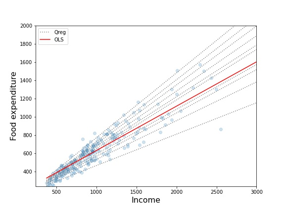
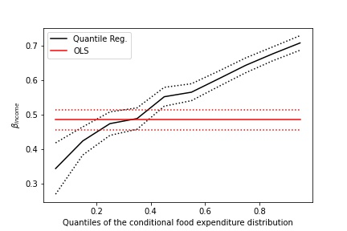

# 分位数回归

## 1. 简介

基本上，回归都是假定一个函数，然后让函数尽可能拟合训练数据，确定函数的未知参数。

尽可能拟合训练数据，一般是通过最小化 MSE 来进行：

$$

MSE=\frac{1}{n} \sum_{i=1}^{n}\left(y_{i}-\hat{f}\left(x_{i}\right)\right)^{2}=E(y-\hat{f}(x))^{2}

$$

所以得到的 $y$ 本质上就是一个期望。

因此线性回归分析得到的函数，本质上就是一个条件期望函数，在 $x$ 等于某个值的条件下，根据数据，求 $y$ 的期望。

分位数回归提出的原因，就是因为不希望仅仅是研究 $y$ 的期望，而是希望能探索 $y$ 的完整分布状况，或者说可能在某些情况下我们更希望了解 $y$ 的某个分位数。下面再举一个例子，说明分位数回归的作用，假如现在我们有一个如图分布的数据，对其进行 OLS 回归和 10 次不同分位的分位数回归：

从拟合的曲线我们可以看出，原数据随着 $x$ 增大，$y$ 的分布范围越来越大，可是因为 OLS 回归分析得到的是条件期望函数，也就是 $y$ 的期望，所以即使 $y$ 的分布变化了，平均来说 $y$ 还是以同样的斜率稳定上升。

再看 10 个不同分位的分位数回归，比起 OLS 回归，能进一步显示出 $y$ 的变化幅度（$\beta$）随着分位的变大而增大。简单来说，所谓的 0.9 分位数回归，就是希望回归曲线之下能够包含 90% 的数据点，这也是分位数的概念，分位数回归是把分位数的概念融入到普通的线性回归而已。

通过画出不同的分位数回归的 $\beta$ 曲线，能明显地看出，随着 $x$ 的增大，$y$ 的不同范围的数据是不同程度地变化的，而这个结论通过以前的回归分析是无法得到的，这就是分位数回归的作用。

所以，**分位数回归，不能说是一种回归模型，而是一类回归模型，或者说是一种改进思想**，我们可以把它应用到线性回归、多项式回归、核回归等等，最根本的就是把损失函数从最小二乘法改成加权最小二乘法，通过不同的分位数得到不同的结果，再根据结果进行分析。

## 2. 分位数回归推导

我们可以最小化以下函数确定分位数：

$$
\hat{Q}_{Y}(\tau)=\operatorname{argmin}_{\xi_{\tau} \in R}\left(\sum_{i: Y_{i} \geq \xi_{\tau}} \tau\left|Y_{i}-\xi_{r}\right|+\sum_{i: Y_{i}<\xi_{\tau}}(1-\tau)\left|Y_{i}-\xi_{r}\right|\right)
$$

本质上，这就是一个加权最小二乘法（虽然形式上有点不一样），给不同的 $y$ 值（大于分位点和小于分位点的 $y$）不同的权重，比如现在我们有一个数据集是 1 到 10 各整数，我们希望求 0.7 分位数，假设这个 0.7 分位数是 $q$，然后所有大于 $q$ 的数都被赋上权重 0.7，小于 $q$ 的赋予权重 0.3，我们要最小化函数 $Q(\tau)$ 求分位数，验证一下就可以知道 7 就是我们要求的分位点。

接下来我想再详细比较这个求分位点的函数和之前求期望的最小二乘法，关于函数 $Q(\tau)$，我们可以再改写一下：

$$
\hat{Q}_{Y}(\tau)=\frac{1}{n}\left(\sum_{i: Y_{i} \geq \xi_{\tau}} \tau\left(Y_{i}-\xi_{r}\right)^{2}+\sum_{i: Y_{i} < \xi_{\tau}}(1-\tau)\left(Y_{i}-\xi_{r}\right)^{2}\right)
$$

写成这个形式就彻底变成我们熟悉的加权最小二乘法了，所以说本质上他们都是一样的，而且最小化这个函数同样可以求出分位点。我们以前用最小二乘法得到均方误差作为回归模型的损失函数，因而得到的结果是条件期望函数，如果我们把损失函数换成这里的加权最小二乘函数：

$$
\operatorname{LOSS}=\frac{1}{n}\left(\sum_{i: Y_{i} \geq \xi_{\tau}} \tau\left(y_{i}-\hat{f}\left(x_{i}\right)\right)^{2}+\sum_{i: Y_{i}<\xi_{\tau}}(1-\tau)\left(y_{i}-\hat{f}\left(x_{i}\right)\right)^{2}\right)
$$

得到的结果也应该符合分位数的定义，也就是说，比如我们使 $\tau=0.8$，那么我们最小化损失函数求参数，得到的回归曲线 $f$，应该有 80% 的数据在曲线的下方。
