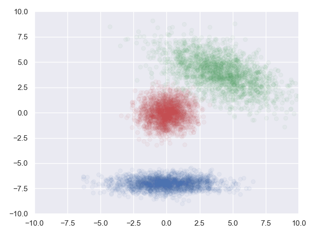
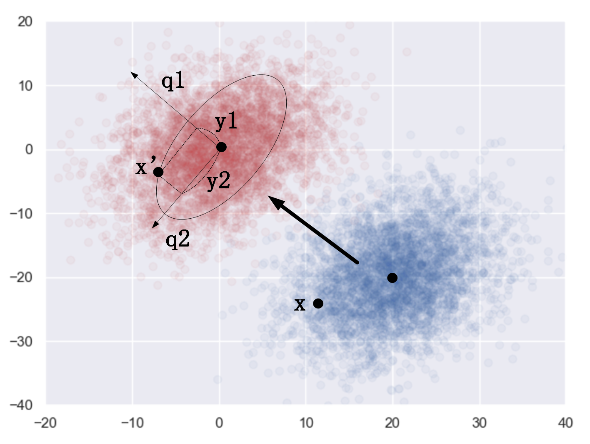

---
tags:
- 数学/随机过程
---

# 02 多元高斯分布：参数特征和几何意义

在上一讲里，我们重新回顾了一元高斯分布，并从这个分布入手，介绍了如何利用极大似然估计的方法对分布的两个参数：均值 $\mu$ 和方差 $\sigma^2$ 进行估计，并从估计的有偏性和无偏性这个角度出发，对两个参数的极大似然估计值进行讨论和验证。

## 1.从一元分布到多元分布

在这一讲，我们从一元高斯分布过渡到多元高斯分布，我们如何来理解多元高斯分布中的“多”呢？

我们记得，在一元高斯分布中，我们是从一组样本 $X=(x_1,x_2,x_3,…,x_N)$ 来引入的，我们基于这组样本中的 $N$ 个样本值对一元高斯分布的两个参数进行极大似然估计。我们要着重强调一点的是，每一个样本都是一个随机变量，更直白的说就是一个随机的“数值”。

而到了多元高斯分布中，同样我们也有一组这样的样本 $X$，但是这里面的每一个样本 $x_i$ 则不再是一个个的随机变量，而是多维的随机向量，每一个样本有 $p$ 维：

$$x=\begin{bmatrix} x_1\\x_2\\x_3 \\…\\x_p\end{bmatrix}$$

我们假定有 $N$ 个样本（随机变量），每一个样本有 $p$ 维，那么可以集中将其对应的表示成矩阵的形式：

$$X=\begin{bmatrix} x_{11}&x_{12}&x_{13}&…&x_{1p}\\x_{21}&x_{22}&x_{23}&…&x_{2p}\\x_{31}&x_{32}&x_{33}&…&x_{3p} \\…&…&…&…&…\\x_{N1}&x_{N2}&x_{N3}&…&x_{Np}\end{bmatrix}$$

我们如何来解释这个 $N$ 行 $p$ 列的样本矩阵呢？

矩阵 $X$ 有 $N$ 行，代表了有 $N$ 个样本，而 $p$ 列代表了每一个样本有 $p$ 个特征，或者说的直白些叫 $p$ 个属性，就好比说这 $N$ 个样本代表了某市的 $N$ 个学生，而 $p$ 个属性则分别可能是学生的身高、体重、考试成绩等等各种值。

而一元高斯分布则是 $p=1$ 的一种特殊情况，即每一个样本我们只看他的一个属性。此时的样本也可以看作是一个列为 $1$ 的“特殊矩阵”了。

$$X=\begin{bmatrix} x_{11}\\x_{21}\\x_{31} \\…\\x_{N1}\end{bmatrix}$$

## 2.多元高斯分布的参数形式

有了样本 $X$ 的矩阵表示之后，我想我们下面来介绍多元高斯分布的参数形式，就会更加清楚一些。

和一元高斯分布类似，多元高斯分布的参数同样包含两个部分，一个用来描述分布的均值，另一个也是用来描述分布的方差，但是又有所不同：

首先用来描述分布均值的 $\mu$ 不再是一个数值，而是一个和样本特征维度相对应的 $p$ 维向量：

$$X=\begin{bmatrix} x_{11}\\x_{21}\\x_{31} \\…\\x_{N1}\end{bmatrix}$$

而向量 $\mu$ 中的每一维 $\mu_i$ 则具体反映了分布中第 $i$ 个特征的均值。

而反映方差的参数也不再是一个数值，而是一个协方差矩阵 $\sum$，他是一个 $p\times p$ 的矩阵

$$\sum=\begin{bmatrix} \sigma_{11}&\sigma_{12}&\sigma_{13}&…&\sigma_{1p}\\\sigma_{21}&\sigma_{22}&\sigma_{23}&…&\sigma_{2p}\\\sigma_{31}&\sigma_{32}&\sigma_{33}&…&\sigma_{3p} \\…&…&…&…&…\\\sigma_{p1}&\sigma_{p2}&\sigma_{p3}&…&\sigma_{pp}\end{bmatrix}$$

我们需要来仔细理解一下这个多元随机变量协方差矩阵 $\sum$ 的细节，首先这个方阵对角线的值 $\sigma_{ii}$ 表示的是分布中第 $i$ 个特征属性的方差，而非对角线上的值 $\sigma_{ij}$ 则表示分布中第 $i$ 个特征属性和第 $j$ 个特征属性的协方差，依据协方差的定义，他反映的是多元高斯分布中，第 $i$ 个特征属性和第 $j$ 个特征属性的相关性。

那么比较特殊的情况就是，当协方差矩阵 $\sum$ 是一个对角矩阵，即所有非对角位置上的值均为 $0$ 的时候，意味着该分布中，不同特征属性之间都是不具备相关性的。

## 3.二元高斯分布的具体示例

这里我们以二元高斯分布为例，通过设置不同的均值向量和协方差矩阵来直观的认识这两个参数对样本分布的影响。

**代码片段：**

```
import numpy as np
import matplotlib.pyplot as plt
import seaborn
seaborn.set()
mean_1 = np.array([0, 0])
conv_1 = np.array([[1, 0],
                 [0, 1]])

mean_2 = np.array([0, -7])
conv_2 = np.array([[4, 0],
                 [0, 0.25]])

mean_3 = np.array([4, 4])
conv_3 = np.array([[4, -3],
                 [-3, 0.25]])

x_1, y_1 = np.random.multivariate_normal(mean=mean_1, cov=conv_1, size=2000).T
x_2, y_2 = np.random.multivariate_normal(mean=mean_2, cov=conv_2, size=2000).T
x_3, y_3 = np.random.multivariate_normal(mean=mean_3, cov=conv_3, size=2000).T

plt.plot(x_1, y_1, 'ro', alpha=0.05)
plt.plot(x_2, y_2, 'bo', alpha=0.05)
plt.plot(x_3, y_3, 'go', alpha=0.05)

plt.gca().axes.set_xlim(-10, 10)
plt.gca().axes.set_ylim(-10, 10)
plt.show()
```

+ 1+ 2+ 3+ 4+ 5+ 6+ 7+ 8+ 9+ 10+ 11+ 12+ 13+ 14+ 15+ 16+ 17+ 18+ 19+ 20+ 21+ 22+ 23+ 24+ 25+ 26+ 27

**运行结果：**


我们在代码当中，设置了三个不同参数的二元高斯分布，他们整体上的分布都呈现出椭圆形（或正圆形），但是我们发现由于均值向量 $\mu$ 和协方差矩阵 $\sum$ 设置的不同，三个分布呈现出不同的形态特点：

红色的分布 1：$\mu=\begin{bmatrix} 0\\0\end{bmatrix}，\sum=\begin{bmatrix} 1&0\\0&1\end{bmatrix}$

分布中包含两维特征属性，均值均为 0，方差均为 1，协方差为 0，因此整个分布的中心点为 $(0,0)$，两维特征属性彼此不相关，因此分布形态为一个正圆。

蓝色的分布 2：$\mu=\begin{bmatrix} 0\\-7\end{bmatrix}，\sum=\begin{bmatrix} 4&0\\0&0.25\end{bmatrix}$

分布中包含的两维特征属性中，第二维特征属性的均值为-7，因此整个分布的中心点位于 $(0,-7)$，协方差矩阵同样是一个对角矩阵，因此两维特征彼此无关，因此椭圆的长短轴和 $x$ 轴、$y$ 轴方向一致，没有倾斜，但是不同的是，第一维特征属性的方差要明显大于第二维特征属性的方差，因此沿 $x$ 轴方向的分布要更加分散一些。

绿色的分布 3：$\mu=\begin{bmatrix} 4\\4\end{bmatrix}，\sum=\begin{bmatrix} 4&-3\\-3&0.25\end{bmatrix}$

分布中唯一不同的就是协方差矩阵不再是一个对角矩阵，两维特征属性呈现出负相关，因此整个分布呈现出来的是一个左上方向的椭圆。

## 4.多元高斯分布的几何特征

从上面的例子中我们感性的认识到，二元高斯分布整体上是一个椭圆形，那我们如何从严格意义上来证明这一点呢？这一部分我们重点讨论这个问题：

我们假定 $X$ 是一个 $p$ 维的随机向量，服从 $p$ 维高斯分布，他的两个参数为 $p$ 维均值向量 $\mu$ 和 $p\times p$ 的协方差矩阵 $\Sigma$，首先我们来看一下多元高斯分布的概率密度函数：

$$p(x|\theta)=\frac{1}{(2\pi)^{\frac{p}{2}}|\Sigma|^{\frac{1}{2}}}exp(-\frac{1}{2}(x-\mu)^T\Sigma^{-1}(x-\mu))$$

我们发现，对于一个特定的样本 $x_i$，他的概率密度值其实就是取决于 $-\frac{1}{2}(x-\mu)^T\Sigma^{-1}(x-\mu)$ 这个表达式的取值：

协方差矩阵是半正定的对称矩阵，可以得到由一组标准正交特征向量构成的特征矩阵。即，矩阵 $Q$ 可以表示成：$\begin{bmatrix} q_1&q_2&…&q_p\end{bmatrix}$。

协方差矩阵可以分解为 $\Sigma=Q\Lambda Q^T$ 的形式，其中满足 $QQ^T=I$，而 $\Lambda=\begin{bmatrix}\lambda_1&&&\\& \lambda_2&&\\&&…&\\&&&\lambda_p\\\end{bmatrix}$。

因此协方差矩阵就可以写成:

$$\Sigma=\begin{bmatrix} q_1&q_2&…&q_p\end{bmatrix}\begin{bmatrix}\lambda_1&&&\\& \lambda_2&&\\&&…&\\&&&\lambda_p\\\end{bmatrix}\begin{bmatrix} q_1^T\\q_2^T\\…\\q_p^T\end{bmatrix}=\sum_{i=1}^pq_i\lambda_iq_i^T$$

$$\Sigma^{-1}=(Q\Lambda Q^T)^{-1}=(Q^T)^{-1}\Lambda^{-1}Q^{-1}\\=(Q^{-1})^{-1}\Lambda^{-1}Q^{-1}=Q\Lambda^{-1}Q^{-1}$$

其中，对角矩阵 $\Lambda^{-1}=\begin{bmatrix}\frac{1}{\lambda_1}&&&\\& \frac{1}{\lambda_2}&&\\&&…&\\&&&\frac{1}{\lambda_p}\\\end{bmatrix}$

因此 $\Sigma^{-1}=\sum_{i=1}^pq_i\frac{1}{\lambda_i}q_i^T$

此时，我们回到上面那个决定概率密度的表达式：$(x-\mu)^T\Sigma^{-1}(x-\mu)$ 当中去

$$(x-\mu)^T\Sigma\,^{-1}(x-\mu)=(x-\mu)^T [\sum_{i=1}^pq_i\frac{1}{\lambda_i}q_i^T](x-\mu) \\=\sum_{i=1}^p(x-\mu)^Tq_i\frac{1}{\lambda_i}q_i^T(x-\mu)$$

此时，我们对这个看似复杂的式子做一个小小变换和替代，令：$y_i=(x-\mu)^Tq_i$

这是一个先平移、后投影的操作，先让随机变量 $X$ 整体按照均值向量 $\mu$ 进行平移，也就是使得原点称为分布的中心点，然后向单位向量 $q_i$ 做一个投影，这其中，很显然 $y_1$ 是样本 $x$ 在 $q_1$ 方向上的投影长度，而 $y_2$ 则是样本 $x$ 在 $q_2$ 方向上的投影长度，$q_1$ 和 $q_2$ 是彼此正交的单位向量。

为了方便的说明问题，我们这里令维度 $p=2$，那么等式就简化为：

$$\sum_{i=1}^2(x-\mu)^Tq_i\frac{1}{\lambda_i}q_i^T(x-\mu)=y_1\frac{1}{\lambda_1}y_1^T+y_2\frac{1}{\lambda_2}y_2^T=\frac{y_1^2}{\lambda_1}+\frac{y_2^2}{\lambda_2}$$

那么，最终的结论就是：只要 $\sum_{i=1}^2(x-\mu)^Tq_i\frac{1}{\lambda_i}q_i^T(x-\mu)$ 也就是 $\frac{y_1^2}{\lambda_1}+\frac{y_2^2}{\lambda_2}$ 这个等式的值一固定，那么整个二元高斯分布的概率密度函数

$$p(x|\theta)=\frac{1}{(2\pi)^{\frac{p}{2}}|\Sigma|^{\frac{1}{2}}}exp(-\frac{1}{2}(x-\mu)^T\Sigma^{-1}(x-\mu))$$

的值就确定了。

这句话感觉还有些抽象，换句话说，就是使得 $\sum_{i=1}^2(x-\mu)^Tq_i\frac{1}{\lambda_i}q_i^T(x-\mu)$ 等于某个具体的常数 $c$ 的所有样本 $x$，出现的概率都是一样大的。

那么进一步等价为 $\frac{y_1^2}{\lambda_1}+\frac{y_2^2}{\lambda_2}$ 等于常数 $c$ 的时候，样本出现的概率都是一样的。

$\frac{y_1^2}{\lambda_1}+\frac{y_2^2}{\lambda_2}=c$ 的几何含义代表了什么？为了看得更明白一些，我们先令 $c=1$，此时 $\frac{y_1^2}{\lambda_1}+\frac{y_2^2}{\lambda_2}=1$ 表示的不就是一个椭圆的方程吗？

只不过这个椭圆的长轴和短轴发生了变化，不再是我们印象当中的 $x$ 轴和 $y$ 轴，而是协方差矩阵经过特征值分解得到的两个标准正交的特征向量 $q_1$ 和 $q_2$，他们构成了这个椭圆的长轴和短轴，而这个椭圆在两个轴上的长度就是 $\sqrt{\lambda_1}$ 和 $\sqrt{\lambda_2}$，而 $y_1$ 和 $y_2$ 就是原来 $xoy$ 坐标系中的样本在 $q_1$ 和 $q_2$ 上的投影长度，说穿了，就是样本点以 $q_1$ 和 $q_2$ 为新坐标系的坐标值。

那么进一步我们来看，对于等式 $\sum_{i=1}^2(x-\mu)^Tq_i\frac{1}{\lambda_i}q_i^T(x-\mu)$，每固定一个常数 $c$，就相当于在平面上以 $q_1$ 和 $q_2$ 为轴，$\sqrt{c\lambda_1}$ 和 $\sqrt{c\lambda_2}$ 为轴长，画了一个椭圆，而这个椭圆上所有的样本点出现的概率是相等的。

随着常数 $c$ 不断增大，也就是 $\sum_{i=1}^2(x-\mu)^Tq_i\frac{1}{\lambda_i}q_i^T(x-\mu)$ 的取值不断增大，椭圆也在不断的增大，而 $p(x|\theta)=\frac{1}{(2\pi)^{\frac{p}{2}}|\Sigma|^{\frac{1}{2}}}exp(-\frac{1}{2}(x-\mu)^T\Sigma^{-1}(x-\mu))$ 的取值不断的减小，越大的椭圆上分布的样本概率越小。

## 5.二元高斯分布几何特征实例分析

我们结合下面这个例子，把上面的分析过程总结一下，以下面这个二元高斯分布为例，分布的参数如下：

$$\mu=\begin{bmatrix} 20\\-20\end{bmatrix}，\Sigma=\begin{bmatrix} 34&12\\12&41\end{bmatrix}$$

我们对着代码和运行结果来总结上面的分析过程：

**代码片段：**

```
import numpy as np
import matplotlib.pyplot as plt
from scipy import linalg
import seaborn
seaborn.set()

mean_1 = np.array([0, 0])
mean_2 = np.array([20, -20])

conv = np.array([[34, 12],
              [12, 41]])

x_1, y_1 = np.random.multivariate_normal(mean=mean_1, cov=conv, size=4000).T
x_2, y_2 = np.random.multivariate_normal(mean=mean_2, cov=conv, size=4000).T

plt.plot(x_1, y_1, 'ro', alpha=0.05)
plt.plot(x_2, y_2, 'bo', alpha=0.05)

plt.gca().axes.set_xlim(-20, 40)
plt.gca().axes.set_ylim(-40, 20)

evalue, evector = linalg.eig(conv)
print(evalue)
print(evector)
plt.show()
```

+ 1+ 2+ 3+ 4+ 5+ 6+ 7+ 8+ 9+ 10+ 11+ 12+ 13+ 14+ 15+ 16+ 17+ 18+ 19+ 20+ 21+ 22+ 23+ 24+ 25

**运行结果：**



```
[25.+0.j 50.+0.j]

[[-0.8 -0.6]
 [ 0.6 -0.8]]
```

+ 1+ 2+ 3+ 4

在图中，蓝色的为原始的二维高斯分布的样本点，样本减去均值向量 $\mu=\begin{bmatrix} 20\\-20\end{bmatrix}$ 之后，整体平移至红色的分布区域。

我们对协方差矩阵 $\Sigma=\begin{bmatrix} 34&12\\12&41\end{bmatrix}$ 进行特征值分解得到特征向量：$q_1=\begin{bmatrix} -0.8\\0.6\end{bmatrix}$ 和 $q_2=\begin{bmatrix} -0.6\\-0.8\end{bmatrix}$，他们分别对应特征值为：$\lambda_1=25$，$\lambda_2=50$。

这意味着在平移后的红色区域中，拥有无数个以 $\begin{bmatrix} 0\\0\end{bmatrix}$ 为中心，以 $q_1$ 和 $q_2$ 为轴的同心椭圆，椭圆的长轴短轴之比为 $\frac{\sqrt{50}}{\sqrt{25}}$，每个椭圆上的样本存在的概率相等，椭圆越大，样本存在的概率越小，这里我们从图中由里到外颜色由深变浅就能很好的看出来。