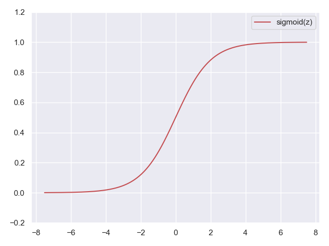

---
tags:
- 数学/随机过程
---

# 04 判别 or 生成：从逻辑回归说起

## 1.线性回归与线性分类

上一讲我们介绍的是线性回归的有关内容，这一讲，我们来介绍线性分类的一些模型，从整体上来看，我们如何来把握线性回归和线性分类的关联？

我们知道线性回归：就是 $w^Tx+b$，得到的结果 $y=w^Tx+b$，他是一个属于 $(-\infty,\infty)$ 的实数 $R$，而线性分类问题（我们以二分类为例），则是进一步需要将 $w^Tx+b$ 进行映射，这里分为两类：

第一类是硬分类，映射的结果是一个二值集合 $\{0,1\}$ 中的一个值，硬分类不是我们介绍的重点；

第二类是软分类，映射的结果是 $[0,1]$ 区间上的一个值，软分类的“软”就体现在这，他不是硬生生的告诉你到底是类别 0 还是类别 1，而是得到一个概率值，表示取得分类的概率，哪个分类的概率大，我们就取哪一个。

## 2.软分类模型：判别与生成

而我们接下来几节中要介绍线性分类模型： [逻辑回归](https://so.csdn.net/so/search?q=%E9%80%BB%E8%BE%91%E5%9B%9E%E5%BD%92&spm=1001.2101.3001.7020) 、高斯判别分析和朴素贝叶斯分类器，都属于软分类。

而软分类又分为判别式模型和生成式模型，突然一下感觉概念好多，这两类又有什么不同呢？

逻辑回归属于判别式模型，直接对条件概率 $p(Y|X)$ 进行建模、学习和求解；而后面两个模型：高斯判别分析和朴素贝叶斯则是生成式模型，他是对联合概率 $p(X,Y)$ 进行建模。

那么，什么称之为对条件概率 $p(Y|X)$ 建模，什么又叫作对联合概率 $p(X,Y)$ 建模？我们通过式子来看。

## 3.逻辑回归的基本建模

我们以二分类问题为例，在逻辑回归当中， 我们关注的是给定一个样本 $x$，如何去求得 $p(y=1|x)$ 的概率，这里我们利用的就是一个称之为 $sigmoid$ 的激活函数 $\sigma(z)=\frac{1}{1+e^{-z}}$，其中 $z=w^Tx$。通过他完成了位于 $(-\infty,+\infty)$ 范围内的 $w^Tx$ 到一个位于 $[0,1]$ 之间概率值的转换。

我们看看 $\sigma(z)=\frac{1}{1+e^{-z}}$ 的函数图像就明白了：

**代码片段：**

```
import matplotlib.pyplot as plt
import numpy as np
import seaborn
seaborn.set()

def sigmoid(z):
    return 1/(1+np.e**(-z))

z = np.linspace(-7.5, 7.5, 1000)
plt.plot(z, sigmoid(z), color='r', label='sigmoid(z)')
plt.ylim(-0.2, 1.2)
plt.legend()
plt.show()
```

+ 1+ 2+ 3+ 4+ 5+ 6+ 7+ 8+ 9+ 10+ 11+ 12+ 13

**运行结果：**

 我们发现：函数的定义域是 $(-\infty,+\infty)$，也就是位于整个实数域上的 $z=w^Tx$ 被映射到了 $[0,1]$ 范围内，也就可以对 $p(y=1|x)$ 的概率值进行表示。

最终，我们来明确一下逻辑回归中的二分类条件概率表达式：

$$p_1=p(y=1|x)=\sigma(w^Tx)=\frac{1}{1+e^{-w^Tx}}=\varphi(x;w)$$

$$p_0=p(y=0|x)=1-p(y=1|x)=\frac{e^{-w^Tx}}{1+e^{-w^Tx}}=1-\varphi(x;w)$$

那么，综合起来，把这两个分类的条件概率统一到一个表达式中，我们就可以写作是：

$$p(y|x)=p_1^{y}p_0^{1-y}$$

其实这个式子没有太多深刻的特殊的含义，纯粹就是一种统一的数学表达，我们可以简单带入验证一下：

当 $y=1$ 时，$p(y=1|x)=p_1^1p_0^0=p_1$，而当 $y=0$ 时，$p(y=0|x)=p_1^0p_0^1=p_0$。

所以你看，是不是就是一个简单的数学运算小技巧而已？这也就是所谓的直接对条件概率建模。而逻辑回归当中的待估计参数，就是向量 $w$。

## 4.逻辑回归参数估计与代码试验

拿到了条件概率模型之后，当我们手上有了一组样本 $(X,Y)$，样本数量为 $N$。同样是通过极大似然估计的方法，去把参数 $w$ 给估计出来：

$$w_{mle}=argmax_{w}=log~p(Y|X)\\=argmax_w~log\prod_{i=1}^{N}p(y_i|x_i)\\=argmax_w\sum_{i=1}^{N}log~p(y_i|x_i)\\=argmax_w\sum_{i=1}^N(y_ilogp_1+(1-y_i)logp_0)\\=argmax_w\sum_{i=1}^N(y_ilog\varphi(x;w)+(1-y_i)log(1-\varphi(x;w)))$$

得到了这个最终的目标式子之后，在这里我们可以采用梯度下降法，就可以逐步逼近到我们所需要的 $w$ 估计值，这里我们就不继续展开了。

在 sklearn 中，处理逻辑回归的问题也是非常容易的，我们举一个实际的例子来看一下

sklearn 的数据集中有一个乳腺癌的样本数据集，样本大小 569，每一个样本包含 30 维的特征，而最终的分类结果表示为 1（是乳腺癌）或者 0（不是乳腺癌）。

**代码片段：**

```
from sklearn.datasets import load_breast_cancer
from sklearn.model_selection import train_test_split
from sklearn.linear_model import LogisticRegression

cancer = load_breast_cancer()
X = cancer.data
y = cancer.target
print(X.shape)
print(y.shape)

X_train, X_test, y_train, y_test = train_test_split(X, y, test_size=0.2, random_state=33)

model = LogisticRegression()
model.fit(X_train, y_train)

print(model.coef_)
print(model.score(X_test, y_test))
```

+ 1+ 2+ 3+ 4+ 5+ 6+ 7+ 8+ 9+ 10+ 11+ 12+ 13+ 14+ 15+ 16+ 17

**运行结果：**

```
(569, 30)
(569,)

[[ 2.30207141e+00  1.00795794e-01 -1.44196343e-01  1.96927419e-03
  -1.40603606e-01 -4.46827777e-01 -6.74062968e-01 -3.18178491e-01
  -1.93828047e-01 -3.26951226e-02 -1.93941475e-02  1.12220752e+00
   4.35401705e-01 -7.51584848e-02 -2.33847494e-02 -7.08485728e-02
  -1.24172626e-01 -4.55451605e-02 -7.40278164e-02 -6.08239626e-03
   1.54572437e+00 -3.09298213e-01 -1.41401755e-01 -2.83776618e-02
  -2.52314145e-01 -1.11551295e+00 -1.43317636e+00 -5.85379297e-01
  -6.14937820e-01 -1.10622292e-01]]
0.9473684210526315
```

+ 1+ 2+ 3+ 4+ 5+ 6+ 7+ 8+ 9+ 10+ 11+ 12

我们同样的，$80\%$ 的样本作为训练数据，而剩下的 $20\%$ 的数据作为测试数据，经过训练，我们得到了一个 $w$ 的估计值，他正是 30 维的参数向量，而最终我们也获得了这个训练模型的评分。我们发现真正用 sklearn 包来做的时候，都还挺简单的。