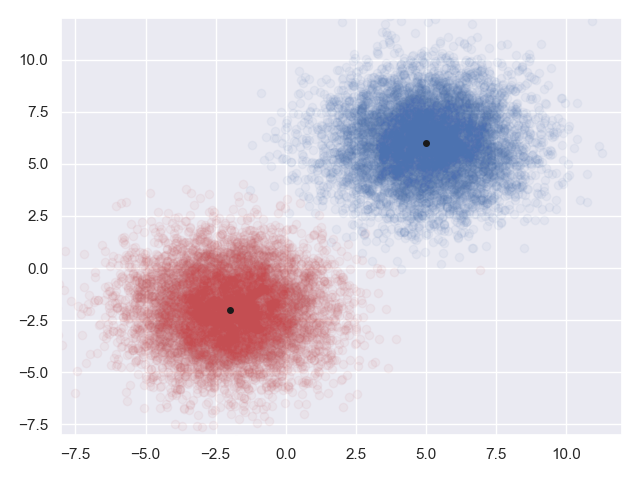
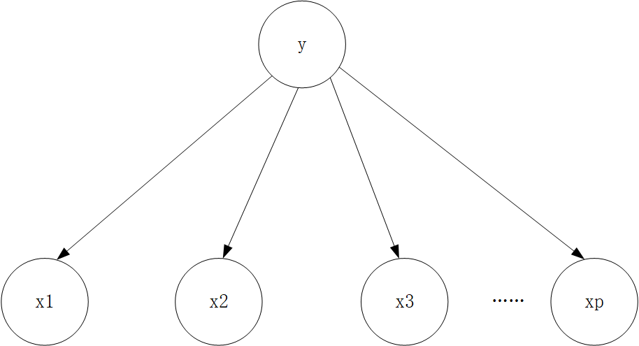

---
tags:
- 数学/随机过程
---

# 06 朴素贝叶斯：基于条件独立性假设

## 1.高斯判别的前提假设回顾

和高斯判别分析一样， [朴素贝叶斯](https://so.csdn.net/so/search?q=%E6%9C%B4%E7%B4%A0%E8%B4%9D%E5%8F%B6%E6%96%AF&spm=1001.2101.3001.7020) 分类器也是一种生成模型，并且也是针对联合概率进行建模：

$$y=argmax_{y \in \{0,1\}}~p(y|x)=argmax~p(y)p(x|y)$$

并且都对先验概率 $p(x|y)$ 有着非常强的假设前提，也正是因为这些很强的假设前提，才让我们的模型变得简化，怎么说呢？

还记得高斯判别分析吧，他假设在指定类别 $y=C_i$ 的情况下，概率 $p(x|y=C_i)$ 满足高斯分布，高斯分布的维度和样本特征的维度 $p$ 一致，不同类别的高斯分布仅仅只有均值不同，但是协方差矩阵都是一样的，如下图所示。

 从上图中我们可以看出，对于平面上任意一个点，他既可能属于 $C_1$，也可能属于 $C_2$，那么到底属于哪一类，就要看 $p(y=C_1)p(x|y=C_1)$ 和 $p(y=C_2)p(x|y=C_2)$ 谁更大。

高斯判别分析最重要的假设，我们再说一遍，就是 $p(x|y=C_i)$ 是一系列均值不同，协方差相同的高斯分布。

## 2.朴素贝叶斯的前提假设

而朴素贝叶斯也有一个前提假设，同样我们也假设随机变量 $y$ 表示分类，$y\in \{0,1\}$，而样本 $x$ 是一个 $p$ 维的随机向量，$x\in R^p$，代表了样本的 $p$ 个特征属性，那给定一个具体的样本 $x$ 的时候，如何判定他具体应该属于哪一个类别？

还是那个大家熟悉的老生常谈的式子：

我们假定给定一组样本：$\{(x_i,y_i)\}_{i=1}^N$，其中 $x_i\in R^p$，$y_i \in \{0,1\}$，这里也假定是一个二分类问题，当然多分类问题的道理也是一样，没有什么不同。

$$y=argmax_{y \in \{0,1\}}~p(y|x)=argmax~p(y)p(x|y)$$

这里问题的关键仍然是 $p(x|y)$，高斯判别分析里，我们假设给定 $y$ 的分类取值的情况下，$x|y$ 服从一个 $p$ 维的高斯分布，然后就得到了 $p(x|y)$ 的表达式，使得我们可以获得似然函数的表达式，而在朴素贝叶斯 [分类器](https://so.csdn.net/so/search?q=%E5%88%86%E7%B1%BB%E5%99%A8&spm=1001.2101.3001.7020) 当中呢？我们也有一个假设，那就是条件独立性假设，即在给定分类$y$的情况下，样本$x$的$p$个维度属性之间是独立的：

$$x_i \perp x_j|y$$

那么，有了条件独立的假设之后，我们就很容易的对 $p(x|y)$ 进行处理了，即：

$$argmax~p(y)p(x|y)\\=argmax~p(y)p(x_1,x_2,x_3,…,x_p|y)\\=argmax~p(y)p(x_1|y)p(x_2|y)p(x_3|y)…p(x_p|y)$$

以上，就是通过条件独立性进行的式子处理，那么后面再该怎么办？

我们一样需要求得最大的似然函数值，但是这里我们不需要像高斯判别分析中那样进行复杂的求导运算来对参数进行估计，这里无论是 $p(y)$ 还是 $p(x_i|y)$ 都可以通过我们的样本集进行直接统计得到。

## 3.贝叶斯分类器举例

这里找了一个简单的小例子来印证上面的话：
序号驾龄平均车速性别 1160 男 2280 男 3380 男 4280 男 5140 男 6240 女 7140 女 8140 女 9360 女 10380 女

此时，当我们拿到一个样本，此人驾龄 2 年，平均车速 80，我们来用朴素贝叶斯分类器来推测此人的性别：

那么，此时分类 $y=\{男，女\}$，样本有两个特征，其中 $x_1$ 表示驾龄，$x_2$ 表示平均车速。

那么，我们来计算不同分类下的 $p(y)p(x_1|y)p(x_2|y)$，来看哪个大。

$p(y=男)p(x_1=2|y=男)p(x_2=80|y=男)=0.5*0.4*0.6=0.12$

$p(y=女)p(x_1=2|y=女)p(x_2=80|y=女)=0.5*0.2*0.2=0.02$

因此我们选择使得似然函数取值最大的 $y$ 值，显然，我们推测此人为男性。

## 4.条件独立性引申思考

最后我们多啰嗦两句，在围绕条件独立性假设来谈一下：

实际上针对我们建模的联合概率分布 $p(y,x)$，我们依据概率的链式法则进行展开：

$$p(y,x)=p(y,x_1,x_2,x_3,x_4,…,x_p)=\\p(x_1|x_2,..,x_n,y)…p(x_{n-2}|x_{n-1},x_n,y)p(x_{n-1}|x_n,y)p(x_n|y)p(y)$$

而这里引入的条件独立性假设 $x_i \perp x_j|y$，指的就是：

$$p(x_i|x_{i+1},x_{i+2},…,x_n,y)=p(x_i|y)$$

也就是在给定 $y$ 的条件下，$x_i$ 以外的特征取值与否，都不影响 $x_i$ 出现的条件概率，因此整个概率的链式等式得以最终化简。

实际上，我们知道，这个前提假设其实是非常强的，因此在正常情况下，$x_i$ 和 $x_j$ 一般都是有关联的，可能并不是相互独立的，但是特征属性之间的相关性又会在特征数量较多的时候，在高维的情况下带来极大的复杂性，因此一些出于简化模型的前提假设就提出来了，这里的条件独立性假设就是其中一种。

朴素贝叶斯模型也是最简单的一种有向的概率图模型，他的概率图表示如下所示，当然概率图的内容我们后续会专题介绍，这里不太清楚也没有关系，有个印象就好了。

 随机过程中的马尔科夫性也同样属于这一类情况，例如一阶马尔科夫性定义为，下一时刻的状态只与当前状态有关，与过去的状态无关：

$$p(x_n|x_{n-1})=p(x_n|x_{n-1},x_{n-2},x_{n-3},…,x_1)$$

同样的，这种马尔科夫性的前提假设一样的也能在概率的链式法则中帮助我们进行化简，这里就不展开了，后面随机过程和概率图模型中还会花大篇幅去讲。