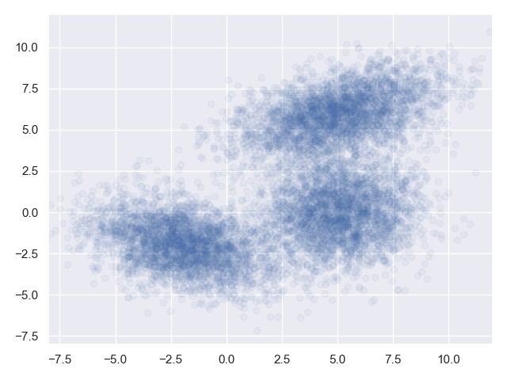
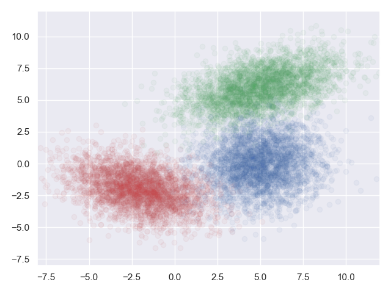
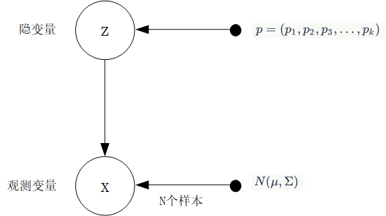

---
tags:
- 数学/随机过程
---

# 10 探索高斯混合模型：EM 迭代实践

## 1.问题背景：多个中心的“高斯分布”

前面我们讲过，在统计学领域，对于很多的样本我们可以用一个高斯分布去概况描述样本的分布，他非常通用，具体的例子我们就不再赘述。现在请大家看看下面这个样本的分布图：

很显然，如果我们试图用一个二元的高斯分布模型去描述图中这些样本点的分布，肯定是不合适的，单个高斯分布无法描述这个图中的样本分布。

## 2.高斯混合模型的引入

这里就需要引入高斯混合模型，顾名思义，这个模型有两个要点，一个是高斯，另一个是混合。

高斯：指的是底层的模型还是高斯分布。

混合：指的是我们利用多个高斯分布进行加权叠加，就是将多个不同的高斯分布的概率密度函数进行加权叠加，形成一个新概率密度函数表达式，他能够更有效的描述当前形式样本的分布。

$$p(x)=\sum_{k=1}^K\alpha_kN(\mu_k,\Sigma_k),\quad \sum_{k=1}^K\alpha_k=1$$

即，我们假设混合高斯模型中有 $N$ 个高斯分布，每个高斯分布概率密度函数 $N(\mu _k,\Sigma_k)$ 的权重是 $\alpha_k$，那么针对上面的例子，我们可以假定高斯混合模型中的高斯分布有 3 个，我们用不同的颜色区分不同的高斯分布，如下图所示，他们拥有不同的权重 $\alpha_1,\alpha_2,\alpha_3$，最终叠加形成所有样本的概率密度函数。

也就是说对于某一个样本，利用高斯混合模型中的每一个高斯分布，都可以计算出一个概率密度值，然后我们把他们按照权重相加就得到他实际最终的概率密度值。

这是从几何角度来介绍高斯混合模型。

## 3.从混合模型的角度看内部机理

但是我觉得这样说可能会给大家带来一定的困惑，下面我们从混合模型的角度，也就是生成模型的角度来探讨，相信更能揭示模型内部的机理：

首先，高斯混合模型中也是同时含有观测变量和隐含变量。观测变量 $x$ 很简单，就是样本各特征的观测值，画在上图中，就是各个点的坐标。

而隐含变量 $z$ 指的是什么呢？这里我们可以拿前面介绍过的软分类的思想做一个类比，就是对于任意一个样本，他并不是“非此即彼”的、“生硬”的属于其中某一个高斯分布，而是属于每一个高斯分布，但是他属于每一个高斯分布的概率不同

假设我们有 $K$ 个高斯分布，即：$C_1,C_2,C_3,…,C_K$，对于每一个样本，他们属于这 $K$ 个高斯分布的概率，都分别对应为 $p_1,p_2,p_3,…,p_K$，这就带来了隐变量 $z$，他是一个离散型的随机变量，他的分布列如下：
$z$$C_1$$C_2$$C_3$$C_4$…$C_K$$p(z)$$p_1$$p_2$$p_3$$p_4$…$p_K$

那么，我们再从混合模型的角度来梳理一下生成一个样本的过程，示意图如下：

第一步：生成一个隐变量 $z$：

换句话说就是依照 $z$ 的随机变量分布，依概率决定当前这个样本属于哪一个高斯分布，想象一个场景，你有一个不均匀的骰子，他有 $K$ 个面儿，每个面向上的概率依次对应为 $p_1,p_2,p_3,…,p_K$，然后我们扔一次骰子，此时哪个面向上，那么我们就决定样本属于哪个高斯分布，记作 $C_i$。

第二步：生成观测变量 $x$。

此时依据我们决定出来的高斯分布 $C_i$，利用这个分布生成一个样本，得到他的观测变量值 $x$。

那么这个混合模型样本生成的过程，听起来和前面的概率密度加权方法似乎不太一样，别急，我们从这个混合模型的角度再来看一下概率密度函数 $p(x)$ 的形式：

$$p(x)=\sum_{z}p(x,z)=\sum_{k=1}^K p(x,z=C_k)\\=\sum_{k=1}^Kp(z=C_k)p(x|z=C_k)=\sum_{k=1}^Kp_kN(x|\mu_k,\Sigma_k)$$

这么一看，不论是从加权平均还是混合模型生成的角度去考察高斯混合模型，得到的结果都是统一的。

## 4.高斯混合模型的参数估计

高斯混合模型的基本由来我们搞明白了，那下面我们来看一下高斯混合模型的参数估计问题：

高斯混合模型的参数包含三个部分：样本属于每个高斯分布的概率、每个高斯分布的均值向量、每个高斯分布的协方差矩阵：

$$\theta=(p_1,p_2,…,p_K,\mu_1,\mu_2,…,\mu_k,\Sigma_1,\Sigma_2,…,\Sigma_k)$$

样本 $X$ 称为观测数据，$Z$ 称之为隐变量，$(X,Z)$ 称之为完全数据。

那针对高斯混合模型，我们如何利用观测数据进行参数估计呢？直接套用极大似然估计的方法：

$$\theta_{mle}=argmax_{\theta}~log~p(X|\theta)$$

能够顺利求出参数 $\theta$ 的解析解吗？我们变换着看看：

$$\theta_{mle}=argmax_{\theta}log~p(X|\theta)\\=argmax_{\theta}log\prod_{i=1}^Np(x_i|\theta)\\=argmax_{\theta}\sum_{i=1}^Nlog~p(x_i|\theta)$$

代入我们在高斯混合模型中定义的概率密度公式：

$$\theta_{mle}=argmax_{\theta}\sum_{i=1}^Nlog\sum_{k=1}^Kp_kN(x_i|\mu_k,\Sigma_k)$$

看一下，如果想用极大似然估计求参数的解析解，就得用

$$\sum_{i=1}^Nlog\sum_{k=1}^Kp_kN(x_i|\mu_k,\Sigma_k)$$

对参数 $p_k,\mu_k,\Sigma_k$ 分别求偏导，然而问题来了，这个式子中，$log$ 运算符中有加号，求偏导非常复杂，基本上是不能通过直接求导的方式获取极大似然估计值。

那么怎么办？解析解求不出来，我们就想到了上一讲介绍的 $EM$ 方法，用数值解的方法，通过不断的迭代，探索出使得 $log~p(x|\theta)$ 取得最大值的参数 $\theta$。具体怎么做，我们下一讲来看。