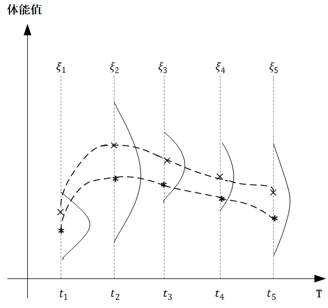
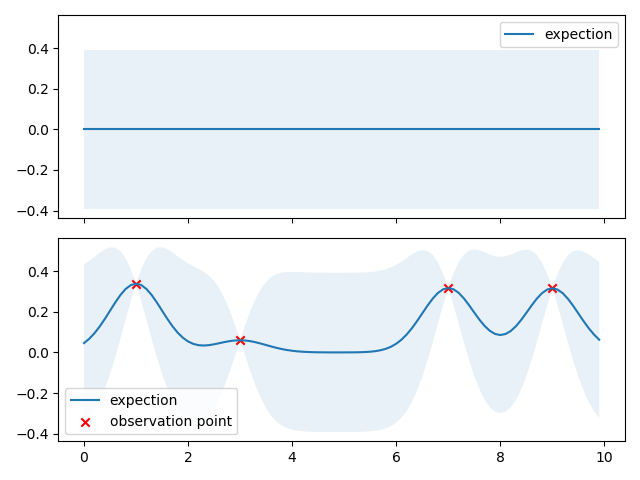

---
tags:
- 数学/随机过程
---

# 12 连续域上的无限维：高斯过程介绍

## 1.高斯过程概述

这一讲，我们介绍高斯过程，从字面上分解，我们就可以看出他包含两部分：

第一：高斯，指的是 [高斯分布](https://so.csdn.net/so/search?q=%E9%AB%98%E6%96%AF%E5%88%86%E5%B8%83&spm=1001.2101.3001.7020) 第二：过程，指的是随机过程

随机过程最基础的概念我们在《机器学习中的数学：概率统计》中已经详细介绍过，大家有兴趣可以再去回顾一下。

我们回过头来重新梳理一下整个高斯分布的脉络：

首先当随机变量是 $1$ 维的时候，我们称之为一维高斯分布，概率密度函数 $p(x)=N(\mu,\sigma^2)$，当随机变量的维度上升到有限的 $p$ 维的时候，就称之为高维高斯分布，$p(x)=N(\mu,\Sigma_{p\times p})$。而高斯过程则更进一步，他是一个定义在连续域上的无限多个高斯随机变量所组成的随机过程，换句话说，高斯过程是一个无限维的高斯分布。

我们用符号来更严谨的进行描述：

对于一个连续域 $T$（假设他是一个时间轴），如果我们在连续域上任选 $n$ 个时刻：$t_1,t_2,t_3,…,t_n\in T$，使得获得的一个 $n$ 维向量 $\{\xi_1,\xi_2,\xi_3,…,\xi_n\}$ 都满足其是一个 $n$ 维高斯分布，那么这个 $\{\xi_t\}$ 就是一个高斯过程。

## 2.高斯过程的一个实际例子

下面我们来实际举一个例子，让大家更能直观的建立高斯过程的印象，在下面的图中，横轴 $T$ 是一个关于时间的连续域，表示人的一生，而纵轴表示的是体能值，对于同一个人种的男性而言，在任意不同的时间点体能值都服从正态分布，但是不同时间点分布的均值和方差不同。

 图中，我们取出了 $t_1,t_2,t_3,t_4,t_5$ 五个时间点，分别代表同一个男性群体童年、少年、青年、中年、老年的具体时刻，$\xi_1,\xi_2,\xi_3,\xi_4,\xi_5$ 分别对应五个时刻的体能值，他们都服从高斯分布，只不过从图中可以看出，均值和方差都不同，那么概括起来：

对于任意 $t\in 连续时间轴 T$，$\xi_t\sim N(\mu_t,\sigma^2_t)$，也就是对于一个确定的高斯过程而言，对于任意时刻 $t$，他的 $\mu_t$ 和 $\sigma^2_t$ 都已经确定了。而像上图中，我们对同一人种男性体能值在关键节点进行采样，然后平滑连接，也就是图中的两条虚线，就形成了这个高斯过程中的两个样本。

## 3.高斯过程的核心要素和严谨描述

那如何用形式化的语言来描述一个具体的高斯过程呢？很简单，我们回忆一下，最开始我们把高斯过程看作什么？看作是无限维的高斯分布。那么我们类比一下：

对于一个 $p$ 维的高斯分布而言，决定他的分布是两个参数，一个是 $p$ 维的均值向量 $\mu_p$，他反映了 $p$ 维高斯分布中每一维随机变量的期望，另一个就是 $p\times p$ 的协方差矩阵 $\Sigma_{p\times p}$，他反映了高维分布中，每一维自身的方差，以及不同维度之间的协方差。

定义在连续域 $T$ 上的高斯过程其实也是一样，他是无限维的高斯分布，他同样需要描述每一个时间点 $t$ 上的均值，但是这个时候就不能用向量了，因为是在连续域上的，维数是无限的，因此就应该定义成一个关于时刻 $t$ 的函数：$m(t)$。

协方差矩阵也是同理，无限维的情况下就定义为一个核函数 $k(s,t)$，其中 $s$ 和 $t$ 表示任意两个时刻，核函数也称协方差函数。核函数是一个高斯过程的核心，他决定了高斯过程的性质，在研究和实践中，核函数有很多种不同的类型，他们对高斯过程的衡量方法也不尽相同，这里我们介绍和使用最为常见的一个核函数：径向基函数 $RBF$，其定义如下：

$$k(s,t)=\sigma^2exp(-\frac{||s-t||^2}{2l^2})$$

这里面的 $\sigma$ 和 $l$ 是径向基函数的超参数，是我们提前可以设置好的，例如我们可以让 $\sigma=1$，$l=1$，从这个式子中，我们可以解读出他的思想：

$s$ 和 $t$ 表示高斯过程连续域上的两个不同的时间点，$||s-t||^2$ 是一个二范式，简单点说就是 $s$ 和 $t$ 之间的距离，径向基函数输出的是一个标量，他代表的就是 $s$ 和 $t$ 两个时间点各自所代表的高斯分布之间的协方差值，很明显径向基函数是一个关于 $s，t$ 距离负相关的函数，两个点距离越大，两个分布之间的协方差值越小，即相关性越小，反之越靠近的两个时间点对应的分布其协方差值就越大。

由此，高斯过程的两个核心要素：均值函数和核函数的定义我们就描述清楚了，按照高斯过程存在性定理，一旦这两个要素确定了，那么整个高斯过程就确定了：

$$\xi_t\sim GP(m(t),k(t,s))$$

## 4.径向基函数的代码演示

我们来看一段径向基函数的演示代码：

**代码片段：**

```
import numpy as np

def gaussian_kernel(x1, x2, l=1.0, sigma_f=1.0):
    m, n = x1.shape[0], x2.shape[0]
    dist_matrix = np.zeros((m, n), dtype=float)
    for i in range(m):
        for j in range(n):
            dist_matrix[i][j] = np.sum((x1[i] - x2[j]) ** 2)
    return sigma_f ** 2 * np.exp(- 0.5 / l ** 2 * dist_matrix)

train_X = np.array([1, 3, 7, 9]).reshape(-1, 1)#转换为4*1矩阵形式
print(gaussian_kernel(train_X, train_X))
```

+ 1+ 2+ 3+ 4+ 5+ 6+ 7+ 8+ 9+ 10+ 11+ 12

**运行结果：**

```
[[1.00000000e+00 1.35335283e-01 1.52299797e-08 1.26641655e-14]
 [1.35335283e-01 1.00000000e+00 3.35462628e-04 1.52299797e-08]
 [1.52299797e-08 3.35462628e-04 1.00000000e+00 1.35335283e-01]
 [1.26641655e-14 1.52299797e-08 1.35335283e-01 1.00000000e+00]]
```

+ 1+ 2+ 3+ 4

在这个函数中，我们输入 $4$ 个时间点：$[t_1,t_2,t_3,t_4]$，输出的是一个 $4\times 4$ 的协方差矩阵，反映的任意 $t_i$ 和 $t_j$ 两个时间点对应的高斯分布的协方差值，当 $i=j$ 时，就是自身的方差。

## 5.高斯过程回归原理详解

最后我们来看高斯过程回归。

这个过程我们其实可以看作是一个先验+观测值，然后推出后验的过程，怎么讲？

我们先通过 $\mu(t)$ 和 $k(s,t)$ 定义一个高斯过程，但是因为此时并没有任何的观测值，所以这是一个先验。

那么，如果我们获得了一组观测值之后，如何来修正这个高斯过程的均值函数和核函数，使之得到他的后验过程呢？

我们先回顾一下高维高斯分布的条件概率，我们知道，高斯分布有一个很好的特性，那就是高斯分布的联合概率、边缘概率、条件概率仍然是满足高斯分布的，假设：$n$ 维的随机变量满足高斯分布：

$$x\sim N(\mu,\Sigma_{n\times n})$$

那么如果我们把这个 $n$ 维的随机变量分成两部分：$p$ 维的 $x_a$ 和 $q$ 维的 $x_b$，满足 $n=q+p$，那么按照均值向量 $\mu$ 和协方差矩阵 $\Sigma$ 的分块规则，就可以写成：

$$x=\begin{bmatrix}x_a\\x_b\end{bmatrix}_{p+q}\quad\mu=\begin{bmatrix}\mu_a\\\mu_b\end{bmatrix}_{p+q}\quad \Sigma=\begin{bmatrix}\Sigma_{aa}&\Sigma_{ab}\\\Sigma_{ba}&\Sigma_{bb}\end{bmatrix}$$

那么依据高斯分布的性质，我们知道下列条件分布依然是一个高维的高斯分布：

$$x_b|x_a\sim N(\mu_{b|a},\Sigma_{b|a})$$

$$\mu_{b|a}=\Sigma_{ba}\Sigma^{-1}_{aa}(x_a-\mu_a)+\mu_b$$

$$\Sigma_{b|a}=\Sigma_{bb}-\Sigma_{ba}\Sigma^{-1}_{aa}\Sigma_{ab}$$

也就是说，设置了高斯过程的先验参数，一旦我们拿到一些观测值，那么就可以对高斯过程的均值函数和核函数进行修正，得到一个修正后的后验高斯过程，而更新后验参数的信息就来自于观测值。

那么将高斯过程对比高维高斯分布，我们把均值向量替换成均值函数，把协方差矩阵替换成核函数，就能够得到高斯过程基于观测值的后验过程的参数表达式：

我们的一组观测值，他们的时刻对应一个向量 $X$，那么对应的值是另一个同维度的向量 $Y$，假设有 $4$ 对观测值，那就是：

$$\{(X[1],Y[1]),((X[2],Y[2])),((X[3],Y[3])),((X[4],Y[4]))\}$$

那么余下的所有非观测点，在连续域上我们定义为 $X^*$，值定义为 $f(X^*)$

首先，联合分布显然是满足无限维高斯分布的：

$$\begin{bmatrix}Y\\f(X^*)\end{bmatrix}\sim N(\begin{bmatrix}\mu(X)\\\mu(X^*)\end{bmatrix}，\begin{bmatrix}k(X,X)& k(X,X^*)\\k(X^*,X)&k(X^*,X^*)\end{bmatrix})$$

从这个联合分布所派生出来的条件概率 $f(X^*)|Y$ 同样也服从高斯分布，当然这里指的是无限维高斯分布，其实对比一下，把 $Y$ 看作是 $x_a$，把 $f(X^*)$ 看作是 $x_b$，直接类比条件分布的参数表达式：

$$f(X^*)|Y\sim N(\mu^*,k^*)$$

这里面的 $\mu^*$ 和 $k^*$ 就是条件分布下的后验高斯过程的均值函数和核函数的形式。

类比我们就可以写成表达式：

$$\mu^*=k(X^*,X)k(X,X)^{-1}(Y-\mu(X))+\mu(X^*)$$

$$k^*=k(X^*,X^*)-k(X^*,X)k(X,X)^{-1}k(X,X^*)$$

## 6.高斯过程回归代码演示

好了，公式堆的够多了，下面我们来实际的进行代码演示，在我们的例子中，高斯过程先验，我们设置均值函数为 $\mu(X)=0$，径向基函数 $k(X,X^*)=\sigma^2exp(-\frac{||X-X^*||^2}{2l^2})$ 中的超参数为 $l=0.5$，$\sigma=0.2$。

然后我们 $X=[1,3,7,9]$ 的位置上设置一组观测值，$Y$ 为 $X$ 取正弦的基础上加上一点高斯噪声（这个 $Y$ 的公式没有任何实际物理意义，纯为随机选取）：

$$y=0.4sin(x)+N(0,0.05)$$

我们在四个观测点的基础上，来求高斯过程的后验。在下面的具体程序实现中，由于绘图是离散化处理的，因此对于连续域上的均值函数以及核函数，我们可以使用一个 $n$ 很大的 $n$ 维均值向量以及 $n\times n$ 协方差矩阵来进行近似等价表示：

**代码片段：**

```
import matplotlib.pyplot as plt
import numpy as np

#高斯核函数
def gaussian_kernel(x1, x2, l=0.5, sigma_f=0.2):
    m, n = x1.shape[0], x2.shape[0]
    dist_matrix = np.zeros((m, n), dtype=float)
    for i in range(m):
        for j in range(n):
            dist_matrix[i][j] = np.sum((x1[i] - x2[j]) ** 2)
    return sigma_f ** 2 * np.exp(- 0.5 / l ** 2 * dist_matrix)

#生成观测值，取sin函数没有别的用意，单纯就是为了计算出Y
def getY(X):
    X = np.asarray(X)
    Y = np.sin(X)*0.4 + np.random.normal(0, 0.05, size=X.shape)
    return Y.tolist()

#根据观察点X，修正生成高斯过程新的均值和协方差
def update(X, X_star):
    X = np.asarray(X)
    X_star = np.asarray(X_star)
    K_YY = gaussian_kernel(X, X)  # K(X,X)
    K_ff = gaussian_kernel(X_star, X_star)  # K(X*, X*)
    K_Yf = gaussian_kernel(X, X_star)  # K(X, X*)
    K_fY = K_Yf.T # K(X*, X) 协方差矩阵是对称的，因此分块互为转置
    K_YY_inv = np.linalg.inv(K_YY + 1e-8 * np.eye(len(X)))  # (N, N)
    
    mu_star = K_fY.dot(K_YY_inv).dot(Y)
    cov_star = K_ff - K_fY.dot(K_YY_inv).dot(K_Yf)
    return mu_star, cov_star

f, ax = plt.subplots(2, 1, sharex=True,sharey=True)
#绘制高斯过程的先验
X_pre = np.arange(0, 10, 0.1)
mu_pre = np.array([0]*len(X_pre))
Y_pre = mu_pre
cov_pre = gaussian_kernel(X_pre, X_pre)
uncertainty = 1.96 * np.sqrt(np.diag(cov_pre))#取95%置信区间
ax[0].fill_between(X_pre, Y_pre + uncertainty,Y_pre - uncertainty, alpha=0.1)
ax[0].plot(X_pre, Y_pre, label="expection")
ax[0].legend()

#绘制基于观测值的高斯过程后验
X = np.array([1, 3, 7, 9]).reshape(-1, 1)#4*1矩阵
Y = getY(X)
X_star = np.arange(0, 10, 0.1).reshape(-1, 1)
mu_star, cov_star = update(X, X_star)
Y_star = mu_star.ravel()
uncertainty = 1.96 * np.sqrt(np.diag(cov_star))#取95%置信区间
ax[1].fill_between(X_star.ravel(), Y_star + uncertainty, Y_star - uncertainty, alpha=0.1)
ax[1].plot(X_star, Y_star, label="expection")
ax[1].scatter(X, Y, label="observation point", c="red", marker="x")
ax[1].legend()
plt.show()
```

+ 1+ 2+ 3+ 4+ 5+ 6+ 7+ 8+ 9+ 10+ 11+ 12+ 13+ 14+ 15+ 16+ 17+ 18+ 19+ 20+ 21+ 22+ 23+ 24+ 25+ 26+ 27+ 28+ 29+ 30+ 31+ 32+ 33+ 34+ 35+ 36+ 37+ 38+ 39+ 40+ 41+ 42+ 43+ 44+ 45+ 46+ 47+ 48+ 49+ 50+ 51+ 52+ 53+ 54+ 55+ 56+ 57+ 58

**运行结果：**

 我们分析一下试验结果，图中浅蓝半透明区域表示在该点均值附近取 $95\%$ 置信区间的区域，上面一幅图是高斯过程的先验，下面是在四对观测值的基础上的高斯过程后验，明显可以看出，由于观测点信息的带入，连续域上各个点的均值发生了变化，同时大部分取值点的 $95\%$ 置信空间也收窄了，证明确定性得到了增强。