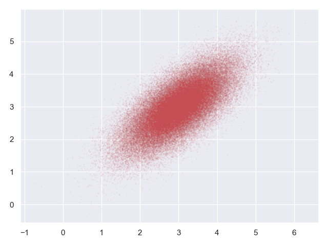

---
tags:
- 数学/随机过程
---

# 16 马尔科夫链蒙特卡洛方法：从 M-H 到 Gibbs

这一讲，我们利用前面介绍的马尔科夫链稳态的性质，来谈谈如何基于马尔科夫链蒙特卡洛方法进行近似采样。

## 1.Metropolis-Hastings 采样原理

我们的目标采样分布是 $p(z)$，同时我们手里有一个便于随时间进行遍历的马尔科夫链，他的状态转移矩阵为 $Q$。

为了方便的在马尔科夫链上随时间进行状态转移，这里的矩阵 $Q$ 设计相当讲究：$Q_{ij}=P(x^{*}|x)=N(\mu=x,\sigma=1).pmf(x^{*})$

这是什么意思？他指的是从 $t$ 时刻的某个指定采样点 $x$ 转移到 $t+1$ 时刻的指定采样点 $x^*$ 的概率等于在均值为 $x$，方差为 $1$ 的整体分布中取得 $x^*$ 的概率值，感觉其实应该写成 $pdf$ 的，因为正态分布是一个连续型的分布，但是这里因为是计算机采样，实际上我们已经把目标分布以及这里的正态分布都给离散化了，所以写成 $pmf$ 更符合实际操作的需要。

至于说为什么选他，后面我们还会专门分析。

但是就这么一个目标概率 $p(z)$ 和一个八竿子打不着的我们心中合适的提议矩阵 $Q$ 能满足马尔科夫链的细致平稳条件吗？想想肯定是不可能的，即：

$$p(z)Q(z,z^*)\neq p(z^*)Q(z^*,z)$$

这里，为了后面整个表达的格式统一，我们将该状态转移矩阵所对应的马尔科夫链的状态 $z$ 转移到状态 $z^*$ 的概率记作：$Q(z,z^*)$

为了让这个细致平稳条件的等式得到满足，我们引入一个接受率因子的表达式：

$$\alpha(z,z^*)=min(1,\frac{p(z^*)Q(z^*,z)}{p(z)Q(z,z^*)})$$

原来的不等式两边各自乘上对应的接受率因子 $\alpha$，细致平稳条件就可以神奇的得到满足：

$$p(z)Q(z,z^*)\alpha(z,z^*)=p(z^*)Q(z^*,z)\alpha(z^*,z)$$

这里我们重点来证明一下，为什么此处细致平稳条件可以被满足：

$$p(z)Q(z,z^*)\alpha(z,z^*)=p(z)Q(z,z^*)min(1,\frac{p(z^*)Q(z^*,z)}{p(z)Q(z,z^*)})\\=min(p(z)Q(z,z^*),p(z^*)Q(z^*,z))\\=p(z^*)Q(z^*,z)min(1,\frac{p(z)Q(z,z^*)}{p(z^*)Q(z^*,z)})\\=p(z^*)Q(z^*,z)\alpha(z^*,z)$$

此时我们非常容易的证明了细致平稳条件的成立。但是此时显然，$p(z)$ 并不是 $Q$ 对应的马尔科夫链的平稳分布，而是叠加了接受率 $\alpha$ 之后新的转移过程。

## 2.M-H 采样步骤

如果我们要采样 $N$ 个样本，那么第 $i$ 轮的采样的过程如下：

第一步：我们从 $[0,1]$ 均匀分布中随机抽取一个数 $u$，即 $u\sim U(0,1)$

第二步：我们利用状态转移矩阵，从上一轮的样本 $z^{(i-1)}$ 依概率抽取出这一步应该转移到的状态 $z^{*}$，即：$z^*\sim Q(z|z^{(i-1)})$

第三步：计算出接受率 $\alpha=min(1,\frac{p(z^*)Q(z^*,z)}{p(z)Q(z,z^*)})$

第四步：判断，如果此时 $u\le \alpha$，那么我们把 $z^*$ 作为第 $i$ 轮的采样值，即 $z^{(i)}=z^*$，如果 $u\ge \alpha$，抛弃 $z^*$，我们沿用上一轮的采样值 $z^{i-1}$ 作为本轮的采样值，即 $z^{(i)}=z^{(i-1)}$

经过燃烧期之后，我们取连续 $N$ 个时间点的状态值，就可以作为我们目标分布的样本近似了。

一般而言，我们会选择一个比较适合进行状态转移操作的马尔科夫链，这里描述为：作为状态空间 $S$ 里的任意两个状态，第 $i$ 个状态 $x$，第 $j$ 个状态为 $x^*$，$Q_{ij}=P(x^{*}|x)=N(\mu=x,\sigma=1).pmf(x^{*})$

显然满足这个条件的 $Q$ 矩阵是一个非常好的选择：

第一，他是合理的，矩阵的任意一行之和显然为 $1$，因此满足状态转移矩阵的条件。

$$\sum_j Q_{ij}=\sum_{x^*\in s}N(\mu=x,\sigma=1).pmf(x^{*})=1$$

道理很容易说明白，就是在一个以 $x$ 为均值，$1$ 为方差的正态分布中，状态空间中所有可选状态的概率之和显然为 $1$，这是概率分布的定义所决定的。

第二，他是方便的，当前状态为 $x$ 的情况下，我们决定下一个状态 $x^*$ 的过程，就是从正态分布 $N(\mu=x,\sigma=1)$ 中采得一个样本的过程。

第三，他是对称的，即 $Q_{ij}=Q_{ji}$：也就是说 $N(\mu=x,\sigma=1).pmf(x^{*})=N(\mu=x^*,\sigma=1).pmf(x^)$，这样使得 $Q(z^*,z)=Q(z,z^*)$，接受率得以简化：

$$\alpha=min(1,\frac{p(z^*)Q(z^*,z)}{p(z)Q(z,z^*)})=min(1,\frac{p(z^*)}{p(z)})$$

方便了计算。

这就是 Metropolis-Hastings 算法的最核心的部分，这足以对 M-H 算法有了一个全面的了解，具体的细节和举例我们在《机器学习中的数学：概率统计》专栏的第 17 讲里掰开揉碎讲的很透彻了，这里我们不再重复，有兴趣大家可以回过头看一看。

## 3.Gibbs 方法核心流程

在 $M-H$ 算法的基础上，我们再介绍一下 $Gibbs$ 采样。

吉布斯采样是一种针对高维分布的采样方法，假设我们待采样的高维目标分布为 $p(z_1,z_2,z_3,…,z_m)$，吉布斯采样的目标就是从这个高维分布中采样出一组样本 $z^{(1)},z^{(2)},z^{(3)},…,z^{(N)}$，使得这一组样本能够服从 $m$ 维分布 $p(z)$。

我们先约定一个记法：按照上述假设，从分布中采得的样本 $z$ 是一个拥有 $m$ 维属性值的样本值，$z_i$ 表示某个样本 $z$ 的第 $i$ 维属性，$z_{-i}$ 表示除开第 $i$ 维样本外，剩余的 $m-1$ 维属性：$z_1,z_2,…,z_{i-1},z_{i+1},…,z_m$

具体如何采样，核心在七个字：一维一维的采样：

那么何谓一维一维的采样呢？我们以三维随机变量 $z$ 为例：$p(z)=p(z_1,z_2,z_3)$

首先在 $0$ 时刻，我们给定一个初值，也就是 $z^{(0)}$ 的三个属性的值：$z^{(0)}_1,z^{(0)}_2,z^{(0)}_3$

好，此时我们来看下一个时刻，也就是时刻 $1$ 的采样值如何生成：

$$z_1^{(1)}\sim p(z_1|z_2^{(0)},z_3^{(0)})$$

$$z_2^{(1)}\sim p(z_2|z_1^{(1)},z_3^{(0)})$$

$$z_3^{(1)}\sim p(z_2|z_1^{(1)},z_2^{(1)})$$

这样就获得了时刻 $1$ 的包含三维属性值的完整采样值。

那么接着往下递推，概况起来，通过 $t$ 时刻的采样值递推到 $t+1$ 时刻，也是如上述方法那样一维一维的生成采样值的各个属性：固定其他维的属性值，通过条件概率，依概率生成 $t+1$ 时刻的某一维度的属性值。

$$z_1^{(t+1)}\sim p(z_1|z_2^{(t)},z_3^{(t)})$$

$$z_2^{(t+1)}\sim p(z_2|z_1^{(t+1)},z_3^{(t)})$$

$$z_3^{(t+1)}\sim p(z_2|z_1^{(t+1)},z_2^{(t+1)})$$

这样就由 $t$ 时刻的采样值 $z^{(t)}$ 得到了下一时刻 $t+1$ 的采样值 $z^{(t+1)}$

按照该方法循环下去，就可以采样出 $N$ 个样本值：$z^{(1)},z^{(2)},z^{(3)},…,z^{(N)}$，丢弃掉前面一部分燃烧期的样本，剩下的样本就服从我们的目标高维分布。

## 4.Gibbs 采样的合理性

以上就是 Gibbs 采样的核心流程，但是有一个问题我们始终没有讨论：为什么通过这种采样方法采得的样本能够服从目标分布 $p(z)$？

我们拿 Gibbs 采样和 M-H 方法进行类比，我们会发现其实 Gibbs 采样就是 M-H 采样的一种特殊情况，这个结论就可以证明 Gibbs 采样的可行性，注意逻辑是这样的，我们已经证明了 M-H 是符合细致平稳条件的，而 Gibbs 是 M-H 的一种特殊情况，因此 Gibbs 也符合细致平稳条件，因此可行。

首先，我们采样的目标分布是 $p(z)$，而我们实际使用的提议转移过程 $Q$ 就是概率 $p$ 本身：$Q(z^*,z)=p(z_i|z_{-i}^*)$，你发现了没，在这个采样过程，好像没有接受率 $\alpha$ 的出现。

我们重新看看接受率 $\alpha(z^*,z)$ 的定义式：

$$\alpha(z^*,z)=min(1,\frac{p(z^*)Q(z^*,z)}{p(z)Q(z,z^*)})$$

重点就在 $\frac{p(z^*)Q(z^*,z)}{p(z)Q(z,z^*)}$ 这个式子：$p(z)=p(z_i,z_{-i})=p(z_i|z_{-i})p(z_{-i})$

$$\frac{p(z^*)Q(z^*,z)}{p(z)Q(z,z^*)}=\frac{[p(z_i^*|z_{-i}^*)p(z_{-i}^*)]p(z_i|z_{-i}^*)}{[p(z_i|z_{-i})p(z_{-i})]p(z_i^*|z_{-i})}$$

这个式子如何化简？我们发现，在上面的转移过程 $z\rightarrow z^*$ 当中，我们是通过固定采样值 $z$ 的 $-i$ 维属性，单采 $z^*$ 的第 $i$ 维属性值，那么在一次属性采样前后 $z_{-i}$ 和 $z_{-i}^*$ 是一码事儿，那我们把上面式子中所有的 $z_{-i}^*$ 都替换成 $z_{-i}$，就有：

$$\frac{p(z^*)Q(z^*,z)}{p(z)Q(z,z^*)}=\frac{[p(z_i^*|z_{-i}^*)p(z_{-i}^*)]p(z_i|z_{-i}^*)}{[p(z_i|z_{-i})p(z_{-i})]p(z_i^*|z_{-i})}$$

$$=\frac{[p(z_i^*|z_{-i})p(z_{-i})]p(z_i|z_{-i})}{[p(z_i|z_{-i})p(z_{-i})]p(z_i^*|z_{-i})}=1$$

也就是说 Gibbs 采样中的接受率 $\alpha$ 为：

$$\alpha(z^*,z)=min(1,\frac{p(z^*)Q(z^*,z)}{p(z)Q(z,z^*)})=min(1,1)=1$$

因此满足细致平稳条件的原始等式：

$$p(z)Q(z,z^*)\alpha(z,z^*)=p(z^*)Q(z^*,z)\alpha(z^*,z)$$

就等效为：

$$p(z)Q(z,z^*)*1=p(z^*)Q(z^*,z)*1$$

$$\Rightarrow p(z)Q(z,z^*)=p(z^*)Q(z^*,z)$$

其中：$Q(z^*,z)=p(z_i|z_{-i}^*)$

因此 $p(z)$ 和 $Q(z,z^*)$ 满足细致平稳条件，按照 $Q$ 描述的状态转移过程所得到的采样样本集，在数量足够多的情况下，就近似为目标分布 $p(z)$。

但是我们看出来了，我们把提议转移概率矩阵 $Q$ 就定位了 $p$ 的满条件概率，那么很显然就有一个限制条件，那就是高维分布 $p$ 的所有满条件概率都是易于采样的。

## 5.Gibbs 采样代码试验

说了这么多，我们举个具体的例子，比如目标分布是一个二维的高斯分布，他的均值向量：$\mu=\begin{bmatrix}3\\3\end{bmatrix}$，协方差矩阵 $\Sigma=\begin{bmatrix}1&0.6\\0.6&1\end{bmatrix}$，即 $z$ 包含两维属性 $(z_1,z_2)$，$z \sim N(\mu, \Sigma)$。

我们通过吉布斯采样的方法，来获取服从上述分布的一组样本值：

很显然，这个二维高斯分布的目标分布是可以进行 Gibbs 采样的，因为高斯分布有一个好的性质，我们之前反复说过，那就是高斯分布的条件分布也是高斯分布，因此保证了一维一维采样的过程是顺畅的。

我们先给出二维高斯分布的条件概率分布公式：

$z$ 包含两维属性 $(z_1,z_2)$，$z \sim N(\mu, \Sigma)$，其中 $\mu=\begin{bmatrix}\mu_1\\\mu_2\end{bmatrix}，\Sigma=\begin{bmatrix}\delta_{11}&\delta_{12}\\\delta_{21}&\delta_{22}\end{bmatrix}$

那么条件分布 $z_1|z_2$ 和 $z_2|z_1$ 分别服从下面的形式：

$$z_1|z_2\sim N(\mu_1+\frac{\delta_{12}}{\delta_{22}}(z_2-\mu_2),\delta_{11}-\frac{\delta^2_{12}}{\delta_{22}})$$

$$z_2|z_1\sim N(\mu_2+\frac{\delta_{12}}{\delta_{11}}(z_1-\mu_2),\delta_{22}-\frac{\delta^2_{12}}{\delta_{11}})$$

这就是二维高斯分布采样过程中，逐维采样所依从的满条件分布，他是高斯分布，因此操作尤其简便，下面我们来看代码：

**代码片段：**

```
import numpy as np
import matplotlib.pyplot as plt
import seaborn
seaborn.set()

#依照z1|z2的条件高斯分布公式，给定z2的条件情况下采样出z1
def p_z1_given_z2(z2, mu, sigma):
    mu = mu[0] + sigma[1][0] / sigma[0][0] * (z2 - mu[1])
    sigma = sigma[0][0] - sigma[1][0]**2 / sigma[1][1]
    return np.random.normal(mu, sigma)

#依照z2|z1的条件高斯分布公式，给定z1的条件情况下采样出z2
def p_z2_given_z1(z1, mu, sigma):
    mu = mu[1] + sigma[0][1] / sigma[1][1] * (z1 - mu[0])
    sigma = sigma[1][1] - sigma[0][1]**2 / sigma[0][0]
    return np.random.normal(mu, sigma)

#Gibbs采样过程
def gibbs_sampling(mu, sigma, samples_period):
    samples = np.zeros((samples_period, 2))
    z2 = np.random.rand() * 10

    for i in range(samples_period):
        z1 = p_z1_given_z2(z2, mu, sigma)
        z2 = p_z2_given_z1(z1, mu, sigma)
        samples[i, :] = [z1, z2]

    return samples

#目标分布p(z)
mus = np.array([3, 3])
sigmas = np.array([[1, .7], [.7, 1]])

#确定总的采样期和燃烧期
burn_period = int(1e4)
samples_period = int(1e5)
#得到采样样本，舍弃燃烧期样本点
samples = gibbs_sampling(mus, sigmas, samples_period)[burn_period:]
plt.plot(samples[:, 0], samples[:, 1], 'ro', alpha=0.05, markersize=1)
plt.show()
```

+ 1+ 2+ 3+ 4+ 5+ 6+ 7+ 8+ 9+ 10+ 11+ 12+ 13+ 14+ 15+ 16+ 17+ 18+ 19+ 20+ 21+ 22+ 23+ 24+ 25+ 26+ 27+ 28+ 29+ 30+ 31+ 32+ 33+ 34+ 35+ 36+ 37+ 38+ 39+ 40+ 41

**运行结果：**


这个采样结果的分布，看上去是满意的，以上就是 Gibbs 采样的原理和演示过程。