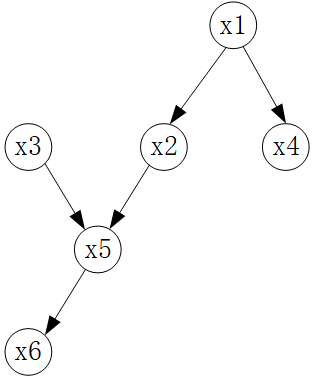
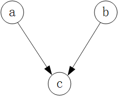
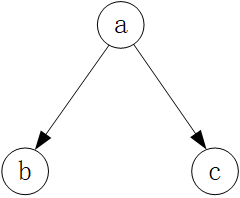
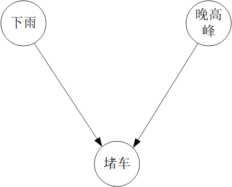

---
tags:
- 数学/随机过程
---

# 18 有向图模型与条件独立性

这一讲，我们从整体介绍概率图模型中的有向图模型，即 [贝叶斯网络](https://so.csdn.net/so/search?q=%E8%B4%9D%E5%8F%B6%E6%96%AF%E7%BD%91%E7%BB%9C&spm=1001.2101.3001.7020) 。

## 1.有向图对概率模型的表达

在上一讲当中，我们曾经遗留了一个问题，即概率图模型将抽象的图赋予了概率的含义，而概率图模型的中心问题就是多维随机变量的联合概率分布 $p(x_1,x_2,x_3,…,x_p)$ 的计算，而高维度就是导致链式法则计算的直接原因，由此我们想了很多办法去进行简化。

那么在这一讲，我们就基于有向概率图模型来谈谈如何进行联合概率表达式的简化，以及其中的窍门：条件独立性。

首先我们来谈谈作为有向图的贝叶斯网络是如何表达概率模型的，如下图所示：

 有向图中，每一个节点代表的都是随机变量，而父子节点之间带有方向性的箭头则表达为条件概率，他反映了父节点和子节点之间的关系，在下面这个局部中：

 在这个局部中，$x_i$ 是 $x_j$ 的父节点，因此这个图中 $x_i$、$x_j$ 两个节点以及二者之间的有向关系则表示为条件概率：$p(x_j|x_i)$

## 2.贝叶斯网络中的三种基本结构

实际上，在贝叶斯网络中，无论节点有多少，看上去网络有多么复杂，实际上都是由三类基本结构（或者我们称之为基本组件）构成：

第一类是：tail to tail 结构：

 第二类是：head to tail 结构：

第三类是：head to head 结构：

再复杂的贝叶斯网络，拆解下来，无非就是这几类基本零件。

## 3.贝叶斯网络对联合概率的拆解

接下来，我们就来谈谈，贝叶斯网络中如何拆解联合概率 $p(x_1,x_2,x_3,…,x_p)$，这就要借助我们在有向图中的一个定义，即：有向图的因子分解公式，利用他我们可以在有向图中，将联合概率拆解成若干个条件概率连乘的形式，从而很好的解决高维随机变量概率的化简：

$$p(x_1,x_2,x_3,…,x_p)=\prod_{i=1}^pp(x_i|x_{pa(i)})$$

其中，$x_{pa(i)}$ 是 $x_i$ 的父节点集合。

因子分解公式套用在最开始的六个节点的贝叶斯网络图中，联合概率的表达式可以拆解为如下形式：

$$p(x_1,x_2,…,x_6)=p(x_1)p(x_2|x_1)p(x_3)p(x_4|x_1)p(x_5|x_2,x_3)p(x_6|x_5)$$

那我们进一步去深挖这个因子分解公式，实际上可以探究出贝叶斯网络拓扑中，由其结构所蕴含的条件独立性质。

我们还是在三个基本结构中来看：

首先是 tail to tail 结构

首先按照因子分解，联合概率写作：

$$p(a,b,c)=p(a)p(b|a)p(c|a)$$

别忘了还有链式法则，再按照链式法则来表达联合概率：

$$p(a,b,c)=p(a)(b|a)p(c|a,b)$$

那么联立这两个式子：

$$p(a)p(b|a)p(c|a)=p(a)(b|a)p(c|a,b)$$

最终可以得到：$p(c|a)=p(c|a,b)$

在前面的章节中，我们介绍过这是一个条件独立的表达，即在随机变量 $a$ 给定的情况下，$b$ 的取值与否，不影响条件概率 $p(c|a)$ 的取值，换句话说就是在给定 $a$ 的条件下，随机变量 $b$ 和 $c$ 是相互独立的，记作：$b\perp c|a$。我们可以说 tail to tail 的结构就是和这种条件独立性是相对应的。

再看 head to tail 结构：

 同样的，按照因子分解的公式和链式法则也可以得到联合概率的两种表达：

因子分解公式：

$$p(a,b,c)=p(a)p(b|a)p(c|b)$$

 链式法则:

$$p(a,b,c)=p(a)(b|a)p(c|a,b)$$

 联立：

$$p(a)p(b|a)p(c|b)=p(a)(b|a)p(c|a,b)$$

最终可以得到：$p(c|b)=p(c|a,b)$，即，给定 $b$ 的条件下，随机变量 $a$ 和 $c$ 条件独立，记作：$a\perp c|b$

沿着这个思路，我们再来看看 head to head 结构：

 按照思维惯性，我们看看是不是也能够摸索出一个条件独立来：

因子分解公式：

$$p(a,b,c)=p(a)p(b)p(c|a,b)$$

 链式法则:

$$p(a,b,c)=p(a)(b|a)p(c|a,b)$$

 联立：

$$p(a)p(b)p(c|a,b)=p(a)(b|a)p(c|a,b)$$

最终得到：$p(b)=p(a|b)$，似乎和前面相比有所不同，直接我们得到了随机变量 $a$ 和 $b$ 是独立的，即 $a\perp b$ 而不需要给定 $c$ 作为条件。

这个我们要仔细分析一下，如果给定 $c$ 作为条件，随机变量 $a$ 和 $b$ 是否满足条件独立性呢？答案是，不满足。

我们重点说明一下为什么在 head to head 这种结构下，不满足 $a\perp b|c$，即 $p(a|c)\neq p(a|b,c)$

我们举个生活中的例子吧：

我们知道，下雨和晚高峰都是造成堵车的原因，假设已知堵车的条件下，下雨的概率为 $p_1$，我们假设他为 $0.3$，即 $p(下雨|堵车)=0.3$，那么如果此时堵车，但是是在晚高峰时期，那下雨的概率肯定就小了，因为晚高峰本身就可能带来堵车，即 $p(下雨|堵车，晚高峰)<0.3$，显然下雨和晚高峰，二者不满足给定堵车条件下的条件独立。

但是如果抛开堵车这个条件呢？那么下雨和晚高峰，就是没啥关系的事儿了，因此二者就是相互独立的。

这里就大致的介绍了贝叶斯网络中的一些共性问题，那么在后续几节里，我们将开始介绍一些具体的特殊的贝叶斯网络模型：

## 4.贝叶斯网络与一些概率模型的关系

前面我们介绍过最简单的贝叶斯网络，回想一下，那就是朴素贝叶斯模型。

然后引入隐含变量后，介绍了贝叶斯网络中的一种简单的带有隐变量的混合模型：混合高斯模型。

同时我们不要网络，随机过程中的马尔科夫链和高斯过程也是一种贝叶斯网络，他是带有时间轴的模型。

后续我们将时间轴和混合两个特征做一个结合，即同时具备时间轴特性和隐变量混合模型特性的模型，将是我们介绍的重点，我们将依次展开隐马尔可夫模型、卡尔曼滤波和粒子滤波的介绍。