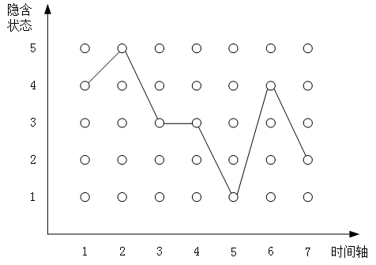
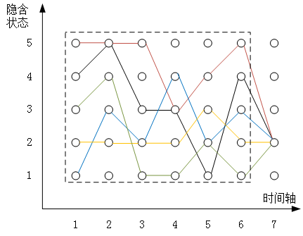
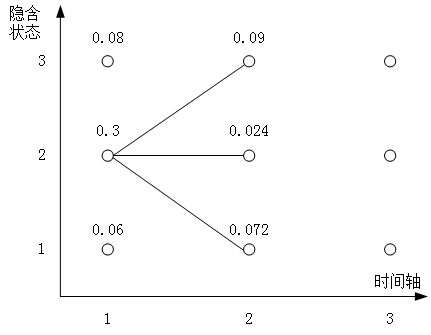
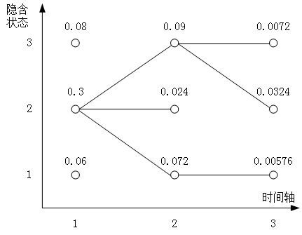

---
tags:
- 数学/随机过程
---

# 21 隐马尔科夫模型的状态解码

## 0.阅读提示

隐马尔可夫模型在《机器学习中的数学：概率统计》中已经做了完整详细的介绍，为了保证本专栏关于动态度模型部分的完整性，第 20 讲和第 21 讲直接引用《机器学习中的数学：概率统计》专栏中的内容，老读者可以直接跳过这两讲内容，直接进入到卡尔曼滤波部分。

## 1.隐含状态解码问题的描述

上一节我们讲完了概率估计问题，这里我们再来讲一下隐马尔科夫模型的状态解码问题。

解码：$decoding$，就是给定一个已知的观测序列，求他最有可能对应的状态序列。那么用形式化的语言来说就是已知模型 $\lambda=(A,B,\pi)$ 和观测序列 $O=(o_1,o_2,…,o_T)$，求使得条件概率 $P(I|O)$ 最大的隐状态序列 $I=(i_1,i_2,…,i_T)$。

我们一步一步的来，先不考虑输出观测，仅仅只考虑隐状态的转移，来体会一下思路，首先我们的目标是去找到路径概率最大的一条状态序列。

我们对着下面这幅图来说，会让大家更好理解一些：

 图中展现的隐马尔科夫模型中的状态序列，其中一共包含 $5$ 种隐含状态，状态序列的长度为 $7$，那么图中很明显横轴是时间轴，纵轴是状态轴。

## 2.最大路径概率与维特比算法

我们从整个隐含状态序列的最后往前面看，在第 $7$ 个时间点，也就是最后一个时间点这，我们要考虑状态序列的最后一个状态是状态 $[1,2,3,4,5]$ 中的哪一个？实质上就是比较路径以谁为结束状态，整个路径的概率最大。

那怎么操作？我们首先关注的是最后一个时间节点 $7$，问题就落脚在如果状态转移路径以结束于状态 $k$ 的路径概率最大（可以是状态 $1$-状态 $5$ 中的任意一个，我们先不管他具体是哪一个了，只知道肯定是其中一个），那么这个概率该怎么表示呢？很显然，他依赖于时间节点 $6$ 可能选取的 $5$ 个状态。

实际上，时间节点 $6$ 取 $5$ 个状态中的任意一个都是有可能的，可能由时间节点 $6$ 处的状态 $1$ 转移到时间节点 $7$ 处的状态 $k$，也可能由状态 $2$ 转移到时间节点 $7$ 的状态 $k$，当然也可以是状态 $3$、状态 $4$ 或者状态 $5$。最终就看从哪里转移过去的路径概率最大，就选择从哪里转移过去，过程示意如下图所示：



我们令 $X_{6i}$ 表示到达时间节点 $6$ 时，此时状态为 $i$ 的最大路径概率，当然了，状态 $i$ 可以取 $\{1,2,3,4,5\}$ 中的任意一个，那么实际上就有 $X_{61}$,$X_{62}$,$X_{63}$,$X_{64}$,$X_{65}$ 五个不同的值。在上面这幅图中，就对应了虚线框中五种颜色示意的到达时间节点 $6$ 的五条路径，他们分别都是在时间节点 $6$ 时到达对应状态 $i$ 的最大概率路径。

那么用它乘以对应的状态转移概率，即 $X_{6i}A_{ik}$，就前进到第 $7$ 个时间节点了，计算出隐含状态序列 $\{x,x,x,x,x,i,k\}$ 的路径概率。那么首先我们固定一个第 $7$ 个时间节点结束的状态，比如选取状态 $1$，那么我们可以分别求出从第 $6$ 个时间节点的状态 $1$，状态 $2$，状态 $3$，状态 $4$，状态 $5$ 分别转移到第 $7$ 个节点状态 $1$ 的概率： $X_{61}A_{11}$,$X_{62}A_{21}$,$X_{63}A_{31}$,$X_{64}A_{41}$,$X_{65}A_{51}$ ，我们计算出这 $5$ 个值，取最大的就是我们结束于状态 $1$ 的最大路径概率。

同样的，我们可以分别假设，令第 $7$ 个时间节点的结束状态分别为 $2,3,4,5$，按照上面的方法，可以分别计算出结束于每一个状态的最大路径概率，我们取最大的一个，就可以真正的定下这条路径最后结束于哪一个状态了。

这里我们补充一点，为什么要强调 $X_{6i}$ 是表示到达时间节点 $6$ 时，状态为 $i$ 的最大路径概率？最大二字道理何在？因为我们需要 $X_{6i}A_{ik}$ 最大，由于对于每一个指定的状态 $k$，$A_{ik}$ 都是固定的，那么就必须要求 $X_{6i}$ 是最大的，否则如果有更大的第 $6$ 时间节点到达状态 $i$ 的路径概率 $X^{'}_{6i}$，那我们就拿他去替换掉原有的 $X_{6i}$ 就好了，因此 $X_{6i}$ 表示最大概率的道理就在这。

但是问题来了，每一个 $X_{6i}$ 是多少？他也是未知的，同样的道理，他依赖于第五个时间点的 $X_{5j}$，即每一个时间点到达某个具体状态的最大路径概率都需要知道前一个时间点的到达各状态的最大路径概率，然后乘以状态转移概率比较而来，那何时是个尽头？走到头就是尽头。对，没错。要走到最早的时间点节点 $1$，时间点 $1$ 的最大概率我们是可以直接算出来的。

那么我们从时间节点 $1$ 出发，正过来，重新描述一下整个过程：

首先我们在时间节点 $1$，我们计算出各状态出现的概率，由于只有一个节点，因此这个概率值就是此时的最大路径概率 $X_{1i}$。

然后我们再向前前进到时间节点 $2$，对于每一个状态 $j$，我们通过利用时间节点 $1$ 的每一个状态的最大路径概率乘以转移概率，会得到 $5$ 个到达时间节点 $2$，状态 $j$ 的路径概率值，取最大的一个就是此时的最大路径概率 $X_{2j}$。

即，$X_{2j}=max(X_{1i}A_{ij})$，$i$ 遍历 $1,2,3,4,5$ 每一个状态。同时我们还需要记录一下此时在时间节点 $2$，状态 $j$ 这个节点在获取最大路径概率 $X_{2j}$ 的情况下，是由时间节点 $1$ 中的哪个状态转移而来的，把状态序号记录下来。

以此类推，我们基于时间节点 $t$，各状态的最大路径概率，就可以向前计算出 $t+1$ 各状态的最大路径概率，直到最后一个时间节点 $T$，我们得到时间节点 $T$ 的所有状态的最大概率路径 $X_{Ti}$，取最大的一个 $max(X_{Ti})$，$i$ 遍历 $1,2,3,4,5$，就是我们要求的最大路径概率，以及结束的状态，然后依据我们记录的前一状态进行回溯，就能够把整个状态序列给找出来了。

上述，就是求取最大概率路径的过程，也就是大名鼎鼎的维特比算法。

## 3.应用维特比算法进行解码

接下来，我们进一步把维特比算法引入到隐马尔科夫模型的解码中来，维特比算法中的最大概率路径就对应着隐马尔科夫模型中要找的那个最有可能的隐状态序列，不过此时在计算的过程中，我们不光要考虑隐状态的状态转移概率，还要考虑观测输出概率。

换句话说，就是我们要寻找一条隐含状态序列 $(i_1,i_2,i_3,…,i_t)$，用它去生成我们指定的观测序列 $(o_1,o_2,o_3,…,o_t)$，使得这个观测序列存在的概率最大？

用公式的语言来描述我们的目标就是：

$\delta_t(i)=max P(i_t=i,i_{t-1},…,i_1,o_t,…,o_1)$, $i=1,2,3,…,N$ 他表示在时刻 $t$，结束于隐状态 $i$，同时满足观测序列 $(o_1,o_2,o_3,…,o_t)$ 的最大路径概率，这个表达式同时考虑了隐状态和输出观测，是一个联合概率，其中 $i$ 取 $i=1,2,3,…,N$，最终我们也是取 $P$ 值最大的一个。

那么依次类推：

$\delta_{t+1}(i)=max P(i_{t+1}=i,i_{t},i_{t-1}…,i_1,o_{t+1},o_t,…,o_1),\quad i=1,2,3,…,N$

那么,$\delta_{t+1}(i)$ 和 $\delta_t(i)$ 的递推关系是怎么样的？我们根据隐马尔科夫模型先进行状态转移，再进行观测输出的过程，不难写出他们的递推关系：

$\delta_{t+1}(i)=max(\delta_t(j)a_{ji}b_{io_{t+1}})\quad 1\leq j\leq N$

当然，我们也可以证明一下这个过程，其实非常简单，实质上也就是反复使用贝叶斯公式进行概率等式的转换。

$max(\delta_t(j)a_{ji}b_{io_{t+1}})$ $=max\,(max\, P(i_t=j,i_{t-1},…,i_1,o_t,…,o_1))P(i_{t+1}=i|i_t=j)P(o_{t+1}|i_{t+1}=i)$ $=max\,P(i_t=j,i_{t-1},…,i_1,o_t,…,o_1))P(i_{t+1}=i|i_t=j)P(o_{t+1}|i_{t+1}=i)$ $=max\,P(i_{t+1}=i,i_t=j,i_{t-1},…,i_1,o_t,…,o_1)P(o_{t+1}|i_{t+1}=i)$ $=(max\, P(i_{t+1}=i,i_t,i_{t-1},…,i_1,o_{t+1},o_t,…,o_1))$ $=\delta_{t+1}(i)$

因此，我们回过头来看一下这个递推公式：$\delta_{t+1}(i)=max(\delta_t(j)a_{ji}b_{io_{t+1}})$

和上面维特比算法中的简单路径概率的例子相比，其实就是多了一个观测输出概率 $b_{io_{t+1}}$，这个值是已知的，比单纯的简单路径概率问题多进行一次观测输出概率的相乘运算，因此本质上并无二致。

因此，我们同样的按照维特比算法中的思路从 $\delta_{1}(i)$ 开始起步，一步一步按照之前介绍过的方法推导到 $\delta_{T}(i)$，求得最大的概率，同时在递推的过程中，在每一个时间点 $t$ 都记录好上一个时间点 $t-1$ 的隐含状态，以便于我们最后的状态回溯。还是那句话，思路和维特比算法中的最大路径概率计算没有什么大的区别。

## 4.案例实践

我们还是利用盒子与球的模型来进行计算过程的实践。

模型中，隐状态集合 $Q=\{盒子 1，盒子 2，盒子 3\}，N=3$，初始概率 $\pi=(0.3,0.5,0.2)^T$。状态概率矩阵为：$A=\begin{bmatrix}0.4&0.4&0.2\\0.3&0.2&0.5\\0.2&0.6&0.2\end{bmatrix}$

观测集合 $V=\{黑球，白球\} ，M=2$。观测概率矩阵：$B=\begin{bmatrix}0.2&0.8\\0.6&0.4\\0.4&0.6\end{bmatrix}$

首先初始化，在 $t=1$ 时，隐状态为 $i$ 观测 $o_1$ 为黑球的概率 $\delta_1(i)$，显然，我们要把隐状态为一号盒子、二号盒子和三号盒子都计算一遍，即：

$\delta_1(1)=\pi_1b_{1o_1}=0.3*0.2=0.06$ $\delta_1(2)=\pi_2b_{2o_1}=0.5*0.6=0.3$ $\delta_1(3)=\pi_3b_{3o_1}=0.2*0.4=0.08$

递推到 $t=2$ 时，表示在 $t=1$ 时隐状态为 $j$ 号盒子，输出观测 $o_1=黑球 $，$t=2$ 时隐状态为 $i$ 号盒子，输出观测 $o_2=白球 $ 的最大概率：

$\delta_2(i)=max[\delta_1(j)a_{ji}]b_{io_2}$，其中 ${1 \le j \le 3}$

$\delta_2(1)=max[\delta_1(j)a_{j1}]b_{1o_2}=max\{\delta_1(1)a_{11},\delta_1(2)a_{21},\delta_1(3)a_{31} \}b_{1o_2}$ $=max\{0.06*0.4,0.3*0.3,0.08*0.2 \} *0.8$ $=max\{0.024,0.09,0.01 6 \} *0.8=0.072$，同时记录 $t=1$ 时的回溯为 $j=2$（对应 $0.09$ 的取值）

$\delta_2(2)=max[\delta_1(j)a_{j2}]b_{2o_2}=max\{\delta_1(1)a_{12},\delta_1(2)a_{22},\delta_1(3)a_{32} \}b_{2o_2}$ $=max\{0.06*0.4,0.3*0.2,0.08*0.6\}*0.4$ $=max\{0.024,0.06,0.048 \} *0.4=0.024$，同时记录 $t=1$ 时的回溯为 $j=2$（对应 $0.06$ 的取值）

$\delta_2(3)=max[\delta_1(j)a_{j3}]b_{3o_2}=max\{\delta_1(1)a_{13},\delta_1(2)a_{23},\delta_1(3)a_{33} \}b_{3o_2}$ $=max\{0.06*0.2,0.3*0.5,0.08*0.2 \} *0.6$ $=max\{0.012,0.15,0.01 6 \}*0.6=0.09$，同时记录 $t=1$ 时的回溯为 $j=2$（对应 $0.15$ 的取值）

阶段性的，我们把递推到 $t=2$ 的图像绘制一下：


 最后我们递推到 $t=3$：

$\delta_3(1)=max[\delta_2(j)a_{j1}]b_{1o_3}=max\{\delta_2(1)a_{11},\delta_2(2)a_{21},\delta_2(3)a_{31}\}b_{1o_3}$ $=max\{0.072*0.4,0.024*0.3,0.09*0.2 \} *0.2$ $=max\{0.0288,0.0072,0.018 \}*0.2=0.00576$，同时记录 $t=2$ 时的回溯为 $j=1$（对应 $0.0288$ 的取值）

$\delta_3(2)=max[\delta_2(j)a_{j2}]b_{2o_3}=max\{\delta_2(1)a_{12},\delta_2(2)a_{22},\delta_2(3)a_{32}\}b_{2o_3}$ $=max\{0.072*0.4,0.024*0.2,0.09*0.6 \} *0.6$ $=max\{0.0288,0.0048,0.054 \}*0.6=0.0324$，同时记录 $t=2$ 时的回溯为 $j=3$（对应 $0.054$ 的取值）

$\delta_3(3)=max[\delta_2(j)a_{j3}]b_{3o_3}=max\{\delta_2(1)a_{13},\delta_2(2)a_{23},\delta_2(3)a_{33}\}b_{3o_3}$ $=max\{0.072*0.2,0.024*0.5,0.09*0.2 \} *0.4$ $=max\{0.0144,0.012,0.018 \}*0.4=0.0072$，同时记录 $t=2$ 时的回溯为 $j=3$（对应 $0.018$ 的取值）

我们结合观测输出概率，看一下此时各个隐状态的路径概率，就得到了如下的这幅图：

 这幅图不仅记录了整个路径概率，还反映了各个时间点、各个隐含状态的在上一时间节点的回溯状态。

那么我们从最后一个时间节点 $3$ 开始，显然选择隐状态 $2$，他的路径概率最大，然后回溯到时间节点 $2$，按图索骥显然是隐含状态 $3$，回溯到时间节点 $1$，是隐含状态 $2$。

因此在这个盒子与球的模型下，我们最后解码出的隐含状态序列是：$\{2 号盒子，3 号盒子，2 号盒子\}$

## 5.python 代码示例

最后，我们也用 $python$ 代码来演示上述计算过程，毕竟在实际工程中，我们不可能次次都用手来计算。

**代码片段：**

```
import numpy as np
from hmmlearn import hmm

# 隐状态集合Q
states = ['box1', 'box2', 'box3']
# 观测集合V
observations = ['black', 'white']
# 初始概率pi
start_probability = np.array([0.3, 0.5, 0.2])
# 状态转移矩阵A
transition_probability = np.array([
  [0.4, 0.4, 0.2],
  [0.3, 0.2, 0.5],
  [0.2, 0.6, 0.2]
])

# 观测概率矩阵B
emission_probability = np.array([
  [0.2, 0.8],
  [0.6, 0.4],
  [0.4, 0.6]
])

# 选用MultinomialHMM对离散观测状态建模
model = hmm.MultinomialHMM(n_components=len(states))
model.startprob_ = start_probability
model.transmat_ = transition_probability
model.emissionprob_ = emission_probability

# 观测序列
obervation_list = np.array([0, 1, 0])
# 调用维特比算法对观测序列进行隐含状态解码
logprob, box_list = model.decode(obervation_list.reshape(-1, 1), algorithm='viterbi')
# 输出解码的隐含状态序列
print(box_list)
for i in range(len(obervation_list)):
    print(states[box_list[i]])
```

+ 1+ 2+ 3+ 4+ 5+ 6+ 7+ 8+ 9+ 10+ 11+ 12+ 13+ 14+ 15+ 16+ 17+ 18+ 19+ 20+ 21+ 22+ 23+ 24+ 25+ 26+ 27+ 28+ 29+ 30+ 31+ 32+ 33+ 34+ 35+ 36+ 37

**运行结果：**

```
[1 2 1]
box2
box3
box2
```

+ 1+ 2+ 3+ 4

$box\_list$ 变量表示的就是隐状态序列的索引。

我们设置好了隐马尔科夫模型中的三要素，同时约定了初始概率、观测序列，运用维特比算法进行解码，程序得到的结果和我们手算的结果是一致的。