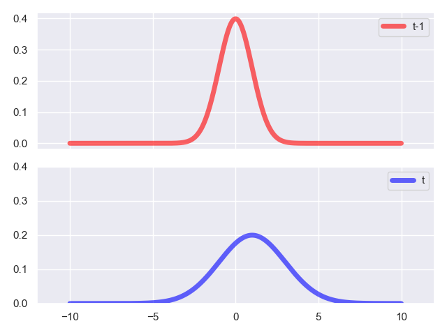
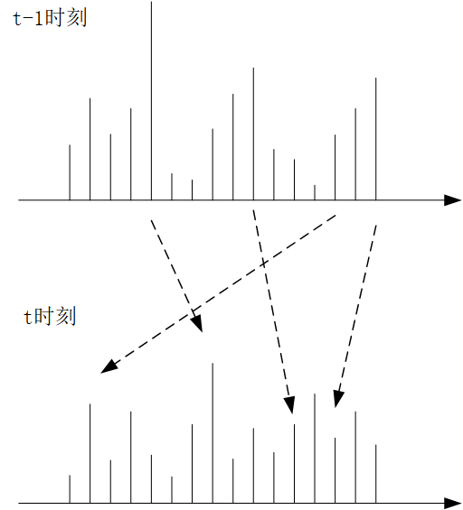
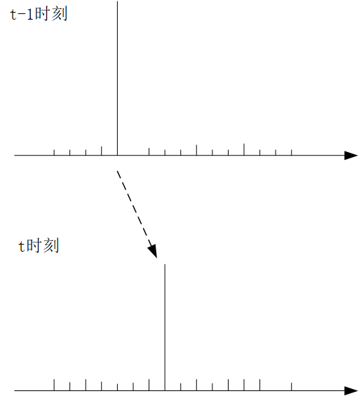
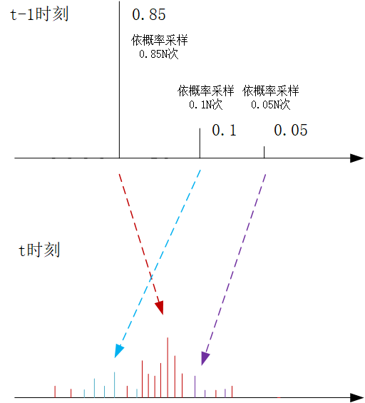

---
tags:
- 数学/随机过程
---

# 24 重采样：粒子滤波中的处理技巧

## 1.粒子滤波采样流程解读

在上一讲中，我们已经得到了粒子滤波中 $t-1$ 时刻和 $t$ 时刻权重之间的关系：$w_t= p(x_t|z_t)w_{t-1}$，那么粒子滤波中的采样过程具体就描述如下，显然这是一个迭代的过程：

前提：在 $t-1$ 时刻采样过程已完成

那么在 $t$ 时刻，我们采样 $N$ 个 $z_t^{(i)}$ 样本点

$for \,\,\,i=1,2,…,N:$ $\,\,\,\,\,\,z_t^{(i)}\sim q(z_t|z_{t-1}^{(i)},x_{1: t})$ $\,\,\,\,\,\,w_t^{(t)}= w_{t-1}^{(i)}\frac{p(x_t|z_t^{(i)})p(z_t^{(i)}|z_{t-1}^{(i)})}{q(z_t^{(i)}|z_{1: t-1}^{(i)},x_{1: t})}$ $end: \,\,w_t^{(i)}$ 进行归一化，使得 $\sum_1^{N}w_t^{(i)}=1$

由于我们选择了提议分布 $q$：$q(z_t^{(i)}|z_{1: t-1}^{(i)},x_{1: t})=p(z_t^{(i)}|z_{1: t-1}^{(i)})=p(z_t^{(i)}|z_{t-1}^{(i)})$，则这个采样和权值迭代的过程就进一步简化为了：

$for \,\,\,i=1,2,…,N:$ $\,\,\,\,\,\,z_t^{(i)}\sim p(z_t|z_{t-1}^{(i)})$ $\,\,\,\,\,\,w_t^{(t)}= w_{t-1}^{(i)}p(x_t|z_t^{(i)})$ $end: \,\,w_t^{(i)}$ 进行归一化，使得 $\sum_1^{N}w_t^{(i)}=1$

我简要的解读一下这个过程，实际上在时间 $t$ 时刻，我们需要从分布 $p(z_t|z_{t-1}^{(i)})$ 中采样 $N$ 个样本 $z_t^{(i)}$，同时我们在上一步 $t-1$ 时刻曾经也得到了一轮采样样本 $z_{t-1}^{(1)},z_{t-1}^{(2)},z_{t-1}^{(3)},…,z_{t-1}^{(N)}$，其中每一个采样样本 $z_{t-1}^{(i)}$ 对应的权重就是 $w_{t-1}^{(i)}$。那么在时刻 $t$ 的这一轮采样过程中，我们对于每一个采样样本 $z_t^{(i)}$，仅仅通过 $w_{t-1}^{(i)}p(x_t|z_t^{(i)})$ 的迭代计算，我们就能获得该样本点 $z_{t}^{(i)}$ 的权重 $w_t^{(i)}$。

那么每一轮的权重都可以通过这种方法获得，至于说初始时刻的 $w_1^{(i)}$ 如何获取，

当 $t=1$ 时，带入有 $w_1^{(t)}= w_{0}^{(i)}p(x_1|z_1^{(i)})$，由于并没有 $t=0$ 时刻，因此所有的 $0$ 时刻权重 $w_0^{(i)}$ 都处理为 $1$。同时 $t=1$ 时，$z_t^{(i)}\sim p(z_t|z_{t-1}^{(i)})$ 中的 $p(z_t|z_{t-1}^{(i)})$ 也直接就是初始概率分布 $p(z_1)$

那么我们把 $t=1$ 时刻的情况带入，合并成完整的粒子滤波流程：

$t=1:$ $for \,\,\,i=1,2,…,N:$ $\,\,\,\,\,\,z_1^{(i)}\sim p(z_1)$ $\,\,\,\,\,\,w_1^{(t)}= p(x_1|z_1^{(i)})$ $w_1^{(i)}$ 进行归一化，使得 $\sum_1^{N}w_1^{(i)}=1$

$t\ge 2:$ 开始循环 $for \,\,\,i=1,2,…,N:$ $\,\,\,\,\,\,z_t^{(i)}\sim p(z_t|z_{t-1}^{(i)})$ $\,\,\,\,\,\,w_t^{(t)}= w_{t-1}^{(i)}p(x_t|z_t^{(i)})$ $end: \,\,w_t^{(i)}$ 进行归一化，使得 $\sum_1^{N}w_t^{(i)}=1$

## 2.观测变量以及隐变量的关系分析

这里有一个点需要提醒一下大家：

初始概率 $p(z_1)$，状态转移概率 $p(z_t|z_{t-1})$ 和发射概率 $p(x_t|z_t)$，这三种概率在隐马尔可夫模型、卡尔曼滤波和粒子滤波中都有，但是他们的表现形式不同，我们总结回顾一下：

对于隐马尔可夫模型，初始概率 $p(z_1)$ 取自于概率向量 $\pi$，而状态转移概率 $p(z_t|z_{t-1})$ 和发射概率 $p(x_t|z_t)$ 取自于状态转移概率矩阵 $A$ 和发射概率矩阵 $B$ 中的对应项

对于卡尔曼滤波，三个概率都必须服从高斯分布：

$$p(z_t|z_{t-1})=N(Az_{t-1}+B,Q)$$

$$p(x_t|z_t)=N(Cz_t+D,R)$$

$$p(z_1)=N(\mu_1,\sigma_1)$$

而粒子滤波则没有任何约束，三个概率都可定义为任意函数形式：

$$p(z_t|z_{t-1})=f(z_{t-1})$$

$$p(x_t|z_t)=g(x_t)$$

$$p(z_1)=f_0(z_1)$$

## 3.滤波中迭代的本质：分布的变化

那么我们从比较卡尔曼滤波和粒子滤波的角度来看看，从时间 $t-1$ 时刻到 $t$ 时刻的迭代本质到底是什么，先看看卡尔曼滤波，卡尔曼滤波关于隐变量 $z_t$ 的估计，实际上是一个高斯分布：

我们知道，在 $t-1$ 时刻，我们通过**predict **步骤，得到了一个预测概率

$$p(z_t|x_1,x_2,x_3,…,x_{t-1})\\=\int_{z_{t-1}}p(z_t|z_{t-1})p(z_{t-1}|x_1,x_2,x_3,…,x_{t-1})dz_{t-1}$$

 这本质上是先拿到了隐变量 $z_t$ 的一个先验高斯分布，然后我们在 $t$ 时刻的**update **步骤，利用我们观察到 $t$ 时刻的观测变量 $x_t$，对先验高斯分布进行修正，得到后验分布，也就是滤波的结果：

$$p(z_t|x_1,x_2,x_3,…,x_t)\propto p(x_t|z_t)p(z_t|x_1,x_2,x_3,…,x_{t-1})$$

 简单点说，从 $t-1$ 时刻的**predict **步骤到 $t$ 时刻的**update **步骤，就是从一个高斯分布变化到另一个高斯分布的过程，高斯分布仅由均值和方差决定，因此前后需要发生改变的就是均值和方差，如下图所示：

而粒子滤波呢？因为没有高斯分布这么好的解析形式，我们没办法在每一轮迭代的过程中获得他的分布的解析形式，因此我们采用蒙特卡洛方法进行采样，用数值的方法进行采样。

换句话说，就是在 $t-1$ 时刻，我们获得了 $N$ 个采样的样本：$z_{t-1}^{(1)},z_{t-1}^{(2)},…,z_{t-1}^{(N)}$，对应了各自不同的权重 $w_{t-1}^{(1)},w_{t-1}^{(2)},…,w_{t-1}^{(N)}$，这实际上就是一个分布列，这个分布列近似的表示了 $z_t$ 的后验分布，而我们正是通过这个分布列求得期望，作为这一轮滤波的估计值。而到了 $t$ 时刻，我们通过 $z_t^{(i)}\sim p(z_t|z_{t-1}^{(i)})$ 和 $w_t^{(t)}= w_{t-1}^{(i)}p(x_t|z_t^{(i)})$ 来获取新的 $t$ 时刻的分布列的值和各自对应的权重。

可以说如果我们明确了概念，即离散型的随机变量的分布列就是连续型随机变量概率分布的一种近似的话，那么粒子滤波从 $t-1$ 时刻到 $t$ 时刻也是从一个分布到另一个分布的变化过程，这里变的更本质，变得就是所有随机变量 $(z_t^{(i)})$ 的取值和对应的权重，回忆一下，分布列的两要素不就是随机变量的取值和他们各自所对应的权重吗？这么一想就非常清晰了。

从图中我们可以清晰的看出粒子滤波迭代的本质，从 $t-1$ 时刻到 $t$ 时刻，虚线箭头表明：每一个采样点 $z^{(i)}$ 的取值发生了变化，权重也发生了变化。

## 4.粒子滤波的权值衰退问题

似乎，粒子滤波就应该介绍完了，但是在最后我想提一个问题，也就是权值衰退的问题，一般例子滤波在经过迭代几轮后，很可能在他的分布列中，某一个取值的权重很大，而其他的都很小，如下图所示：

也就是当某一个采样点的权重非常大，其他的采样点非常小的情况下，后续迭代都会保持这种趋势，而导致各个采样点的权值出现了衰退，首先这种情况是没有意义的，这种一枝独秀的情况就不能很好的反映这些采样点整体的分布了，或者说他可能都不叫分布了。

在考虑如何解决这种问题之前，我们先来想想为什么会这样，在前面讲的粒子滤波算法中，这 $N$ 个样本进行迭代的时候，每个样本点都被处理一次，这一次处理通过 $z_t^{(i)}\sim p(z_t|z_{t-1}^{(i)})$ 确定 $t$ 时刻这个采样点的值，同时连带的通过 $w_t^{(t)}= w_{t-1}^{(i)}p(x_t|z_t^{(i)})$ 把权重也携带过去了。

因此那个权重极大的采样点，下一轮的权重依然非常大，而权重很小的（接近于 $0$），总体上看，下一轮权值依旧很小。概括成一句话就是：在 $t-1$ 到 $t$ 的迭代过程中，$N$ 个样本点，每个采样点只处理一次，权重随着值一起转移了。

## 5.用重采样解决权值衰退

那么从直觉上改变思路，应该让采样点的值转移过程和权重脱钩，但又要反映各个采样点的权重属性，这个既要、又要怎么实现？这里就要介绍重采样的思路：

打个比方，考虑一种比较极端的情况，比如 $z^{(j)}_{t-1}$ 的权重是 $0.85$，$z^{(k)}_{t-1}$ 的权重是 $0.1$，$z^{(m)}_{t-1}$ 的权重是 $0.05$，其他采样点的权重都为 $0$ 了（当然实际情况应该是每个采样点都有权重，这里我们为了简化描述，道理都是一样的，请大家注意）。

那么在 $t-1$ 时刻到 $t$ 时刻的采样过程中，我们还是进行 $N$ 次采样，但是在每次采样的过程中，我们让其有 $0.85$ 的概率去处理 $z^{(j)}_{t-1}$，$0.1$ 的概率去处理 $z^{(k)}_{t-1}$，$0.05$ 的概率去处理 $z^{(m)}_{t-1}$，假设 $N=100$，那么按照大数定理，$z^{(j)}_{t-1}$ 的处理次数就是 $85$ 次，这样他同样照顾到了 $t-1$ 时刻各个采样点的权重属性。但是他的好处却很明显，每一次都是依照 $z_t^{(i)}\sim p(z_t|z_{t-1}^{(i)})$ 的概率分布进行采样确定下一轮的采样值，显然这 $85$ 次依概率的采样值的迭代结果 $z_t^{(i)}$ 就不会集中于一点了

那权重如何处理呢？在 $t-1$ 时刻，在 $N$ 次采样过程中，我们每一次所选中的采样点，他的权重都是 $\frac{1}{N}$，在这个例子中，$N=100$，每一次采样的权重就是 $0.01$，但是每次采样有 $0.85$ 的概率处理 $z^{(j)}_{t-1}$，依照大数定理，$z^{(j)}_{t-1}$ 的处理次数就是 $85$ 次，仍然包含了原始采样点的权重信息，那么迭代到下一轮 $w_t^{(i)}= \frac{1}{N}p(x_t|z_t^{(i)})$，决定了 $t$ 时刻这个采样点的权重，而且这里面还蕴含了一个比较有意思的地方：

我们依照 $z_t^{(i)}\sim p(z_t|z_{t-1}^{(i)})$ 概率取出了 $t$ 时刻的样本 $z_t^{(i)}$，如果这个样本对于生成观测变量 $x_t$ 是更加适合的，换句话说 $p(x_t|z_t^{(i)})$ 的值就更大，那么这个样本点在 $t$ 时刻所对应的权重 $w_t^{(i)}= \frac{1}{N}p(x_t|z_t^{(i)})$ 就更大，这个道理和逻辑是很顺的。

下面画一个图做一个简单图示：

 因此在前面基本的粒子滤波迭代算法的基础上，我们在 $t-1$ 轮生成了新的 $N$ 个样本点 $z_{t-1}^{(i)}$ 以及他们的权重 $w_{t-1}^{(i)}$（这个称之为更新前的权重）之后，在向 $t$ 时刻的迭代过程中，我们的目标还是去采样 $N$ 个采样点，我们首先更新 $z_{t-1}^{(i)}$ 的权重，将他们都变成等权重的 $\frac{1}{N}$（这个称之为更新后的权重），但是在每次采样的过程中，我们依照更新前的权重 $w_{t-1}^{(1)},w_{t-1}^{(2)},…,w_{t-1}^{(N)}$，依概率选择一个采样点进行处理，利用 $z_t^{(i)}\sim p(z_t|z_{t-1}^{(i)})$ 获得下一轮 $t$ 时刻的新的采样点的值，利用更新后的等权重值，$w_t^{(i)}= \frac{1}{N}p(x_t|z_t^{(i)})$ 得到这个采样点在 $t$ 时刻的权重。

这个就是加上重采样优化后的粒子滤波的过程。至此，粒子滤波就介绍完了，的确比较复杂。