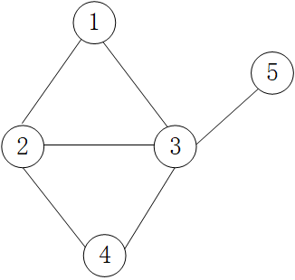

---
tags:
- 数学/随机过程
---

# 25 从有向到无向：谈谈条件随机场

这是这一期专栏的最后一讲了，我们来简要介绍一下无向图模型中的一个非常重要的模型：条件随机场。

## 1.隐马尔可夫模型中的一些问题

还记得前面我们隐马尔可夫模型中，我们老说的两个假设吗？老生常谈了，不厌其烦再谈一次。

 第一个假设：观测独立性假设。观测变量 $x_t$ 的取值只与对应的隐变量 $y_t$ 相关，而与其他的观测变量、隐变量均无关。

第二个假设：齐次马尔科夫假设。隐变量 $y_t$ 的取值只与前一时刻的 $y_{t-1}$ 相关，而与其他的观测变量、隐变量均无关。

这两个假设模型在很大程度上简化了计算，但是在有些场景之下这两个假设就不太合时宜。

例如词性标注问题，假设观测序列 $X$ 代表一句话，而其中任意一个 $x_t$ 代表的是句子中的一个词，而与之对应的 $y_t$ 则是这个词的词性，例如：动词、名字、介词、代词等等，我们所关注的就是条件概率 $p(Y|X)$，我们给定一个观测序列（句子），目标是找到一个标注序列 $Y$，使得条件概率 $p(Y|X)$ 值取得最大。

我们想想，在词性标注的背景下，观测独立性假设首先不合常理，应该是由观测变量 $x_t$ 来决定隐变量 $y_t$ 的取值，而非观测独立性所描述的反方向。

第二，齐次马尔科夫性也不再适用，因为词性隐变量 $y_t$ 显然与词 $x_t$、词性 $y_{t-1}$ 都相关，比如“我们做运动”，那么 $x_3$=“运动”，$y_3$ 的取值同时考虑 $x_3$ 和 $y_2$ 两方面因素，因此为名词。

## 2.线性链条件随机场

因此为了实现上述目标，打破这两个前提假设，就有了本讲要介绍无向图模型：条件随机场，这里我们仅简单的介绍线性链条件随机场的基本概念，让大家有一个初步印象。

他的概率图如下：

从图中，我们看出所有的有向边都变成了无向边，这是最鲜明的一个特点，在序列标注问题中，我们一般会认为整个观测序列都会对某一个标注隐变量或多或少的产生影响，因此线性链条件随机场我们也会把他画成如下的形式。

## 3.线性链条件随机场的概率与特征函数

无向图中的概率我们通过最大团和势函数来定义：

最大团的概念是，在概率图中任意两个节点都满足无向边相连的最大节点集合构成一个最大团，例如下图中：

这个图中，有三个最大团，分别是

$X_{c1}$：节点 $1$、节点 $2$ 和节点 $3$ 构成最大团 $1$； $X_{c2}$：节点 $2$、节点 $3$ 和节点 $4$ 构成最大团 $2$； $X_{c3}$：节点 $3$ 和节点 $5$ 构成最大团 $3$；

那么在上面的线性链条件随机场的概率图中，$y_{t-1}$、$y_t$ 和 $X_{1: T}$ 构成一个最大团，$t$ 从 $1$ 取到 $T-1$，一共有 $T-1$ 个最大团。

那么，线性链条件随机场中的条件概率 $p(Y|X)$ 就依照最大团来定义：

$$p(Y|X)=\frac{1}{Z}\prod_{i=i}^{T-1}\varphi_i(x_{c_i})$$

其中： $c_i$ 表示第 $i$ 个最大团 $x_{c_i}$ 表示第 $i$ 个最大团中对应的所有节点 $\varphi_i$ 表示针对第 $i$ 个最大团定义的势函数

这里势函数一般记作：$\varphi_i(x_{c_i})=exp[F_i(x_{c_i})]$，于是有：

$$p(Y|X)=\frac{1}{Z}\prod_{i=1}^{T-1}\varphi_i(x_{c_i})=\frac{1}{Z}\prod_{i=1}^{T-1}exp[F_i(x_{c_i})]\\=\frac{1}{Z}exp\sum_{i=1}^{T-1}F_i(x_{c_i})=\frac{1}{Z}exp\sum_{t=1}^{T-1}F_t(y_{t-1},y_t,x_{1: T})$$

在线性链条件随机场中，我们没有必要针对每一个最大团定义不同的势函数 $F_t$，因此我们定义一个统一的形式，即在 $t$ 时刻

$$F(y_{t-1},y_t,X_{1: T})=\Delta y_{t-1},x_{1: T}+\Delta y_t,x_{1: T}+\Delta y_{t-1},y_t,x_{1: T}$$

其中，$\Delta y_{t-1},x_{1: T}$ 的形式在 $F(y_{t-2},y_{t-1},X_{1: T})$ 中同样会出现，因此我们合并一下，只在 $F(y_{t-1},y_t,X_{1: T})$ 考虑两项即可：

$$F(y_{t-1},y_t,X_{1: T})=\Delta y_t,x_{1: T}+\Delta y_{t-1},y_t,x_{1: T}$$

其中，$\Delta y_{t-1},y_t,x_{1: T}$ 是转移函数，他可以进一步展开为：

$$\Delta y_{t-1},y_t,x_{1: T}=\sum_{k=1}^K\lambda_k f_k(y_{t-1},y_t,X_{1: T})$$

这里面每一个 $f_k(y_{t-1},y_t,X_{1: T})$ 都是一个我们事先定义好的特征函数，特征函数的形态和取值都是我们事先规定好的，我们一共定义 $K$ 个特征函数。而每个特征函数前面对应的系数 $\lambda_k$ 都是未知的。

这些特征函数构成一个特征集，例如

$$f_m(y_{t-1}=名词,y_t=动词,X_{1: T})=1$$

$$f_n(y_{t-1}=名词,y_t=动词,X_{1: T})=0$$

等等，一共 $k$ 个

同理：$\Delta y_t,x_{1: T}$ 是状态函数，他也可以进一步展开：

$$\Delta y_t,x_{1: T}=\sum_{l=1}^L\eta_l g_l(y_t,x_{1: T})$$

同样的，$g_l$ 也是我们定义的一套特征函数，一共 $L$ 个，其具体形态和取值类似转移特征值函数，是规定好的，而前面的系数 $\eta_l$ 也是未知的。

那么标注问题下的线性链条件随机场的条件概率最终就完整的写成：

$$p(Y|X)=\frac{1}{Z}exp\sum_{t=1}^T[\sum_{k=1}^K\lambda_k f_k(y_{t-1},y_t,X_{1: T})+\sum_{l=1}^L\eta_l g_l(y_t,x_{1: T})]$$

## 4.条件随机场的主要任务

基于这个架构，我们来说说条件随机场里最重要的两件事儿：

第一：学习，也就是参数估计，对应到序列标注里就是，我们给定已经标注好的样本集 $X$ 和对应的标注 $Y$，学习出参数 $\lambda_k$ 和 $\eta_l$

第二：就是推断，也就是在参数学习的基础上，找到在给定 $X$ 的条件下，使得 $p(Y|X)$ 取得最大值的标注序列 $Y$。

因为专栏章节和涉及内容所限，这里我们就不再具体展开了，有兴趣的读者可以自行学习和深入了解。