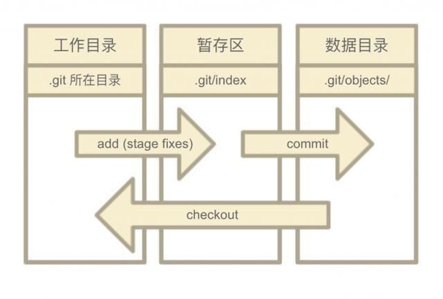
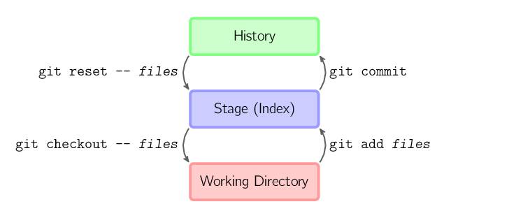

# Git 入门

## 1. Git 的安装和基础配置

在 linux 系统下，git 可以简单的通过命令安装：

```bash
apt-get install git
```

安装完成之后，还需要配置一下用户名与邮箱，让 Git 知道是谁在提交代码：

```bash
git config --global user.name "Your Name"
git config --global user.email "email@example.com"
```

命令中的 `--global` 参数表示你这台机器上所有的 Git 仓库都会使用这个配置
当然也可以对某个仓库指定不同的用户名和 Email 地址，方法是在某一已经创建好的仓库下运行 `git config user.name "Your Name"` 和 `git config user.email "email@example.com"` 命令进行设置

## 2. 创建版本库(repository)

版本库可以在任意目录下创建，无所谓空目录或已有文件，之后这一目录及其子目录就会包含到版本库中

```bash
cd /path/to/your/folder
git init
```

这样就在指定目录下创建好了一个 Git 仓库

> 版本控制系统只能显示出文本文件的具体改动，二进制文件仅能看出文件大小的改变

## 3. 提交修改

将文件提交到版本库需要两步，`git add` 和 `git commit`:

`git add` 会将文件从工作目录提交到暂存区，`git commit` 会将暂存区内的所有文件提交到数据目录中，这样就完成了一次版本提交

```bash
git add sample_a.txt
git add sample_b.txt
git commit -m "comment"
git commit -am "comment" # 可以一次性将add和commit合并操作，会将所有的修改一次性提交
```

> `git add -A` 可以 stages 所有文件  
> `git add .` 只能 stages 新文件和被修改文件，有被删除文件时会报错  
> `git state` 可已显示仓库当前的状态  
> `git diff <file>` 可以显示出具体修改内容  



git 中的 add 与 commit 的细节可以看这里：[git add 与 git commit](git%20add%20与%20git%20commit)

git 可以通过配置 `.gitignore` 文件来[忽略提交](Git%20忽略提交)工作区的部分文件:

## 4. 版本切换

每一次 commit 都可以看作为保存了一次快照，而 git 可以让我们在不同的快照之间切换。通过 `git log` 命令我们可以查看快照记录并通过 commit id 来进行版本切换

```bash
git reset <commit_id>       # 根据id来选择版本
git reset HEAD^             # 退回到上一版本，^表示上一版本，^^表示上上版本
git checkout -- <file>      # 将文件从暂存区恢复到工作区
git reset --hard HEAD~100   # 退回到前100个版本
```



> HEAD 表示当前分支
> 参数 --hard 表示这一版本切换同时覆盖工作区的文件，否则只会覆盖暂存区

当我们退回前一版本后突然后悔了该怎么办，通过 `git log` 并不能看到被我们抛弃的最新版本，这时我们需要通过 `git reflog` 来查看所有的提交记录，包括已经被抛弃的版本。

`git reset` 会让我丢掉一部分的版本记录，即使当前我们认为撤回这些记录很有必要，但假如我们考虑的更深入一些，万一这些被丢弃的版本在未来会有用呢。这时我们需要另一个命令，`git revert <commit_id>` 这一命令会反向操作 commit 的修改并提交一个新的版本，这样我们的版本库指针会向前走一步而不是退回，并且同样达到了撤销修改的目的。

更直观的版本切换与分支管理可以看[动画示例](Git%20常用命令动画)

> [git reset 详解](https://segmentfault.com/a/1190000009658888)  
 > [git reset 和 git revert](https://www.jianshu.com/p/d4342949f75c)  
 > [git restore 是新命令](https://git-scm.com/docs/git-restore)  
> `git restore <file>` 等同于 `git checkout -- <file>`  
> `git restore --staged <file>` 等同于 `git reset -- <file>`  

## 5. 远程仓库

一般我们通过 SSH 来连接远程仓库，最出名的当然是 GitHub，国内比较出名的是码云。

首先我们需要切到当前用户主目录并创建 SSH key：

```bash
cd /usr/user_name
ssh-keygen -t rsa -C "youremail@example.com"  
# -C "youremail@example.com" 是额外信息可以不写
```

之后会在用户主目录.ssh 文件夹中生成 id_rsa 和 id_rsa.pub 两个文件，id_rsa 是私钥，需要自己保管好，id_rsa.pub 是公钥，马上会用到

以 GitHub 为例: ` 登录个人账户 ` --> `settings` --> `SSH and GPG keys` -->`New SSH key`，title 随意填写，然后将公钥内容粘贴上去即可

接下来我们需要在 GitHub 上创建一个新的仓库，并将本地仓库和这一仓库连接起来：

```bash
git remote add origin git@github.com:YourGithubID/YourRepositoryName.git
# origin是远程库的默认名字，你也可以改成其他
git push -u origin master
# -u 是第一次推送时关联两个库，以后推送就不需要了
```

以后再次推送时可以使用：`git push` 或 `git push origin master`

在配置好 SSH 后，从远程克隆库也十分简单，首先切换到一个新的目录，然后克隆你想要的库:

```bash
cd /usr/user_name/
mkdir newRepo
cd /usr/user_name/newRepo
git clone git@github.com:YourGithubID/YourRepositoryName.git
```

## 6. 分支管理

git 可以快速创建删除分支：

创建分支：`git checkout -b NewBranch`

删除分支：`git branch -d NewBranch`

推送本地分支到远程分支有两种方法：

- 远程先开好分支然后拉到本地

```bash
git checkout -b NewBranch origin/NewBranchName
```

- 本地先开好分支然后推送到远程

```bash
git checkout -b NewBranch    # 创建并切换到分支NewBranch  
git push origin NewBranch:NewBranch   # 推送本地的NewBranch(冒号前面的)分支到远程origin的NewBranch(冒号后面的)分支(没有会自动创建)
```

## 7. 标签管理

git 可以给具体的 commit 打标签，以便于管理：

```bash
git tag <tag_name>                              # 将标签打在目前分支的最新commit上
git tag <tag_name> <commit_id>                  # 将标签打到指定的commit上
git tag -a <tag_name> -m "comment" <commit_id>  # 给标签加上注释
git show <tag_name>                             # 显示标签及说明
git tag                                         # 查看所有标签
git tag -d <tag_name>                           # 删除标签
```

但标签不会随着推送同步到远程库，因此想要推送标签到远程或删掉远程标签需要手动操作：

```bash
git push origin <tag_name>              # 将标签推送到远程
git push origin --tags                  # 将所有标签推送到远程
git push origin :refs/tags/<tag_name>   # 删除远程标签，需要先删除本地标签
```

## 8. 其他

当git中意外提交了不想提交的文件后，可以通过第三方工具进行清除：[git 彻底删除大文件](Git%20彻底删除大文件)
