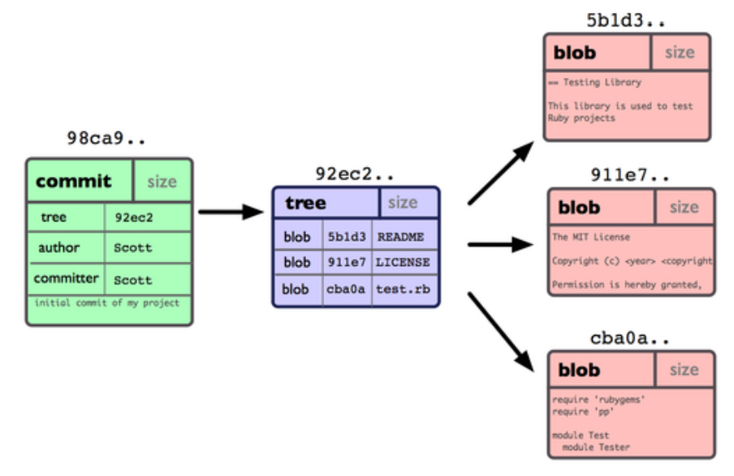
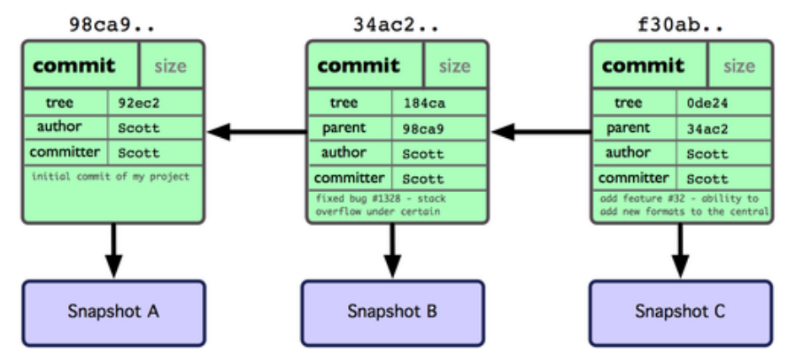

# git add 与 git commit

## Git 如何存储数据

首先我们要知道 Git 是如何储存我们项目数据的。Git 保存的不是文件差异或者变化量，而只是一系列文件快照（每当文件有变化时就创建一个快照），这是和其他版本控制系统不同的。也正是 Git 相较其他版本控制系统的优点之一。

每个项目都有一个 *.git* 目录，它是 Git 用来保存**元数据**和**对象数据库**的地方。该目录非常重要，每次克隆镜像仓库的时候，实际拷贝的就是这个目录里面的数据。

从项目中取出某个版本的所有文件和目录，用以开始后续工作的叫做工作目录。这些文件实际上都是从 *.git* 目录中的**压缩对象数据库中提取**出来的，接下来就可以在工作目录中对这些文件进行编辑。

所谓的暂存区域只不过是个简单的文件（保存了快照的索引）: *.git/index*。有时候人们会把这个文件叫做索引文件，不过标准说法还是叫暂存区域。

基本的 Git 工作流程如下所示：

1.  在工作目录中修改某些文件。

2.  对这些修改了的文件作快照（并使用 blob 类型的对象存储快照），并将校验和（快照索引）保存到暂存区域。

3.  提交更新，将保存在暂存区域的文件快照索引转储到 git 目录中的数据库。

## git add

**git add 命令所做的事（暂存操作）**：

为直观起见，我们假设在工作目录中有三个文件（分别为 *README*, *test.rb*, *LICENSE2*），准备将它们暂存后提交。命令如下：

```shell
$ git add README test.rb LICENSE2
```

**暂存操作**会对每一个文件计算校验和（SHA-1 哈希字串），然后把当前版本的文件快照保存到 Git 仓库中（Git 使用 blob 类型的对象存储这些快照），并将校验和加入暂存区域

## git commit

**git commit 命令所做的事：**

```shell
 $ git commit -m 'initial commit of my project'
```

在 Git 中提交时，会保存一个 **commit 对象**，它包含一个指向暂存内容快照的指针，作者和相关附属信息，以及一定数量（也可能没有）指向该提交对象直接祖先的指针：第一次提交是没有直接祖的，普通提交有一个祖先，由两个或多个分支合并产生的提交则有多个祖先。

当使用 git commit 新建一个提交对象前，Git 会先计算每一个子目录（本例中就是项目根目录）的校验和，然后在 Git 仓库中将这些目录保存为**树（tree）对象**。之后 Git 创建的提交对象，除了包含相关提交信息以外，还包含着指向这个树对象（项目根目录）的指针，如此它就可以在将来需要的时候，重现此次快照的内容了。

现在，Git 仓库中有五个对象：三个表示文件快照内容的 blob 对象；一个记录着目录树内容及其中各个文件对应 blob 对象索引的 tree 对象；以及一个包含指向 tree 对象（根目录）的索引和其他提交信息元数据的 commit 对象。

概念上来说，仓库中的各个对象保存的数据和相互关系看起来如图所示：



作些修改后再次提交，那么这次的提交对象会包含一个指向上次提交对象的指针（译注：即下图中的  
parent 对象）。两次提交后，仓库历史会变成下图的样子：

