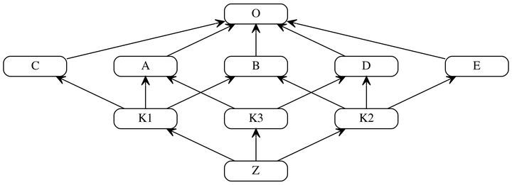

# C3算法

## 多重继承、MRO 及 C3算法之间的关系

在计算机科学中，**C3算法**主要用于确定多重继承时，子类应该继承哪一个父类的方法，即**方法解析顺序**（Method Resolution Order，**MRO**）。

C3算法实现了三种重要特性：

-   保持继承拓扑图的一致性。
-   保证局部优先原则（比如A继承C，C继承B，那么A读取父类方法，应该优先使用C的方法而不是B的方法）。
-   保证单调性原则（即子类不改变父类的方法搜索顺序）。

## 为什么采用C3算法

C3主要用于在多继承时判断继承调用的路径(来自于哪个类)。在Python2.3之前是基于深度优先算法，为了解决原来基于深度优先搜索算法不满足本地优先级，和单调性以及继承不清晰的问题，从Python2.3起应用了新的C3算法。 在Python官网的The Python 2.3 Method Resolution Order中作者举了例子，说明这一情况。

```python
F=type('Food', (), {remember2buy:'spam'})
E=type('Eggs', (F,), {remember2buy:'eggs'})
G=type('GoodFood', (F,E), {})
```

根据本地优先级在调用G类对象属性时应该优先查找F类，但是在Python2.3之前的算法给出的顺序是GEFO，而在**C3算法中通过阻止类层次不清晰的声明来解决这一问题，`以上声明在C3算法中就是非法的`**。

## C3算法简介

判断mro要先确定一个线性序列，然后查找路径由由序列中类的顺序决定。所以C3算法就是生成一个线性序列。如果继承至一个基类：

```python
class B(A)
```

这时B的mro序列为[B,A]

如果继承至多个基类：

```python
class B(A1,A2,...,An)
```

这时B的mro序列：

```python
mro(B) = [B] + merge(mro(A1), mro(A2),...,mro(An), [A1,A2,...,An])
```

> merge操作就是C3算法的核心，是递归运算。  

遍历执行merge操作的序列，如果一个序列的第一个元素，在其他序列中也是第一个元素，或不在其他序列出现，则从所有执行merge操作序列中删除这个元素，合并到当前的mro中。merge操作后的序列，递归地执行merge操作，直到merge操作的序列为空。

> 如果merge操作的序列无法为空，则说明不合法。  

### 例子1：

```python
class A(object):pass
class B(object):pass
class C(object):pass
class E(A,B):pass
class F(B,C):pass
class G(E,F):pass
```

A、B、C都继承至一个基类，所以mro序列依次为[A,O]、[B,O]、[C,O]

```python
mro(E) = [E] + merge(mro(A), mro(B), [A,B])
       = [E] + merge([A,O], [B,O], [A,B])
```

执行merge操作的序列为[A,O]、[B,O]、[A,B] A是序列[A,O]中的第一个元素，在序列[B,O]中不出现，在序列[A,B]中也是第一个元素，所以从执行merge操作的序列([A,O]、[B,O]、[A,B])中删除A，合并到当前mro，[E]中。

```python
mro(E) = [E,A] + merge([O], [B,O], [B])
```

再执行merge操作，O是序列[O]中的第一个元素，但O在序列[B,O]中出现并且不是其中第一个元素。继续查看[B,O]的第一个元素B，B满足条件，所以从执行merge操作的序列中删除B，合并到[E, A]中。

```python
mro(E) = [E,A,B] + merge([O], [O])
       = [E,A,B,O]
```

同理

```python
mro(F) = [F] + merge(mro(B), mro(C), [B,C])
           = [F] + merge([B,O], [C,O], [B,C])
           = [F,B] + merge([O], [C,O], [C])
           = [F,B,C] + merge([O], [O])
           = [F,B,C,O]

mro(G) = [G] + merge(mro[E], mro[F], [E,F])
           = [G] + merge([E,A,B,O], [F,B,C,O], [E,F])
           = [G,E] + merge([A,B,O], [F,B,C,O], [F])
           = [G,E,A] + merge([B,O], [F,B,C,O], [F])
           = [G,E,A,F] + merge([B,O], [B,C,O])
           = [G,E,A,F,B] + merge([O], [C,O])
           = [G,E,A,F,B,C] + merge([O], [O])
           = [G,E,A,F,B,C,O]
```

另一个Python版本的C3算法:

```python
def c3MRO(cls):
    if cls is object:
        # 讨论假设顶层基类为object，递归终止
        return [object]

    # 构造C3-MRO算法的总式，递归开始
    mergeList = [c3MRO(baseCls) for baseCls in cls.__bases__]
    mergeList.append(list(cls.__bases__))
    mro = [cls] + merge(mergeList)
    return mro


def merge(inLists):
    if not inLists:
        # 若合并的内容为空，返回空list
        # 配合下文的排除空list操作，递归终止
        return []

    # 遍历要合并的mro
    for mroList in inLists:
        # 取head
        head = mroList[0]
        # 遍历要合并的mro（与外一层相同），检查尾中是否有head
        ### 此处也遍历了被取head的mro，严格地来说不符合标准算法实现
        ### 但按照多继承中地基础规则（一个类只能被继承一次），
        ### head不可能在自己地尾中，无影响，若标准实现，反而增加开销
        for cmpList in inLists[inLists.index(mroList) + 1:]:
            if head in cmpList[1:]:
                break
        else:
            # 筛选出好head
            nextList = []
            for mergeItem in inLists:
                if head in mergeItem:
                    mergeItem.remove(head)
                if mergeItem:
                    # 排除空list
                    nextList.append(mergeItem)
            # 递归开始
            return [head] + merge(nextList)
    else:
        # 无好head，引发类型错误
        raise TypeError
```

验证上述算法的正确性，

```python
class A(object):pass
class B(object):pass
class C(object):pass
class E(A,B):pass
class F(B,C):pass
class G(E,F):pass

print([i.__name__ for i in c3MRO(G)])
## ['G', 'E', 'A', 'F', 'B', 'C', 'object']
```

在Python3下，如果想要查看继承顺序的话，更简单，每个类都有一个`cls.mro()`的方法。比如上面的例子，直接执行`G.mro()`就会打印MRO List。

### 例子2

再看一个复杂的例子：

```python
class Type(type):
    def __repr__(cls):
        return cls.__name__

A = Type('A', (object,), {})
B = Type('B', (object,), {})
C = Type('C', (object,), {})
D = Type('D', (object,), {})
E = Type('E', (object,), {})
K1 = Type('K1', (A, B, C), {})
K2 = Type('K2', (D, B, E), {})
K3 = Type('K3', (D, A), {})
Z = Type('Z', (K1, K2,K3), {})
```

我们根据上面的继承关系可以画出继承图：



你可以尝试着自己计算一下MRO List，当然，最后你需要用上面的算法或者自带的`.mro()`进行验证。

```python3
print(Z.mro()) # [Z, K1, K2, K3, D, A, B, C, E, <class 'object'>]

print([i.__name__ for i in c3MRO(Z)]) 
# ['Z', 'K1', 'K2', 'K3', 'D', 'A', 'B', 'C', 'E', 'object']
```

看到这里，我想说的是，尽量不要乱用继承。否则，代码后期维护和升级会十分的困难，容易被后来者吐槽为“屎山”。

以上！