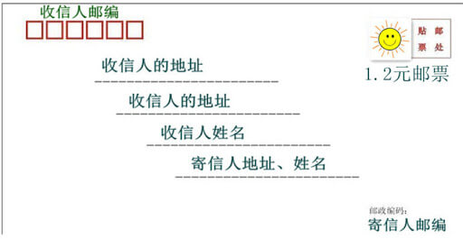

# 网络协议是什么

随着互联网技术的发展和应用，我们的生活方式发生了翻天覆地的变化。我们可以通过互联网：

- 浏览网页
- 收发邮件
- 视频聊天
- 传输文件
- ect

互联网无处不在，因此也成为现代软件开发中绕不开的一环。作为互联网时代的开发人员，对互联网工作原理进行一次全面学习，很有必要。不然，连原理都搞不明白，怎么做好互联网应用开发呢？

那么，互联网是如何工作的呢？我们打开一个浏览器浏览网页时，背后都发送哪些事情呢？

我们知道，网页是服务器提供的，浏览器想要获取网页数据，需要与服务器进行网络通信。通信的过程可能很复杂，除了浏览器和服务器双方，可能还要涉及其他网络设备，例如路由器。

另一方面，浏览器也不可能只访问某个服务器或者某个网站上的网页。实际上，不同的网站通常由不同的服务器提供。浏览器想要访问各种站点，势必要与各种服务器打交道。

既然网络通信是通过 **多方协作** 共同完成的，各个参与方需要遵守同一规则约定，才能保证通信有序进行。这样的规则约定，就是所谓的 **网络协议** 。

如果将网络通信类比成邮寄信件，那么网络协议就是信封格式：

一封信从寄信人手中寄出去后，需要经过各地邮局层层分拣投递，才能最终送达收信人手中。只有按照约定俗成的格式书写的信件，才能被邮局正确分拣、投送。

网络通信的过程也是类似的：数据被封装在 **报文** 中，从 **发送方** 传输到 **接收方** 。为了让通信双方和中间路由共同协作，报文必须遵循同一套 **网络协议** 。网络协议规定了报文的 **字段结构** 以及 **处理策略** 。

网络报文一般分为 **头部** 和 **数据** 两部分，而头部中的字段则保存着 **地址** 等信息。举个例子，一个 IP 协议报文，头部分别保存目的地址和源地址；中间路由根据目的地址，将报文接力转发至目的主机。

那么，网络协议都有哪些呢？其实有很多，目前最流行的是 **TCP/IP** 协议族。TCP/IP 协议族是互联网的基石，它包含了一系列彼此协作的协议。最常用的是以下这些：

- IP 协议，负责将报文从一台主机传输到另一台主机；
- TCP 协议，在 IP 协议的基础上，提供了可靠的流式传输能力；
- HTTP 协议，规定了访问 Web 服务器方法，以及请求和响应的格式；
- etc

一次简单网络通信，背后可能需要由好几个协议互相配合，才能完成。至于各个协议之间是如何互相配合的，后续章节将会展开介绍，本节先有个初步认识即可。

下一小节，我们将介绍网络协议的 **分层** 设计思想以及 OSI 七层模型以及 TCP/IP 四层模型。
