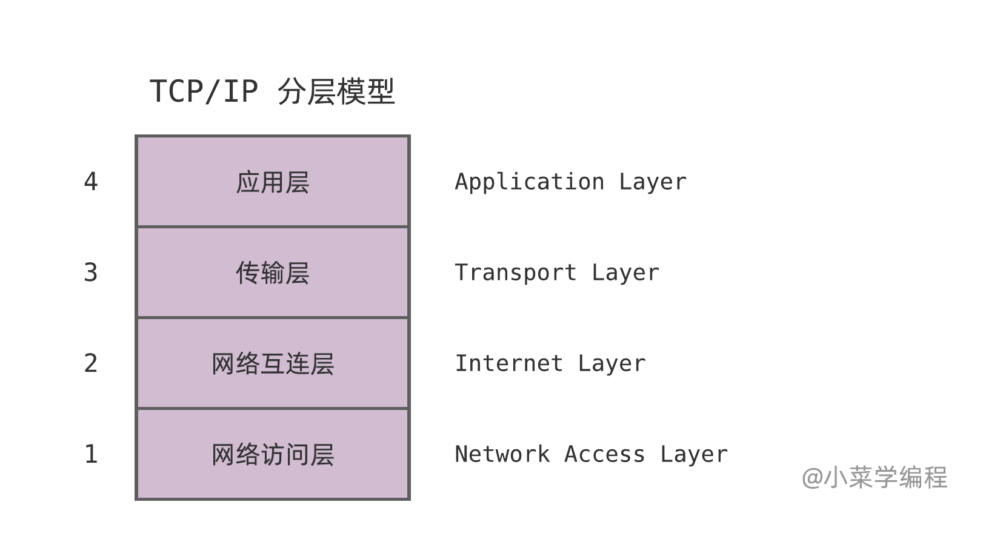
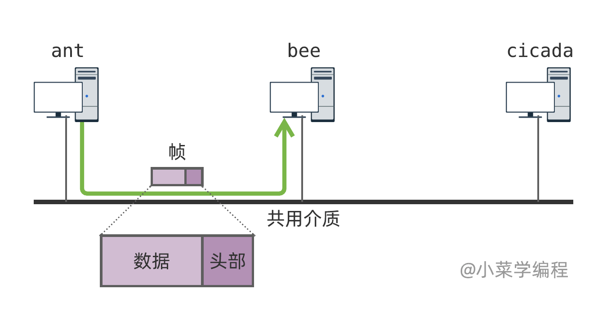
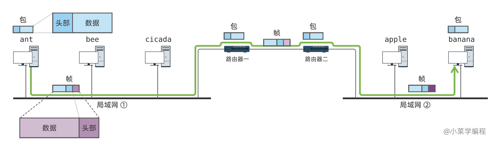
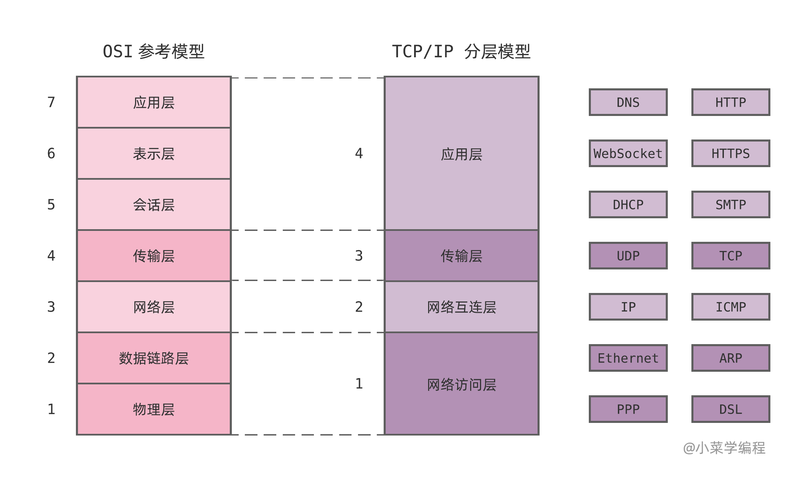

# TCP/IP 协议栈

上一小节，我们学习了 _OSI_ 参考模型，见识到 **分层** 设计思想在通信系统中的重要作用。那么，现行的通信协议是不是按照 _OSI_ 模型进行分层呢？各层的重要协议都有哪些呢？

目前使用最广泛的通信协议是 _TCP/IP_ 系列协议，但它并不是严格按照 _OSI_ 参考模型设计的。实际上，_TCP/IP_ 早在 _OSI_ 参考模型提出前就开始研发，并逐步发展至今。

_TCP/IP_ 协议栈也是分层设计的，但与 _OSI_ 不同，它只分为 _4_ 层：

## 网络访问层

**网络访问层** （ _network access layer_ ）负责管理物理介质，并提供将数据从当前节点传输到下一节点的能力。因此，网络访问层的功能相当于 _OSI_ 中的 **物理层** 和 **数据链路层** 。

不同的通信介质，有不同的接入设备，采用的协议也不同，常见的有：

- _Ethernet_ ，以太网协议；
- _PPP_ ，点对点协议；
- _DSL_ ，用户数字线路；
- _etc_

以 **以太网卡** 为例，它的通信介质是电缆，而通信协议则是 **以太网协议** ，协议传输单元是 **以太网帧** 。

网卡电路直接处理电信号，并完成电信号与比特间的转化。这相当于 _OSI_ 物理层的功能，但网卡不会将物理层功能直接呈现给上层。

实际上，网卡将数据链路层中 **网络寻址** 和 **错误侦测** 的功能也一并实现了，向上层提供以太网帧收发能力。系统可以调用网卡驱动发送以太网帧；网卡接到以太网帧后，也通过驱动程序提交给系统来处理。

总而言之，网络访问层以 **帧** 为通信单元，负责将数据发送到同一网络（局域网）中的另一节点。

- 以 **帧** 为通信单元；
- 实现局域网通信；

## 网络互连层

**网络互连层**（ _internet layer_ ）在网络访问层提供的局域网通信能力之上，实现网际通信能力。该层作用相当于 _OSI_ 模型中的网络层，同样以 **包** 为通信单元，负责路径选择和数据包转发。

_TCP/IP_ 协议栈中的 _IP_ 协议就是该层最核心的协议，它以 _IP_ 包为通信单元。采用 _IP_ 协议进行通信的主机，需要分配一个地址，这就是 _IP_ 地址。_IP_ 包头部的源地址和目的地址字段，用来标注 _IP_ 包的来源和目的地。

网络互连层利用网络访问层的局域网通信能力，将 _IP_ 包传输到下一节点。经过若干次转发，_IP_ 包最终被送达目标主机。更多细节，我们将在后续章节中揭晓。

- 以 **包** 为通信单元；
- 实现网际通信（点到点）；

## 传输层

**传输层**（ _transport layer_ ）则在网络互连层点到点传输能力基础上，实现端到端的进程间通信。该层相当于 _OSI_ 模型中的传输层，同样以 **段** 为通信单元，负责根据段中的端口号将数据送至目标进程。

最简单的传输层协议应该是 _UDP_ 协议，它非常简单，只是引入了一个端口号。当一个 _UDP_ 段搭载在 _IP_ 包中送达目标主机后，系统根据段中的端口号，将数据提交给对应的进程。

_IP_ 只是一种尽力而为的传输协议，并不完全可靠：一方面， _IP_ 包在传输的过程中可能经过不同路由，达到目标主机时次序可能会乱；另一方面，中间路由可能因网络拥塞而丢包。

为了保证数据传输的可靠性，协传输层还提供了 _TCP_ 协议。除了端口号，_TCP_ 协议还实现了数据序号、接收确认，以及超时重传机制，从而为进程提供可靠、有序的数据流。

_TCP_ 协议是传输层的核心协议，应用范围也非常广泛，因而是网络学习中的重点。_TCP_ 协议的实现非常复杂，细节将在后续章节展开介绍，现在有个初步认识即可。

- 以 **分组** 为通信单元；
- 实现进程间通信（端到端）；

## 应用层

**应用层**（ _application layer_ ）定义具体网络应用的通信逻辑，让应用进程间的协作成为可能。

传输层为进程提供了一般化的数据传输能力，但对数据本身未作任何规定。因此，实现应用的多个协作进程，需要一种协议，以对数据达成统一认识。

以 _Web_ 应用举例，浏览器进程作为客户端，必须按照 _HTTP_ 协议的规定，向 _Web_ 服务进程发起请求，才能为服务器所理解；同理，_Web_ 服务器处理请求后，必须按照 _HTTP_ 协议的规定，想客户端回复响应。

_HTTP_ 协议对 _Web_ 应用进程来说，就是它们彼此间交流的共同语言。由于网络应用极为丰富，应用协议种类也不在少数，我们常见的有以下这些：

- _HTTP_
- _HTTPS_
- _FTP_
- _SMTP_（邮件发送）
- _etc_

## 小结

本节介绍了目前最流行的 _TCP/IP_ 协议栈，它同样采用分层设计思路，与 _OSI_ 分层略有差别，但大同小异。 _TCP/IP_ 模型与 _OSI_ 模型的对应关系，以及各层的主要协议，列举如下：

后续我们将以该图为指引，自底向上，逐层深入学习。敬请期待！
