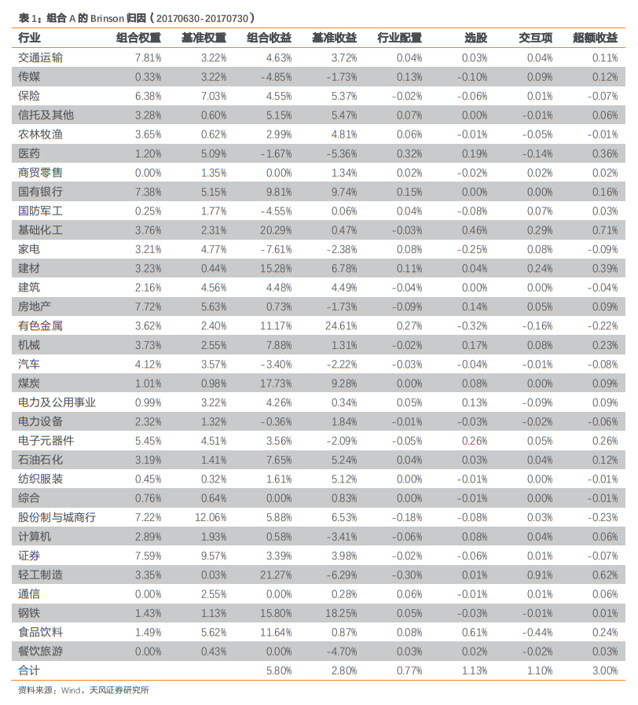

---
tags:
- 收益归因
aliases:
- Brinson 模型
---

# Brinson 收益归因模型

在 Brinson 模型中，组合相对于基准的超额收益就是主动管理的收益，超额收益的来源有三部分：

- **配置**：超配或者低配资产类别（或板块）带来的超额收益。
- **选股**：在资产类别（或板块）内部，超配或者低配个股带来的超额收益。
- **交互作用**：超配有正向选股能力的资产类别（或板块）、低配负向选股能力的资产类别（或板块）。

可以看到，收益分解的过程反应了投资决策的流程，即首先选择基准，然后对板块的超配或者低配进行决策，最后在板块内选股。

[Brinson, Hood, & Beebower (BHB, 1986)](../论文/brinson1986.pdf) 模型阐述了这样的收益分解方法。假设组合收益为:

$$R^{P}=\Sigma w_{i}^{p} r_{i}^{P}$$

其中 $w_{i}^{p}$ 为组合中板块 $i$ 的权重, $r_{i}^{P}$ 为组合中板块 $i$ 的收益。

相应地，基准组合的收益为:

$$R^{B}=\Sigma w_{i}^{B} r_{i}^{B}$$

其中 $w_{i}^{B}$ 为基准组合中板块 $i$ 的权重,  $r_{i}^{B}$ 为基准组合中板块 $i$ 的收益。

因此, 组合相对于基准的超额收益为:

$$R^{P}-R^{B}=\Sigma w_{i}^{p} r_{i}^{P}-\Sigma w_{i}^{B} r_{i}^{B}$$

进一步地, 上式可分解为

$$R^{P}-R^{B}=\Sigma_{i}\left(w_{i}^{p}-w_{i}^{B}\right) r_{i}^{B}+\Sigma_{i} w_{i}^{B}\left(r_{i}^{P}-r_{i}^{B}\right)+\Sigma_{i}\left(w_{i}^{P}-w_{i}^{B}\right)\left(r_{i}^{P}-r_{i}^{B}\right)$$

对于配置效应 $\left(w_{i}^{P}-w_{i}^{B}\right) r_{i}^{B}$ ，$w_{i}^{P}-w_{i}^{B}$ 为组合与基准在同一个板块上的配置差异, 配置差异与基准中板块收益 $r_{i}^{B}$ 的乘积为板块权重偏离带来的收益。

然而, 为了更好地理解各板块的收益贡献, 可将配置效应中的基准板块收益替换为基准中板块的相对收益, 即 $\left(w_{i}^{P}-w_{i}^{B}\right)\left(r_{i}^{B}-R^{B}\right)$ , 这就是 [Brinson & Fachler  (BF, 1985)](../论文/brinson1985.pdf)模型:

$$R^{P}-R^{B}=\Sigma_{i}\left(w_{i}^{p}-w_{i}^{B}\right)\left(r_{i}^{B}-R^{B}\right)+\Sigma_{i} w_{i}^{B}\left(r_{i}^{P}-r_{i}^{B}\right)+\Sigma_{i}\left(w_{i}^{P}-w_{i}^{B}\right)\left(r_{i}^{P}-r_{i}^{B}\right)$$
在该形式下，板块的表现是相对的。因此，超配相对表现更好的板块或者低配相对表现更差的板块都能够带来正向的收益。通常使用的 Brinson 模型就是该形式。 

第一项为配置效应（Allocation effect），即板块权重偏离基准而没有主动选股带来的收益。 

以组合 A 为例，表 1 以组合 A 在 20170630 的权重，对该组合在 2017 年 7 月的收益 进行 Brinson 归因。可以看到，交通运输行业的行业配置效应为组合在该行业的配置权重 （即第二列组合的行业权重 7.81%）与基准（即第三列基准的行业权重 3.22%）的差别，乘以基准行业的相对收益（即第五列基准行业收益 3.72% 减去基准收益 2.80%），得到第六列 行业配置效应 0.04%。 

第二项为选股效应（Selection effect），即板块权重被动配置，而通过主动选股带来的收益。 

同样以组合 A 为例，在表 1 中，交通运输行业的选股效应为基准在该行业的配置权重 （即第三列基准的行业权重 3.22%）乘以组合行业收益（即第四列的组合行业收益 4.63%） 与基准行业收益（即第五列的基准行业收益 3.72%）的差，得到第七列选股效应 0.03%。

第三项是配置与选股共同带来的收益, 即交互项应 (Interaction effect)。

对于交互效应 $\left(w_{i}^{P}-w_{i}^{B}\right)\left(r_{i}^{P}-r_{i}^{B}\right)$ , 当投资经理在特定板块上具有正向的选股效应（ 即 $r_{i}^{P}-r_{i}^{B}>0$ ） 并且超配该板块 （ 即 $w_{i}^{P}-w_{i}^{B}>0$ ）时, 交互项对组合收益的贡献是正向的。而当投资经理在特定板块上具有正向的选股效应（ 即 $r_{i}^{P}-r_{i}^{B}>0$ ）却低配该板块（ 即 $w_{i}^{P}-w_{i}^{B}>0$） 时, 交互项对组合收益的贡献是负向的。

在表 1 中, 投资经理在交通运输行业上的选股效应为正向的 (第四列的组合行业收益 4.63%-第五列的基准行业收益 3.72%>0  ）, 并且超配了该行业（第二列的组合行业权重 7.81% - 第 三列的基准行业权重 3.22%>0  ), 因此交互项为正向的。

将各行业的三个效应求和，得到组合 A 的行业配置效应为 0.77%，选股效应为 1.13%， 交互项为 1.10%，三项之和为组合的超额收益 3.00%，也等于组合收益 5.80% 减去基准收益 2.80%。 因此，组合 A 在 2017 年 7 月的超额收益主要来自于选股效应。

可见，Brinson 模型将组合的超额收益分解为三个层面，并且对于各个板块（或行业） 的超额收益也可以进行相应的分解。通过对收益的拆解，有助于定位策略表现异常的原因。 如果不进行业绩归因，当组合发生巨大波动时，既不清楚为何收益陡增，也不清楚为何大 幅回撤。而使用 Brinson 模型进行归因分析能够使投资者知其然并知其所以然。
